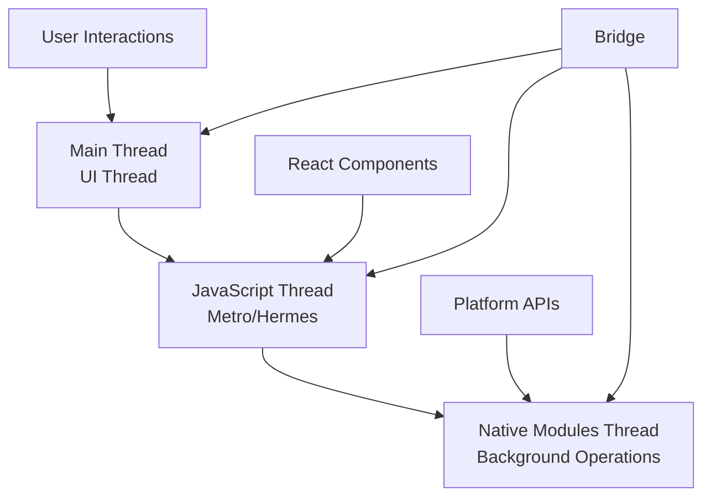

# Section 1: Legacy Architecture: The Bridge

React Native's original architecture, known as the "bridge architecture," has powered React Native applications since the framework's inception. Understanding this architecture is crucial for grasping both React Native's capabilities and its limitations.

## The fundamental problem

Before diving into the architecture, let's understand the challenge React Native solves:

**Two different worlds:**
- **JavaScript world:** React components, state management, business logic
- **Native world:** iOS (Objective-C/Swift) and Android (Java/Kotlin) platform APIs

**The bridge solution:**
React Native creates a communication channel between these worlds, allowing JavaScript code to control native UI elements and access platform capabilities.

## Bridge architecture overview

### Threading model

React Native operates with three main threads:



The React Native threading model separates JavaScript execution from UI rendering and native operations, using the bridge to coordinate communication between threads while maintaining responsive user interfaces.

**Main Thread (UI Thread):**
- Handles user interface rendering
- Processes touch events and user interactions
- Manages native component lifecycle
- Must remain unblocked for smooth 60fps performance

**JavaScript Thread:**
- Executes React application code
- Manages component state and lifecycle
- Processes business logic and API calls
- Runs on Hermes engine (Android) or JavaScriptCore (iOS)

**Native Modules Thread:**
- Executes platform-specific operations
- Handles file system access, network requests
- Manages database operations and device sensors
- Offloads heavy computations from main thread

### Bridge communication protocol

The bridge facilitates asynchronous communication using JSON messages:

**JavaScript to Native:**
1. JavaScript calls a native module method
2. Call is serialized to JSON format
3. Message is queued in the bridge
4. Native side deserializes and executes the call
5. Result is serialized and sent back through bridge

**Native to JavaScript:**
1. Native code triggers an event or callback
2. Data is serialized to JSON format
3. Message is sent through bridge to JavaScript thread
4. JavaScript thread processes the message
5. React components update based on new data

### Message passing example

When you call a native module method:

```javascript
// JavaScript side
import { NativeModules } from 'react-native';

// This call goes through the bridge
NativeModules.CameraModule.takePicture({
  quality: 0.8,
  format: 'jpeg'
}).then(result => {
  console.log('Photo saved:', result.path);
});
```

**Behind the scenes:**
1. Method call serialized: `{"module": "CameraModule", "method": "takePicture", "args": [{"quality": 0.8, "format": "jpeg"}]}`
2. Message sent through bridge to native thread
3. Native camera module executes photo capture
4. Result serialized: `{"success": true, "path": "/path/to/photo.jpg"}`
5. Response sent back through bridge to JavaScript
6. Promise resolves with the result data

## Bridge architecture components

### Bridge module

The bridge is the central communication hub:

**Responsibilities:**
- Message serialization and deserialization
- Thread synchronization and message queuing
- Module registry and method resolution
- Error handling and debugging support

**Implementation details:**
- Written in C++ for performance
- Maintains separate message queues for each thread
- Batches messages for efficiency
- Provides debugging hooks for development tools

### Native modules

Native modules expose platform functionality to JavaScript:

**Module structure:**
```objc
// iOS native module example
@interface CameraModule : NSObject <RCTBridgeModule>
@end

@implementation CameraModule

RCT_EXPORT_MODULE();

RCT_EXPORT_METHOD(takePicture:(NSDictionary *)options
                  resolver:(RCTPromiseResolveBlock)resolve
                  rejecter:(RCTPromiseRejectBlock)reject)
{
  // Native camera implementation
  // Results passed back through bridge
}

@end
```

**Registration process:**
1. Native modules register themselves with the bridge
2. Bridge creates a module registry mapping names to implementations
3. JavaScript can call registered modules by name
4. Bridge routes calls to appropriate native implementations

### Native components

Native components provide UI elements:

**Component lifecycle:**
1. JavaScript describes desired UI structure
2. Bridge communicates UI changes to native side
3. Native UI manager creates/updates platform components
4. Changes are applied on the main thread
5. User interactions flow back through bridge to JavaScript

## Bridge benefits

### Development experience advantages

**Familiar patterns:**
- React component architecture
- JavaScript ecosystem and tooling
- Hot reloading and fast iteration
- Consistent development practices across platforms

**Debugging capabilities:**
- Chrome DevTools integration
- JavaScript debugging in familiar environment
- React Developer Tools support
- Source maps for meaningful stack traces

### Cross-platform efficiency

**Code sharing:**
- Business logic written once in JavaScript
- Shared state management and API integration
- Common testing strategies and patterns
- Unified development and deployment processes

**Platform abstraction:**
- Consistent API across iOS and Android
- Platform-specific implementations hidden from JavaScript
- Automatic platform adaptation for UI components
- Shared navigation and routing patterns

## Bridge limitations

### Performance constraints

**Asynchronous communication overhead:**
- All bridge calls are asynchronous by design
- JSON serialization/deserialization costs
- Message queuing and thread synchronization delays
- No direct synchronous access to native APIs

**Data transfer limitations:**
- Large data structures expensive to serialize
- Image and binary data require special handling
- Frequent bridge calls can create bottlenecks
- Memory pressure from message queuing

### Threading restrictions

**Main thread blocking:**
- Heavy JavaScript computation blocks UI thread
- Bridge congestion affects user interface responsiveness
- No priority system for critical UI operations
- Difficult to achieve consistent 60fps for complex UIs

**Animation limitations:**
- JavaScript-driven animations limited by bridge latency
- Complex animations may appear janky or stuttered
- Interactive gestures require careful optimization
- High-frequency updates can overwhelm bridge capacity

### Development complexity

**Debugging challenges:**
- Errors can occur across multiple threads and languages
- Bridge communication not always transparent
- Platform-specific behavior differences
- Performance issues difficult to diagnose and optimize

**Native integration complexity:**
- Custom native modules require platform-specific expertise
- Bridge interface definition and maintenance overhead
- Version compatibility issues between React Native and native modules
- Testing complexity across JavaScript and native code

## Real-world implications

### When bridge limitations matter

**Animation-heavy applications:**
- Games with complex interactive graphics
- Applications with frequent UI animations
- Real-time data visualization applications
- Camera and media processing applications

**High-frequency operations:**
- Real-time audio/video processing
- Sensor data processing and visualization
- High-performance mathematical computations
- Applications requiring sub-millisecond response times

### Mitigation strategies

**Performance optimization techniques:**
- Batch bridge calls when possible
- Use native animations for smooth interactions
- Implement performance-critical code as native modules
- Profile and optimize bridge communication patterns

**Architectural patterns:**
- Minimize bridge traffic through smart caching
- Use React Native's built-in optimization features
- Implement proper state management to reduce unnecessary updates
- Design UI interactions to work within bridge constraints

## Bridge evolution

### Improvements over time

**Performance optimizations:**
- Better message batching and queuing strategies
- Improved serialization and deserialization performance
- Enhanced memory management and garbage collection
- More efficient threading and synchronization

**Developer experience enhancements:**
- Better debugging tools and error reporting
- Improved hot reloading and fast refresh
- Enhanced profiling and performance monitoring
- Simplified native module development and integration

### Limitations that persist

Despite improvements, fundamental bridge limitations remain:

**Architectural constraints:**
- Asynchronous communication model cannot be changed
- JSON serialization overhead remains significant
- Threading model complexity persists
- Performance ceiling for bridge-heavy operations

**These limitations motivated the development of React Native's New Architecture.**

## Understanding bridge behavior

### Performance characteristics

**Bridge throughput:**
- Typical bridge call latency: 1-5 milliseconds
- Maximum throughput: ~100 calls per second
- Batch processing can improve efficiency
- Performance varies significantly by platform and device

**Memory usage patterns:**
- Message queues consume memory based on traffic
- Large objects create serialization pressure
- Garbage collection affects bridge performance
- Memory leaks possible with improper cleanup

### Debugging bridge issues

**Common symptoms:**
- Laggy animations and user interactions
- Slow response to user input
- High memory usage and crashes
- Inconsistent performance across platforms

**Diagnostic approaches:**
- React Native performance profiler
- Bridge traffic monitoring and analysis
- Memory usage profiling and optimization
- Platform-specific native debugging tools

## Next steps

Understanding the bridge architecture provides the foundation for appreciating React Native's New Architecture improvements. The bridge served React Native well for many years, but its limitations led to significant architectural changes that address performance and developer experience concerns.

Continue to [Section 2: The New Architecture: JSI, TurboModules, Fabric, Codegen](./section-2-new-architecture-jsi-turbomodules-fabric-codegen.md) to learn how React Native's architecture has evolved to overcome these limitations.

> 🛣️ **Learning Path Guidance (All Learners):**
>
> The bridge architecture concepts may seem complex, but understanding them helps you write better React Native code. Focus on understanding when bridge communication happens and how to minimize unnecessary calls for better performance.

> 🍎 **iOS Developer:**
>
> **Comparison:** The bridge architecture is similar to how iOS apps communicate with web views or JavaScript contexts, but React Native's bridge is much more sophisticated and bidirectional. Think of it as a highly optimized message passing system between your Swift/Objective-C code and JavaScript.

> 🤖 **Android Developer:**
>
> **Comparison:** React Native's bridge functions similarly to Android's AIDL (Android Interface Definition Language) for inter-process communication, but operates between JavaScript and native threads within the same process for better performance.