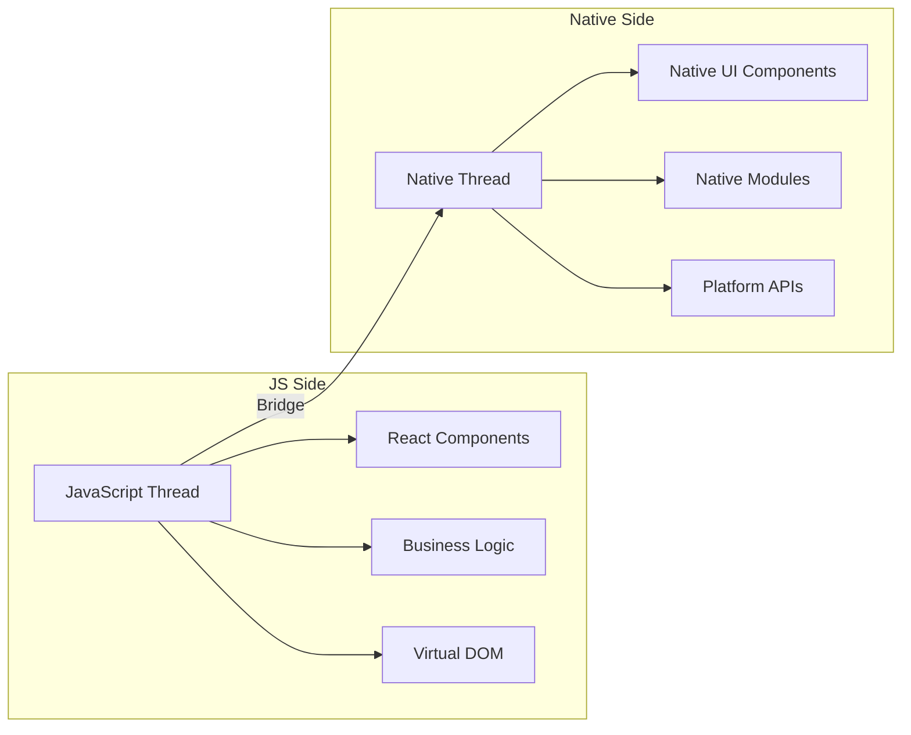

# React Native Fundamentals

<div class="instructor-led">Instructor-Led</div>
<div class="self-led">Self-Led</div>
<div class="asynchronous">Asynchronous</div>

## Overview

This module provides an introduction to React Native, covering its history, core concepts, and how it fits into the mobile development ecosystem. We'll explore the evolution of mobile development approaches and understand why React Native has become a popular choice for cross-platform app development.

Note: This module sets the foundation for the entire course. Emphasize the "learn once, write anywhere" philosophy and how React Native bridges the gap between web and mobile development.

---

## Learning Objectives

By the end of this module, you will be able to:

- Explain the history and evolution of mobile development approaches
- Describe how React Native works under the hood
- Compare React Native with other mobile development frameworks
- Understand the React Native architecture and its core components
- Navigate the React Native documentation effectively

---

# Section 1: The Evolution of Mobile Development

---

## Native Development (2008-2012)

The early days of mobile app development:

- iOS: Objective-C, later Swift
- Android: Java, later Kotlin
- Platform-specific SDKs and tools
- Separate codebases for each platform

<div class="platform-specific">
<strong>iOS Developers:</strong> You're familiar with UIKit, SwiftUI, and the iOS development ecosystem.
</div>

<div class="platform-specific">
<strong>Android Developers:</strong> You've worked with Android SDK, Activities, Fragments, and the Android development ecosystem.
</div>

---

## Hybrid Approaches (2012-2015)

Early attempts at cross-platform development:

- PhoneGap/Cordova: Web views wrapped as native apps
- Xamarin: C# and .NET for cross-platform development
- Titanium: JavaScript bridge to native components
- Limitations in performance and user experience

---

## The React Native Approach (2015-Present)

Facebook's solution to mobile development challenges:

- Introduced at React.js Conf 2015
- "Learn once, write anywhere" philosophy
- JavaScript/TypeScript code compiled to native components
- Shared business logic with platform-specific UI when needed
- Community-driven development since 2018

<div class="platform-specific">
<strong>React Developers:</strong> React Native builds on your existing React knowledge, with components, props, and state working similarly.
</div>

<div class="platform-specific">
<strong>Angular Developers:</strong> While the syntax differs, many concepts like components, services, and dependency injection have parallels in React Native.
</div>

---

# Section 2: How React Native Works

---

## The React Native Architecture



- JavaScript Thread: Runs your React/JavaScript code
- Native Thread: Handles UI rendering and native modules
- Bridge: Facilitates communication between JS and native code
- Native Modules: Access platform-specific features


Note: The architecture diagram should show the JS thread, native thread, and the bridge connecting them. Emphasize that this architecture is evolving with the new architecture initiatives.

---

## The Bridge

The communication layer between JavaScript and native code:

- Serializes data between JS and native environments
- Asynchronous communication
- Batches updates for performance
- Current performance bottleneck being addressed in the new architecture

--

## The New Architecture (Fabric & Turbo Modules)

React Native is evolving:

- Fabric: New rendering system with synchronous operations
- JSI (JavaScript Interface): Direct communication without serialization
- Turbo Modules: Enhanced native modules system
- Codegen: Automated code generation for type safety
- Improved performance and developer experience

---

## React Native vs. Other Approaches

| Approach | Pros | Cons |
|----------|------|------|
| Native Development | Best performance, Full platform access | Separate codebases, Higher cost |
| Web/Hybrid (Cordova) | Single codebase, Web skills | Limited performance, Less native feel |
| React Native | Near-native performance, Single codebase | Bridge overhead, Some native code may be needed |
| Flutter | Good performance, Single codebase | Different language (Dart), Newer ecosystem |

---

# Section 3: React Native Core Concepts

---

## Core Philosophy

React Native embraces:

- Component-based architecture
- Declarative UI paradigm
- Virtual DOM for efficient updates
- Native rendering for authentic look and feel
- Hot reloading for rapid development
- Community-driven development

---

## Key Components and APIs

Essential building blocks:

- View: Container component (like div in web)
- Text: For displaying text
- Image: For displaying images
- ScrollView: Scrollable container
- FlatList: Efficient list rendering
- TextInput: For user input
- TouchableOpacity: For touch interactions
- StyleSheet: For styling components

```jsx
import React from 'react';
import { View, Text, StyleSheet } from 'react-native';

const App = () => (
  <View style={styles.container}>
    <Text style={styles.text}>Hello, React Native!</Text>
  </View>
);

const styles = StyleSheet.create({
  container: {
    flex: 1,
    justifyContent: 'center',
    alignItems: 'center',
  },
  text: {
    fontSize: 24,
    fontWeight: 'bold',
  },
});

export default App;
```

---

## Platform-Specific Code

React Native allows for platform customization:

- Platform module: `Platform.OS === 'ios'`
- Platform-specific file extensions: `.ios.js` and `.android.js`
- Platform-specific components: `<ActivityIndicator />` adapts automatically

```jsx
import { Platform, StyleSheet } from 'react-native';

const styles = StyleSheet.create({
  container: {
    paddingTop: Platform.OS === 'ios' ? 30 : 20,
    ...Platform.select({
      ios: {
        shadowColor: 'black',
        shadowOffset: { width: 0, height: 2 },
        shadowOpacity: 0.2,
      },
      android: {
        elevation: 4,
      },
    }),
  },
});
```

---

## React Native Documentation

The official documentation is your best resource:

- [React Native Documentation](https://reactnative.dev/docs/getting-started)
- [Component Reference](https://reactnative.dev/docs/components-and-apis)
- [API Reference](https://reactnative.dev/docs/accessibilityinfo)
- [The Basics](https://reactnative.dev/docs/intro-react)
- [Guides](https://reactnative.dev/docs/environment-setup)

---

## Exercise

<div class="exercise">

### Exercise: Exploring React Native Documentation

**Objective:** Become familiar with the React Native documentation and understand how to find information.

**Time:** 15-20 minutes

**Instructions:**
1. Visit the [React Native documentation](https://reactnative.dev/docs/getting-started)
2. Find the documentation for the `FlatList` component
3. Identify three props that are specific to `FlatList` and not available in `ScrollView`
4. Find an example of how to implement pull-to-refresh functionality
5. Locate information about optimizing `FlatList` performance

**Resources:**
- [React Native Documentation](https://reactnative.dev/docs/getting-started)

</div>

---

# Section 4: The React Native Ecosystem

---

## Community and Support

React Native has a vibrant ecosystem:

- GitHub repository: [facebook/react-native](https://github.com/facebook/react-native)
- React Native Community: [react-native-community](https://github.com/react-native-community)
- Stack Overflow: [react-native tag](https://stackoverflow.com/questions/tagged/react-native)
- Discord: [Reactiflux](https://www.reactiflux.com/)
- Twitter: [@reactnative](https://twitter.com/reactnative)

---

## Popular Libraries

Essential third-party libraries:

- Navigation: React Navigation, Expo Router
- State Management: Redux, MobX, Zustand, React Query
- UI Kits: React Native Paper, UI Kitten, NativeBase
- Forms: Formik, React Hook Form
- Animations: Reanimated, Lottie
- Testing: Jest, React Native Testing Library

---

## Development Tools

Tools that enhance the development experience:

- Expo: Simplified development workflow
- Flipper: Debugging and inspection
- React Native Debugger: Enhanced debugging experience
- React DevTools: Component inspection
- Metro Bundler: JavaScript bundler for React Native

---

## Challenge

<div class="challenge">

### Challenge: React Native Ecosystem Research

**Objective:** Research and evaluate third-party libraries for a pharmacy/medication app.

**Time:** 30-60 minutes

**Instructions:**
1. Imagine you're building a pharmacy app that needs:
   - Navigation between screens
   - Form handling for prescriptions
   - Secure storage for user medication information
   - Animations for medication reminders
   - Charts for medication adherence

2. Research and select one library for each of these needs
3. For each library, document:
   - Library name and GitHub link
   - Key features
   - Why you selected it over alternatives
   - A simple code example of how you would use it

**Requirements:**
- All libraries must be actively maintained (updated within the last 6 months)
- Include links to documentation
- Consider compatibility with both iOS and Android
- Consider TypeScript support

**Resources:**
- [GitHub](https://github.com)
- [npm](https://www.npmjs.com)
- [React Native Directory](https://reactnative.directory/)

</div>

---

## Summary

- Mobile development has evolved from native-only to cross-platform approaches
- React Native bridges JavaScript and native code through a bridge architecture
- React Native provides a component-based, declarative approach to mobile UI
- The ecosystem includes a wide range of libraries and tools
- The framework continues to evolve with the new architecture initiative

---

## Additional Resources

- [React Native: The Documentary](https://www.youtube.com/watch?v=UHIPsFpzTME)
- [React Native Under the Hood](https://www.reactnative.guide/3-react-native-internals/3.1-react-native-internals.html)
- [The New React Native Architecture Explained](https://formidable.com/blog/2019/react-native-architecture-explained/)
- [React Native at Airbnb](https://medium.com/airbnb-engineering/react-native-at-airbnb-f95aa460be1c)
- [State of React Native 2022](https://github.com/callstack/react-native-state-of-the-art)

---

# Thank You!

Questions?

[Back to Course Home](../../index.html)
