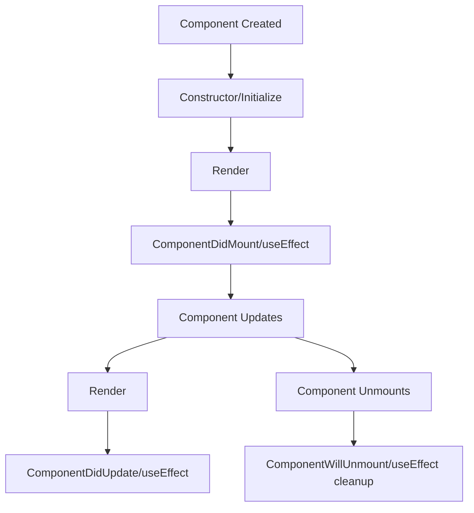
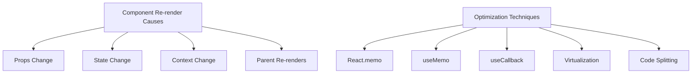

# Module 6: React Essentials

<link rel="stylesheet" href="../../custom.css">

---

## Overview

<div class="instructor-led">Instructor-led content</div>
<div class="self-led">Self-led content</div>
<div class="asynchronous">Asynchronous learning</div>

In this module, we'll explore the fundamentals of React, the foundation of React Native development.

<blockquote><details>

React forms the foundation of React Native, making it essential to master React concepts before diving into mobile development. This module covers core principles and patterns that transfer directly to React Native applications.

React was designed with a component-based architecture that naturally extends to mobile development. The core concepts - components, props, state, and lifecycle - are identical between React and React Native. The main difference is the rendering targets: DOM elements in React versus native components in React Native.

Understanding React hooks is particularly important as they're used extensively in modern React Native applications. Similarly, the Context API provides a consistent approach to state management across both platforms.

Even developers with prior React experience will benefit from this module, as it emphasizes the aspects of React that are most relevant to React Native development. Throughout the module, we'll highlight specific parallels and differences between web and mobile implementations to reinforce how these concepts apply in both contexts.

</details></blockquote>

---

## Learning Objectives

By the end of this module, you will be able to:

- Understand React's core concepts and philosophy
- Create and manage components effectively
- Implement data flow using props and state
- Use modern React hooks for state and side effects
- Apply performance optimization techniques
- Build reusable component architectures

<blockquote><details>

These learning objectives build on each other to provide a comprehensive foundation in React development that directly transfers to React Native. The objectives are carefully sequenced to start with fundamental concepts and progressively move toward more advanced techniques.

Understanding React's core concepts is essential as these same principles apply in React Native. This includes the component model, JSX syntax, and the declarative approach to UI development. Creating and managing components effectively ensures you can build well-structured interfaces with clear separation of concerns.

Data flow implementation through props and state is identical in React and React Native, forming the backbone of component communication. Modern hooks knowledge (useState, useEffect, useContext, etc.) is particularly valuable as hooks work the same way across both platforms, enabling consistent state management and side effect handling.

Performance optimization techniques are especially important for mobile applications where resources are more constrained. Building reusable component architectures leads to maintainable codebases and allows for sharing logic between web and mobile applications.

As we progress through this module, each objective builds upon previous ones, creating a solid mental model of React that will serve as the foundation for React Native development.

</details></blockquote>

---

## Prerequisites

- JavaScript ES6+ knowledge
- TypeScript fundamentals
- Understanding of web concepts

<div class="react-dev">If you're already familiar with React, you can skim this module for review</div>

<blockquote><details>

The prerequisites for this module ensure participants can effectively learn and apply React concepts. These foundational skills are necessary to understand React's approach to UI development.

**JavaScript ES6+** knowledge is essential as React makes heavy use of modern JavaScript features. Specifically, you should be comfortable with arrow functions, destructuring, spread operators, template literals, classes, and array methods like map, filter, and reduce. React's component patterns and JSX syntax rely on these modern JavaScript features.

**TypeScript fundamentals** are increasingly important in the React ecosystem, especially for large-scale applications. Understanding types, interfaces, generics, and type assertions enables you to create more robust, self-documenting code. All examples in this module use TypeScript to prepare you for typed React Native development.

A basic **understanding of web concepts** provides context for how React works, even though React Native targets mobile platforms. Concepts like the DOM, events, and component life cycles have parallels in React Native.

For participants with different backgrounds, certain prerequisites may require more attention:
- Web developers may need to focus more on TypeScript concepts
- Mobile developers may need to strengthen their JavaScript knowledge
- Backend developers may need to adjust to both JavaScript and component-based UI approaches

The module is designed to accommodate different levels of experience, with additional resources available for those needing to strengthen specific prerequisite areas.

</details></blockquote>

---

## Introduction to React


React is a JavaScript library for building user interfaces, particularly single-page applications. It's maintained by Meta (formerly Facebook) and a community of developers.


- Created by Facebook (now Meta) in 2013
- Declarative, component-based architecture
- Virtual DOM for efficient rendering
- One-way data flow
- Extensive ecosystem

<blockquote><details>

React revolutionized front-end development when it was introduced by Facebook (now Meta) in 2013. Initially created to solve specific problems with building complex, data-driven interfaces, React has since become one of the most popular JavaScript libraries for building user interfaces.

The core innovation of React is its **declarative approach** to UI development. Rather than manipulating the DOM directly (imperative programming), React lets developers describe what the UI should look like for a given state, and handles the DOM updates efficiently behind the scenes. This approach leads to more predictable code that's easier to debug and maintain.

React's **component-based architecture** encourages breaking down interfaces into reusable, self-contained pieces. Each component encapsulates its own logic, appearance, and behavior, making complex UIs more manageable. This component model directly transfers to React Native, where you'll build mobile UIs using the same component-based approach.

The **Virtual DOM** is a key performance optimization in React. Instead of updating the real DOM directly (which is costly), React maintains a lightweight virtual representation of the DOM in memory. When state changes, React first updates this virtual DOM, calculates the minimal set of changes needed to update the real DOM, and then efficiently applies only those changes. React Native uses a similar approach, but instead of a Virtual DOM, it uses a abstraction of native UI components.

**One-way data flow** means data flows down from parent to child components through props, making applications more predictable and easier to understand. This unidirectional data binding is a core principle in both React and React Native.

React's **extensive ecosystem** includes state management solutions (Redux, Context API), routing libraries, testing utilities, and of course, React Native for mobile development. Learning React gives you access to this vast ecosystem of tools and libraries.

These fundamental concepts form the foundation of React Native development, with the primary difference being that React Native renders to native mobile components rather than DOM elements.

</details></blockquote>

---

## React Philosophy

> "Learn once, write anywhere"

This differs from traditional "write once, run anywhere" philosophies.

React focuses on:

- The view layer
- Composition over inheritance
- Declarative vs imperative programming
- Component reusability

<blockquote><details>

React's philosophy is encapsulated in the phrase "Learn once, write anywhere," which stands in deliberate contrast to the "write once, run anywhere" approach promoted by other frameworks. This distinction reveals much about React's approach to cross-platform development.

Rather than trying to abstract away all platform differences behind a unified API, React acknowledges that different platforms have unique characteristics, constraints, and best practices. Instead of forcing developers to write a single codebase that runs everywhere (often leading to a "lowest common denominator" experience), React encourages learning a consistent mental model and component paradigm, then applying those principles appropriately for each target platform.

This philosophy is particularly evident in the relationship between React and React Native. The core concepts, patterns, and much of the syntax are identical, but the implementation details respect the unique aspects of web and mobile platforms. For example, the component model and lifecycle methods work the same way, but React uses `<div>` and `<span>` elements while React Native uses `<View>` and `<Text>` components.

React deliberately focuses on just the **view layer** rather than providing an all-encompassing framework. This targeted approach allows it to excel at UI rendering while giving developers the freedom to choose complementary libraries for routing, state management, and other concerns.

The preference for **composition over inheritance** reflects a fundamental architectural choice that leads to more flexible and maintainable component hierarchies. Instead of creating complex inheritance chains, React encourages building small, focused components that can be composed together in various ways.

**Declarative programming** is at the heart of React - you describe what the UI should look like for a given state, not how to transition from one state to another. This produces more predictable and less error-prone code compared to imperative approaches that directly manipulate the DOM.

**Component reusability** is both a goal and a result of React's design. Well-crafted components can be shared across projects, teams, and even platforms (with appropriate adaptations), accelerating development and ensuring consistency.

Understanding this philosophy helps developers approach React Native with the right mindset: leveraging their React knowledge while respecting the unique aspects of mobile development.

</details></blockquote>

---

## React vs React Native

| React | React Native |
|-------|--------------|
| Uses DOM for rendering | Uses native components |
| `<div>`, `<span>`, etc. | `<View>`, `<Text>`, etc. |
| CSS for styling | StyleSheet API |
| Web platform APIs | Native platform APIs |
| Single-threaded | Multi-threaded (JS and native) |

<blockquote><details>

Understanding the relationship between React and React Native is crucial for developers working across platforms. While they share the same core principles and component model, they differ significantly in their implementation details and target platforms.

**Rendering Targets**: The most fundamental difference is what they render to. React renders to the browser's DOM using HTML elements like `<div>`, `<span>`, and `<p>`. React Native, on the other hand, renders to native mobile components provided by iOS and Android platforms. Instead of HTML elements, you use platform-agnostic components like `<View>`, `<Text>`, and `<Image>` that map to their native counterparts (UIView/android.View, UIText/TextView, etc.). This key difference means React Native applications have truly native performance and feel, rather than running in a WebView.

**Styling Approach**: React applications use CSS with its full feature set, including cascade, inheritance, and multiple units of measurement. React Native introduces a subset of CSS implemented through the StyleSheet API, which resembles CSS but has important limitations. There's no cascade or inheritance, units are primarily density-independent pixels, and styling is applied primarily through the style prop rather than class names or IDs. Layout is handled almost exclusively through Flexbox in React Native.

**Platform APIs**: React applications use web platform APIs provided by the browser (fetch, localStorage, geolocation, etc.). React Native applications interface with native platform APIs, giving access to device capabilities like camera, GPS, and push notifications. These are accessed through built-in APIs or native modules that bridge JavaScript and native code.

**Architecture and Threading**: React operates in the browser's single-threaded environment. React Native has a more complex multi-threaded architecture: JavaScript runs in a separate JavaScript thread, UI updates happen on the main thread, and intensive operations can run in background threads. Communication between JavaScript and native code happens through a "bridge" or the newer "JavaScript Interface" (JSI).

**Development Workflow**: Both use similar tooling (npm/yarn, Babel, webpack, etc.), but React Native introduces additional complexity with native development tools (Xcode, Android Studio) and device simulators/emulators.

Despite these differences, the mental model of building with components, managing state, and handling lifecycle is remarkably consistent across both technologies. This consistency is what makes React Native so approachable for React developers and enables code sharing between web and mobile applications, particularly for business logic and state management.

</details></blockquote>

---

## JSX: JavaScript XML

JSX allows you to write HTML-like syntax within JavaScript.

```jsx
// This is JSX
const element = <h1>Hello, world!</h1>;

// Compiled to:
const element = React.createElement('h1', null, 'Hello, world!');
```

<blockquote><details>

JSX (JavaScript XML) is a syntax extension for JavaScript that looks remarkably like HTML but provides the full power of JavaScript. It's a key part of what makes React intuitive and productive for UI development.

JSX may initially appear to be a templating language, but it's fundamentally different - it's a syntax extension that's transformed into regular JavaScript function calls during the build process. When you write a JSX expression like `<h1>Hello, world!</h1>`, a transpiler (typically Babel) converts it into a call to `React.createElement('h1', null, 'Hello, world!')`. This function creates a "React element" - a lightweight description of what should be rendered.

The transformation process happens at build time, not runtime, which means there's no performance penalty for using JSX. The example code demonstrates this transformation, showing both the JSX format and the compiled JavaScript output. Understanding this transformation helps demystify how JSX works under the hood.

JSX offers several significant advantages over using React.createElement directly:
1. **Visual clarity**: The structure and hierarchy of UI elements is immediately apparent
2. **Familiarity**: The syntax resembles HTML, making it intuitive for web developers
3. **Compile-time checks**: Syntax errors and some type errors are caught during compilation
4. **Editor support**: Modern IDEs provide better autocomplete and syntax highlighting for JSX

In React Native, JSX works exactly the same way but creates native component instances instead of DOM elements. For example, `<View><Text>Hello</Text></View>` in React Native JSX becomes function calls that ultimately create native UI components. This consistent syntax between React and React Native is a key part of the "learn once, write anywhere" philosophy.

When working with JSX, it's important to remember that it represents JavaScript objects, not strings. This means you can store JSX in variables, pass it as arguments to functions, return it from functions, and include it in if statements and for loops. This flexibility makes JSX much more powerful than traditional template languages.

The combination of declarative UI description through JSX and React's component model creates a powerful paradigm for building user interfaces that extends seamlessly from web to mobile development with React Native.

</details></blockquote>

---

## JSX Features

```tsx
// Using expressions in JSX
function Greeting({ name, age }: { name: string; age: number }) {
  return (
    <div className="greeting">
      <h1>{name}'s Prescription</h1>
      <p>Patient age: {age}</p>
      {age >= 18 ? <AdultDosage /> : <ChildDosage />}
    </div>
  );
}
```

- JSX expressions use curly braces `{}`
- Can include any valid JavaScript expression
- Attributes use camelCase (`className` not `class`)
- Self-closing tags must end with `/>`

<blockquote><details>

JSX becomes truly powerful when combined with JavaScript expressions, allowing you to create dynamic, data-driven user interfaces. The curly braces `{}` in JSX create a "window" back into JavaScript, letting you embed expressions directly in your markup.

The example demonstrates several key features of JSX with TypeScript. The function component `Greeting` accepts props with explicit type definitions, providing compile-time type safety. Inside the JSX, we see three uses of embedded expressions: interpolating the `name` prop into text content, displaying the `age` prop, and using a ternary expression to conditionally render either an `AdultDosage` or `ChildDosage` component based on the patient's age.

Anything that evaluates to a valid JavaScript expression can go inside curly braces, including:
- Simple variables and properties: `{name}`, `{user.address}`
- Calculations: `{price * quantity}`
- Function calls: `{formatDate(timestamp)}`
- Conditional expressions: `{isLoggedIn ? <LogoutButton /> : <LoginButton />}`
- Array methods like map for rendering lists: `{items.map(item => <ListItem key={item.id} data={item} />)}`

JSX attribute syntax differs from HTML in several important ways. Attributes use camelCase naming conventions, matching JavaScript style (e.g., `className` instead of `class`, `onClick` instead of `onclick`). Values can be string literals in quotes (`className="greeting"`) or JavaScript expressions in curly braces (`style={{ color: isActive ? 'red' : 'black' }}`) - note the double curly braces which represent a JavaScript object within a JSX expression.

Self-closing tags in JSX must include a closing slash (`` not ``), following XML rules rather than HTML's more lenient approach. This enforces consistency and helps prevent errors.

When using TypeScript with JSX (sometimes called TSX), you gain additional benefits: props and state can be typed, preventing common errors like misspelled prop names or incorrect data types. The example uses inline type annotation, but in larger applications, you'd typically define interfaces for your prop types.

In React Native, these same JSX features apply, though the available components and their props differ. For example, `<div>` becomes `<View>` and `className` becomes `style`, but the expression syntax, attribute naming conventions, and TypeScript integration remain identical. This consistency makes the transition between React and React Native more seamless, as the core syntax and patterns are the same across both platforms.

</details></blockquote>

---

## Component Types

<div style="display: flex; justify-content: space-around;">
<div>

### Functional (Modern)

```tsx
function Medication({ name, dosage }: MedicationProps) {
  return (
    <div>
      <h3>{name}</h3>
      <p>Dosage: {dosage}</p>
    </div>
  );
}
```

</div>
<div>

### Class (Legacy)

```tsx
class Medication extends React.Component<MedicationProps> {
  render() {
    return (
      <div>
        <h3>{this.props.name}</h3>
        <p>Dosage: {this.props.dosage}</p>
      </div>
    );
  }
}
```

</div>
</div>

<blockquote><details>

React provides two approaches to defining components: functional and class-based. While both produce the same result, they differ significantly in syntax, capabilities, and modern best practices. Understanding both types is important, particularly when working with existing codebases, though functional components are now strongly preferred for new development.

**Functional components** are JavaScript functions that accept props as an argument and return React elements. The example shows a simple `Medication` component that receives `name` and `dosage` props and renders them within appropriate HTML elements. Functional components offer several advantages:

1. **Simplicity**: They're more concise and easier to read than class components
2. **Performance**: They have a slightly smaller performance footprint
3. **Testing**: They're typically easier to test as pure functions
4. **Hooks compatibility**: They can use React's hooks API for state and lifecycle features

With the introduction of hooks in React 16.8, functional components gained all the capabilities previously exclusive to class components (state management, lifecycle methods, etc.) while maintaining their simpler syntax.

**Class components** are ES6 classes that extend `React.Component`. They were the standard before hooks were introduced and are still found in many existing codebases. The class-based version of the `Medication` component demonstrates several key differences:

1. Props are accessed through `this.props` rather than function parameters
2. The component's output is defined in a required `render()` method
3. TypeScript integration uses generic parameters: `React.Component<MedicationProps>`
4. State management and lifecycle methods use class properties and methods

While class components are still supported, they have several disadvantages compared to functional components:
- More verbose with more boilerplate code
- `this` binding can be confusing and lead to bugs
- Less efficient in some cases due to additional memory usage
- Don't fully benefit from React's latest optimizations

In React Native, the same component patterns apply - you can use either functional or class components with identical behavior. The only difference would be the rendered elements (`<View>` and `<Text>` instead of `<div>` and other HTML elements).

For new development in both React and React Native, functional components with hooks are strongly recommended as they represent the future direction of React development. However, understanding class components remains important for maintaining existing codebases and understanding legacy patterns in documentation and examples.

</details></blockquote>

---

## Component Lifecycle


Components go through a series of lifecycle events. Understanding this process is crucial for implementing features at the right time during a component's existence.




<blockquote><details>

Understanding the component lifecycle is fundamental to working effectively with React and React Native. Components go through a series of predictable phases from creation to destruction, and React provides hooks into these phases to allow developers to execute code at specific times.

The diagram illustrates the main phases of the component lifecycle and how they map between class components and hooks in functional components. This lifecycle is identical in both React and React Native, providing a consistent mental model across platforms.

The lifecycle begins when a component is **created**. In class components, the constructor runs first, initializing the component's state and binding methods. In functional components with hooks, initialization happens during the function execution, with hooks like `useState` setting up initial state.

Next comes the first **render**, where the component's JSX is evaluated and translated into elements in the virtual DOM (or native components in React Native). This initial render establishes the component's initial output based on its props and state.

After the initial render and DOM update, the "**mounting**" phase completes. In class components, the `componentDidMount` lifecycle method fires at this point. In functional components, effects specified with `useEffect` run (when the dependency array is empty or not provided). This is the ideal time for operations that should happen once after rendering, such as data fetching, subscriptions, or direct DOM manipulations.

When props or state change, the component enters the "**updating**" phase. React re-renders the component and updates the DOM as needed. In class components, `componentDidUpdate` fires after the update; in functional components, `useEffect` runs again if any values in its dependency array have changed. This allows for side effects that need to respond to specific prop or state changes.

Finally, when a component is removed from the UI, it enters the "**unmounting**" phase. Class components use `componentWillUnmount` for cleanup, while functional components handle cleanup in the return function of `useEffect`. This is crucial for cleaning up resources like timers, event listeners, or subscriptions to prevent memory leaks.

Understanding this lifecycle is essential for correctly implementing features like data fetching, DOM manipulations, and resource management. It helps determine when to execute code based on the component's state in its lifecycle, ensuring efficient and correct behavior in both React and React Native applications.

</details></blockquote>

</details></blockquote>

--

### Functional Component Lifecycle with Hooks

```tsx
import React, { useState, useEffect } from 'react';

function MedicationTimer({ medicine }: { medicine: string }) {
  // Similar to constructor/initialization
  const [seconds, setSeconds] = useState(0);
  const [isActive, setIsActive] = useState(false);
  
  // Combines componentDidMount, componentDidUpdate, componentWillUnmount
  useEffect(() => {
    let interval: number | null = null;
    
    if (isActive) {
      // Setup (componentDidMount/componentDidUpdate)
      interval = window.setInterval(() => {
        setSeconds(seconds => seconds + 1);
      }, 1000);
    }
    
    // Cleanup (componentWillUnmount)
    return () => {
      if (interval) clearInterval(interval);
    };
  }, [isActive]); // Dependency array controls when effect runs
  
  // Render
  return (
    <div>
      <p>{medicine} reminder: {seconds} seconds</p>
      <button onClick={() => setIsActive(!isActive)}>
        {isActive ? 'Pause' : 'Start'}
      </button>
    </div>
  );
}
```

<blockquote><details>

The introduction of hooks in React 16.8 revolutionized how developers manage component lifecycle events. The `useEffect` hook in particular provides a unified API for handling effects that were previously spread across multiple lifecycle methods in class components.

This `MedicationTimer` example demonstrates how hooks map to the traditional component lifecycle. The component creates a timer that tracks how long since a medication was taken, with the ability to start and pause the timer.

At the **initialization** phase (equivalent to a constructor in class components), we set up two state variables using the `useState` hook:
- `seconds` tracks the elapsed time, starting at 0
- `isActive` determines whether the timer is running, starting as false

The **lifecycle management** happens through the `useEffect` hook, which combines the functionality of multiple class lifecycle methods:
- It runs after the first render (like `componentDidMount`)
- It runs after re-renders when dependencies change (like `componentDidUpdate`)
- Its cleanup function runs before unmounting (like `componentWillUnmount`) and before re-running the effect

Inside the effect, we conditionally set up an interval that increments the seconds counter every 1000ms, but only when `isActive` is true. Note the functional form of the state updater (`setSeconds(seconds => seconds + 1)`), which ensures we're always working with the most current state value, avoiding closure-related bugs.

The dependency array `[isActive]` controls when the effect runs - it will only re-execute when the `isActive` state changes. This selective execution is more flexible than traditional lifecycle methods, allowing effects to synchronize with specific state or prop changes.

The cleanup function returned from the effect ensures that intervals are properly cleared when the component unmounts or when `isActive` changes. This prevents memory leaks and ensures we don't have multiple intervals running simultaneously.

This hook-based approach offers several advantages over class lifecycle methods:
1. **Grouping by concern**: Related code stays together, rather than being split across different lifecycle methods
2. **Preventing bugs**: The dependency array helps avoid stale closures and missed updates
3. **Simpler code**: Less boilerplate and more declarative expression of side effects
4. **Reusability**: Effect logic can be extracted into custom hooks for reuse

In React Native, `useEffect` works identically, though platform-specific APIs would replace browser-specific ones (for example, using a native timer API instead of `window.setInterval`).

Understanding the relationship between hooks and the component lifecycle is crucial for building robust React and React Native applications that manage resources efficiently and respond correctly to state and prop changes.

</details></blockquote>

---

## Props: Component Communication


Props (short for "properties") are a way to pass data from parent to child components. They are read-only and help create reusable components.


```tsx
// Parent component
function Prescription() {
  return (
    <div>
      <h2>Your Prescription</h2>
      <Medication 
        name="Ibuprofen"
        dosage="200mg"
        frequency="every 6 hours"
        maxDose={4}
      />
    </div>
  );
}

// Child component
interface MedicationProps {
  name: string;
  dosage: string;
  frequency: string;
  maxDose: number;
}

function Medication({ name, dosage, frequency, maxDose }: MedicationProps) {
  return (
    <div className="medication-card">
      <h3>{name}</h3>
      <p>Take {dosage} {frequency}</p>
      <p>Maximum {maxDose} doses per day</p>
    </div>
  );
}
```

<blockquote><details>

Props are the primary mechanism for passing data between components in React and React Native, forming the foundation of component communication and reusability. Think of props as the arguments to a component function - they allow parent components to configure their children, creating a unidirectional data flow that makes applications more predictable and easier to debug.

In the example, we see a complete props implementation with TypeScript. The parent `Prescription` component renders a child `Medication` component, passing four props: `name`, `dosage`, `frequency`, and `maxDose`. String values are passed with quotes, while the number value `maxDose` is passed in curly braces to evaluate it as a JavaScript expression.

The `Medication` component defines an interface `MedicationProps` that explicitly types the expected props. This type-checking ensures the component receives the correct data types and helps catch errors at compile time rather than runtime. The component destructures these props in its parameter list for cleaner, more readable code.

Props follow several important principles in React:

1. **Props are read-only** - A component should never modify its own props directly. This immutability is a core part of React's unidirectional data flow. If a component needs to modify data, it should use state instead, or the parent should pass callback functions as props that allow the child to request changes.

2. **Props can include any value type** - You can pass strings, numbers, booleans, objects, arrays, functions, and even other React elements as props.

3. **Props flow downward** - Data passes from parent to child components, not the other way around. This creates a clear hierarchy and makes the application's data flow easier to understand.

4. **Props enable component reusability** - By configuring components through props, the same component can be reused in different contexts with different data and behavior.

In React Native, props work identically, though the component types and available props differ. For example, instead of `className` for styling, React Native components use the `style` prop, but the concept of passing data from parent to child remains the same.

When working with props, common patterns include providing default values (using default parameters or defaultProps), prop validation (through TypeScript or PropTypes), and passing event handlers as props to allow child-to-parent communication. These patterns are consistent across both React and React Native, reinforcing the "learn once, write anywhere" philosophy that makes React Native so accessible to React developers.

</details></blockquote>

---

## State: Component Memory


While props are passed from parent to child, state is managed within a component. State represents data that changes over time and affects a component's rendering.


```tsx
import React, { useState } from 'react';

function MedicationTracker() {
  // Initialize state with useState hook
  const [taken, setTaken] = useState(0);
  const [lastTaken, setLastTaken] = useState<Date | null>(null);
  
  const takeDose = () => {
    // Update state
    setTaken(taken + 1);
    setLastTaken(new Date());
  };
  
  return (
    <div>
      <h3>Medication Tracker</h3>
      <p>Doses taken today: {taken}</p>
      {lastTaken && <p>Last taken: {lastTaken.toLocaleTimeString()}</p>}
      <button onClick={takeDose}>Take Dose</button>
    </div>
  );
}
```

<blockquote><details>

State is the mechanism that allows React components to remember information between renders and respond to user interactions, network responses, or other events. While props are passed from parent components and remain read-only, state is internally managed within a component and can be modified over time.

The `MedicationTracker` example demonstrates modern state management using the `useState` hook in a functional component. This component tracks medication usage with two separate state variables: `taken` (a counter for doses taken) and `lastTaken` (a timestamp for when the medication was last taken).

The first call to `useState(0)` initializes the `taken` state variable to 0 and provides a `setTaken` function to update it. The second call initializes `lastTaken` to null with a TypeScript type annotation `<Date | null>` indicating it can be either a Date object or null.

Each call to `useState` creates an independent piece of state, allowing for more granular updates and clearer code organization compared to the traditional class-based approach of having a single state object. When the user clicks the "Take Dose" button, the `takeDose` function is called, which updates both state variables: incrementing the dose count and setting the last taken time to the current date and time.

These state updates trigger a re-render of the component with the new values. The UI then shows the updated dose count and conditionally renders the last taken time (using the logical AND operator for conditional rendering) only when `lastTaken` is not null.

Several key aspects of state management with hooks are important to understand:

1. **State updates are not merged** - Unlike `setState` in class components, each state update function from `useState` completely replaces the previous value for that specific state variable.

2. **State updates may be batched** - React may batch multiple state updates for performance reasons, so multiple calls to state setters in a single event handler might result in only one re-render.

3. **Functional updates** - When updating state based on previous state, always use the functional form (e.g., `setTaken(prev => prev + 1)`) to avoid issues with stale values due to closures.

4. **Asynchronous updates** - State updates are not immediate; they're scheduled by React and applied before the next render.

State should be used for data that affects rendering and can change over time, such as user input values, toggle states, loading states, or locally managed data. Data that doesn't affect rendering should be stored in regular variables or refs.

In React Native, state works exactly the same way, though the UI components and event handling differ slightly. This consistent state management model between React and React Native is one of the key benefits of the shared architecture.

</details></blockquote>

---

## Hooks: Functional Component Superpowers


Hooks were introduced in React 16.8 to allow functional components to use state and other React features without writing a class. They've become the preferred way to build React components.


Core Hooks:

- `useState`: Manage state
- `useEffect`: Handle side effects
- `useContext`: Access context
- `useRef`: Reference DOM or persist values
- `useMemo`: Memoize expensive calculations
- `useCallback`: Memoize functions
- `useReducer`: Complex state logic

<div class="platform-specific">
Hooks follow specific rules:
- Only call hooks at the top level
- Only call hooks from React functions
</div>

<blockquote><details>

Hooks represent one of the most significant evolutions in React's history, fundamentally changing how developers write and organize components. Introduced in React 16.8, hooks allow functional components to use features that were previously only available to class components, such as state, lifecycle methods, and context.

Before hooks, developers had to choose between functional components (simpler but limited) and class components (more powerful but verbose). Hooks eliminated this tradeoff, allowing functional components to access all React features while maintaining their concise syntax. This innovation has led to more readable, reusable, and testable code across the React ecosystem.

The core hooks address different aspects of component functionality:

- **useState** manages local component state, replacing this.state and this.setState from class components. It accepts an initial value and returns a pair: the current state value and a function to update it.

- **useEffect** handles side effects like data fetching, subscriptions, or DOM manipulations. It combines the functionality of several lifecycle methods (componentDidMount, componentDidUpdate, componentWillUnmount) into a unified API that expresses the intention of the effect more clearly.

- **useContext** provides a way to consume React context directly in functional components, enabling global state access without prop drilling.

- **useRef** creates a mutable reference that persists across renders, useful for accessing DOM elements directly or storing values that shouldn't trigger re-renders when changed.

- **useMemo** memoizes expensive calculations, preventing them from being recalculated on every render unless dependencies change.

- **useCallback** memoizes function definitions, useful for optimizing performance when passing callbacks to child components.

- **useReducer** manages more complex state logic, similar to Redux's pattern with actions and reducers.

Hooks follow specific rules that must be observed: they can only be called at the top level of a function component or custom hook (not inside loops, conditions, or nested functions), and they can only be called from React functions. These rules enable React to correctly preserve state between renders.

Beyond these core hooks, the React community has embraced custom hooks as a powerful pattern for extracting and reusing stateful logic across components. Custom hooks are regular JavaScript functions that may call other hooks and usually start with "use".

In React Native, hooks work identically to their React counterparts, providing the same benefits of simplified component logic and improved code organization. This consistency between platforms is another example of React's "learn once, write anywhere" philosophy.

</details></blockquote>

---

## useState

```tsx
import React, { useState } from 'react';

/**
 * Medication counter component
 * Tracks remaining pills and alerts when running low
 */
function MedicationCounter() {
  // State declaration with initial value
  const [count, setCount] = useState(30);
  
  const takePill = () => {
    // State update function
    setCount(prevCount => prevCount - 1);
  };
  
  return (
    <div className="med-counter">
      <h3>Medication Remaining</h3>
      <p className={count < 5 ? "warning" : ""}>
        Pills remaining: {count}
      </p>
      <button onClick={takePill} disabled={count <= 0}>
        Take Pill
      </button>
      {count <= 5 && (
        <p>Please refill your prescription soon!</p>
      )}
    </div>
  );
}
```

<blockquote><details>

The `useState` hook is the foundation of state management in modern React components, enabling functional components to maintain and update local state that persists between renders. It provides a simpler and more direct API compared to the class-based setState approach, while maintaining the same capabilities.

In this `MedicationCounter` example, we're using `useState` to track the number of pills remaining in a medication. The hook is initialized with `useState(30)`, providing an initial value of 30 pills. When called, `useState` returns an array with exactly two elements, which we immediately destructure: `count` is the current state value, and `setCount` is a function to update that value.

The `takePill` function demonstrates the safest way to update state based on previous state - using the functional update form `setCount(prevCount => prevCount - 1)`. This approach guarantees we're working with the most current state value, avoiding potential race conditions that could occur with the direct form `setCount(count - 1)` in certain scenarios like rapid successive updates.

The component's UI reacts to the state in several ways:
1. It applies a warning class when pills are running low (count < 5)
2. It disables the button when no pills remain (count <= 0)
3. It conditionally displays a refill reminder when count drops to 5 or below

This reactive UI updates automatically whenever the state changes, demonstrating React's declarative approach to UI development. When the user clicks the "Take Pill" button, `setCount` is called, React schedules a re-render with the new count value, and the UI updates to reflect the current state.

Unlike class component state, which is always an object, `useState` can work with any type of value - numbers, strings, booleans, arrays, objects, or custom types. Each `useState` call creates an independent piece of state, allowing for more granular updates and better organization in complex components.

Several important patterns to understand when using `useState`:
1. **Multiple state variables** - You can call `useState` multiple times in a component to manage different pieces of state independently
2. **Object state** - When using objects as state, remember to spread the previous state: `setState(prev => ({ ...prev, property: newValue }))`
3. **Functional updates** - Always use the functional form when new state depends on previous state
4. **Lazy initialization** - For expensive initial calculations, pass a function to `useState`: `useState(() => expensiveComputation())`

In React Native, `useState` functions identically, though the UI components would differ. This consistent state management model is a key part of what makes moving between React and React Native relatively seamless.

</details></blockquote>

---

## useEffect

```tsx
import React, { useState, useEffect } from 'react';

/**
 * Component that tracks medication schedule
 * @param {object} props - Component props
 * @param {string} props.medicationName - Name of medication
 * @param {number} props.hourInterval - Hours between doses
 */
function MedicationReminder({ medicationName, hourInterval }: 
  { medicationName: string, hourInterval: number }) {
  
  const [lastTaken, setLastTaken] = useState<Date | null>(null);
  const [nextDue, setNextDue] = useState<Date | null>(null);
  const [isOverdue, setIsOverdue] = useState(false);
  
  // Effect for timer setup
  useEffect(() => {
    // Skip if no last taken time
    if (!lastTaken) return;
    
    // Calculate next due time
    const next = new Date(lastTaken);
    next.setHours(next.getHours() + hourInterval);
    setNextDue(next);
    
    // Setup interval to check if overdue
    const intervalId = setInterval(() => {
      const now = new Date();
      setIsOverdue(next <= now);
    }, 30000); // Check every 30 seconds
    
    // Cleanup function
    return () => clearInterval(intervalId);
  }, [lastTaken, hourInterval]); // Dependency array
  
  return (
    <div className={isOverdue ? "warning" : ""}>
      <h3>{medicationName} Reminder</h3>
      {lastTaken && <p>Last taken: {lastTaken.toLocaleString()}</p>}
      {nextDue && <p>Next dose: {nextDue.toLocaleString()}</p>}
      {isOverdue && <p>OVERDUE: Please take your medication</p>}
      <button onClick={() => setLastTaken(new Date())}>
        Take Medication
      </button>
    </div>
  );
}
```

<blockquote><details>

The `useEffect` hook is a powerful tool for handling side effects in React components - operations that don't directly relate to rendering but are necessary for functionality, such as data fetching, subscriptions, manual DOM manipulations, or logging. It provides a unified way to handle operations that were previously spread across multiple lifecycle methods in class components.

This `MedicationReminder` example demonstrates a practical use of `useEffect` to implement a medication reminder system that tracks when medications are due and notifies the user when doses are overdue. Let's break down the key aspects:

The component manages three related pieces of state:
- `lastTaken`: when the medication was last taken (null initially)
- `nextDue`: when the next dose is due (calculated based on lastTaken)
- `isOverdue`: whether the current time has passed the next due time

The `useEffect` hook has three main parts:
1. The effect function itself (the first argument)
2. A cleanup function (returned from the effect)
3. A dependency array (the second argument)

The effect first checks if `lastTaken` exists, exiting early if not (since we can't calculate reminders without knowing when the medication was last taken). If we have a `lastTaken` time, it:
1. Calculates the `nextDue` time by adding the `hourInterval` to the last taken time
2. Sets up an interval that runs every 30 seconds to check if the current time has passed the next due time
3. Updates the `isOverdue` state accordingly

The dependency array `[lastTaken, hourInterval]` tells React to re-run this effect whenever either of these values changes. This selective execution is crucial for performance and preventing unwanted behavior. Without a dependency array, the effect would run after every render; with an empty array (`[]`), it would run only once after initial render.

The cleanup function, which runs before the component unmounts or before the effect runs again, clears the interval to prevent memory leaks. This cleanup is essential for any effect that creates resources like timers, subscriptions, or event listeners.

The UI reactively updates based on the component's state, showing relevant information and visual warnings when the medication is overdue. The "Take Medication" button updates the `lastTaken` state, triggering the effect to recalculate the next due time.

Several important patterns to understand with `useEffect`:
1. **Multiple effects** - You can use multiple `useEffect` calls to separate concerns
2. **Dependency array** - Always include all values from the component scope that the effect uses
3. **Cleanup function** - Always return a cleanup function for effects that create resources
4. **Conditional execution** - Use early returns inside effects for conditional logic

In React Native, `useEffect` works identically, though you would use platform-specific APIs for things like notifications instead of browser-specific features. This consistent effect model is a key part of what makes moving between React and React Native relatively seamless.

</details></blockquote>

---

## useRef

```tsx
import React, { useRef, useEffect, useState } from 'react';

/**
 * Component for medication adherence tracking
 * Uses ref to access DOM element and store non-state values
 */
function MedicationAdherence() {
  // Ref for input element
  const inputRef = useRef<HTMLInputElement>(null);
  // Ref for storing previous value (doesn't trigger re-render)
  const prevDosesRef = useRef<number>(0);
  const [doses, setDoses] = useState(0);
  const [streak, setStreak] = useState(0);
  
  // Focus the input on mount
  useEffect(() => {
    if (inputRef.current) {
      inputRef.current.focus();
    }
  }, []);
  
  // Track changes in doses to update streak
  useEffect(() => {
    if (doses > prevDosesRef.current) {
      setStreak(streak + 1);
    }
    prevDosesRef.current = doses;
  }, [doses, streak]);
  
  return (
    <div>
      <h3>Medication Adherence Tracker</h3>
      <p>Current streak: {streak} days</p>
      <p>Doses taken: {doses}</p>
      <input 
        ref={inputRef}
        type="date" 
        onChange={() => setDoses(doses + 1)}
      />
    </div>
  );
}
```

<blockquote><details>

The `useRef` hook serves two primary purposes in React: providing direct access to DOM elements and preserving values between renders without triggering re-renders when those values change. It's an essential part of the React hooks ecosystem that bridges the gap between React's declarative approach and imperative operations.

This `MedicationAdherence` component demonstrates both key use cases of `useRef`:

First, we create `inputRef` using `useRef<HTMLInputElement>(null)` with TypeScript typing to specify it will reference an input element. This ref is attached to the input element via the `ref` attribute, giving us a direct reference to the DOM node. We use this in the first `useEffect` hook to automatically focus the input when the component mounts - a common use case for DOM refs. The empty dependency array ensures this effect runs only once after initial render.

Second, we create `prevDosesRef` to store the previous value of the `doses` state between renders. Unlike state variables, updating a ref's `.current` property doesn't cause a re-render, making refs ideal for storing values that need to persist but shouldn't affect the UI directly. In the second `useEffect` hook, we compare the current `doses` state with the previous value stored in `prevDosesRef` to determine if the user has taken a new dose. If so, we increment the `streak` state. After the comparison, we update `prevDosesRef.current` to the current `doses` value to prepare for the next change.

This pattern of "remembering" previous values to compare with current ones is a common `useRef` pattern and can replace the need for the now-deprecated `componentDidUpdate` lifecycle method in class components.

The key characteristics of `useRef` that differentiate it from `useState` are:
1. Changes to `ref.current` don't trigger re-renders, while state updates do
2. Refs persist for the entire lifetime of the component, maintaining their values across renders
3. Refs provide a mutable object with a `.current` property that can be assigned any value

In React Native, `useRef` works identically for preserving values between renders. However, accessing native UI elements works differently - React Native provides a system of refs for native components, but you interact with them through React Native's APIs rather than direct DOM manipulation.

Common use cases for `useRef` include:
1. Accessing and manipulating DOM elements directly (focus management, measurements, etc.)
2. Storing previous prop or state values for comparison
3. Keeping reference to timers, subscriptions, or API instances that don't affect rendering
4. Implementing imperative methods on function components via forwardRef

By understanding both aspects of `useRef` - DOM access and value persistence - you can handle cases where React's declarative model needs to interface with imperative code or where you need to maintain values across renders without triggering UI updates.

</details></blockquote>

---

## Custom Hooks: Reusable Logic

```tsx
import { useState, useEffect } from 'react';

/**
 * Custom hook for medication reminders
 * @param {number} hoursBetweenDoses - Hours between medication doses
 * @returns {object} Reminder state and functions
 */
function useMedicationReminder(hoursBetweenDoses: number) {
  const [doses, setDoses] = useState<Date[]>([]);
  const [nextDue, setNextDue] = useState<Date | null>(null);
  const [isOverdue, setIsOverdue] = useState(false);
  
  // Calculate next due time when doses change
  useEffect(() => {
    if (doses.length === 0) {
      setNextDue(null);
      setIsOverdue(false);
      return;
    }
    
    // Sort doses by date (newest first)
    const sortedDoses = [...doses].sort((a, b) => b.getTime() - a.getTime());
    const lastDose = sortedDoses[0];
    
    // Calculate next due time
    const next = new Date(lastDose);
    next.setHours(next.getHours() + hoursBetweenDoses);
    setNextDue(next);
    
    // Check if overdue
    const checkOverdue = () => {
      const now = new Date();
      setIsOverdue(next <= now);
    };
    
    // Check immediately and set interval
    checkOverdue();
    const interval = setInterval(checkOverdue, 60000);
    
    return () => clearInterval(interval);
  }, [doses, hoursBetweenDoses]);
  
  // Function to record a dose
  const takeDose = () => {
    setDoses([...doses, new Date()]);
  };
  
  return {
    doses,
    nextDue,
    isOverdue,
    takeDose
  };
}

// Usage
function MedicationTracker() {
  const { doses, nextDue, isOverdue, takeDose } = useMedicationReminder(8);
  
  return (
    <div className={isOverdue ? "warning" : ""}>
      <h3>Medication Tracker</h3>
      <p>Doses taken: {doses.length}</p>
      {nextDue && <p>Next dose due: {nextDue.toLocaleTimeString()}</p>}
      {isOverdue && <p>OVERDUE: Please take your medication</p>}
      <button onClick={takeDose}>Take Dose</button>
    </div>
  );
}
```

<blockquote><details>

Custom hooks represent one of the most powerful patterns in modern React development. They enable developers to extract, reuse, and share stateful logic between components without introducing unnecessary component nesting or prop drilling. Custom hooks build on React's built-in hooks to create specialized, domain-specific hooks that encapsulate related functionality.

The `useMedicationReminder` custom hook demonstrates this pattern by encapsulating complete logic for tracking medication doses, calculating next due times, and determining if doses are overdue. By extracting this logic into a custom hook, it becomes reusable across multiple components and easier to test and maintain.

Custom hooks follow important conventions:
1. They always start with the word "use" (e.g., `useMedicationReminder`) - this isn't just a naming convention but a signal to React's linter that this function follows the rules of hooks
2. They can call other hooks, both built-in and custom
3. They return values (state, functions, etc.) that components can use

Inside this custom hook, we see several built-in hooks at work:
- `useState` manages three separate pieces of state: an array of dose timestamps, the next due time, and an overdue flag
- `useEffect` handles side effects like calculating the next due time and setting up an interval to check if the dose is overdue
- The hook also defines a function (`takeDose`) to record a new dose

The logic is well-encapsulated: it sorts doses to find the most recent, calculates the next due time, sets up checking intervals, and provides a clean external API. The hook includes proper cleanup by clearing the interval when dependencies change or when components using the hook unmount.

The example also shows how to use the custom hook in a component. The `MedicationTracker` component calls `useMedicationReminder` with a specific interval (8 hours), destructures the returned values, and uses them to render the UI. Notice how much cleaner this component is - all the complex timing logic is abstracted away in the hook, letting the component focus on presentation.

Custom hooks offer several major benefits:
1. **Code reuse** - Logic can be shared across multiple components without duplication
2. **Separation of concerns** - UI rendering is separated from business logic
3. **Testability** - Hooks can be tested independently of components
4. **Composition** - Multiple hooks can be combined to create more powerful behavior
5. **Abstraction** - Implementation details are hidden behind a clean API

In React Native, custom hooks work identically and are especially valuable for encapsulating platform-specific APIs or behaviors. For example, you might create hooks like `useDeviceOrientation`, `useNetworkStatus`, or `useAppState` that abstract away the details of native APIs while providing a consistent interface to your components.

Custom hooks represent a paradigm shift in how we organize and share code in React applications, moving from class-based inheritance and higher-order components to function composition and hook composition. This approach typically leads to more maintainable and easier-to-understand code in both React and React Native.

</details></blockquote>

---

## Lists and Keys

```tsx
import React from 'react';

interface Medication {
  id: string;
  name: string;
  dosage: string;
  schedule: string;
}

function MedicationList({ medications }: { medications: Medication[] }) {
  return (
    <div>
      <h2>Your Medications</h2>
      <ul>
        {medications.map(medication => (
          // Key helps React identify which items have changed
          <li key={medication.id} className="medication-item">
            <h3>{medication.name}</h3>
            <p>Dosage: {medication.dosage}</p>
            <p>Schedule: {medication.schedule}</p>
          </li>
        ))}
      </ul>
    </div>
  );
}
```

<blockquote><details>

Rendering lists of data is a fundamental pattern in both React and React Native applications. From simple menus to complex data tables, the ability to efficiently render collections of items is essential. React's declarative approach makes this straightforward through array methods like `map()`, but it introduces an important concept: keys.

In this `MedicationList` example, we're rendering a list of medications, each with properties like name, dosage, and schedule. The component accepts an array of `Medication` objects (with TypeScript interface definition) and maps over them to create list items.

The `key` attribute on each list item is crucial. It serves as a unique identifier that helps React's reconciliation process efficiently update the DOM when the list changes. Without keys, React has no reliable way to know which items have changed, been added, or removed, potentially leading to performance issues and unexpected behavior.

Keys serve several important purposes:
1. They help React identify which items have changed, been added, or removed
2. They help preserve component state across renders for items that remain in the list
3. They improve performance by minimizing DOM operations when lists change

Keys should have several characteristics:
1. **Uniqueness among siblings** - Keys must be unique within the same array, not globally
2. **Stability** - Keys shouldn't change unless the item's identity changes
3. **Predictability** - The same item should always get the same key

In our example, we're using `medication.id` as the key, which is ideal assuming ids are unique within the medications array. This approach follows the best practice of using a stable, unique identifier from your data.

Common pitfalls with keys include:
1. **Using array indices as keys** - This is discouraged except for static lists, as it can lead to bugs when items are reordered or filtered
2. **Using non-stable values** - Keys that change between renders defeat their purpose
3. **Omitting keys entirely** - React will use indices by default, but will issue warnings

In React Native, the same principles apply, though you'll typically use specialized components like `FlatList` or `SectionList` instead of directly mapping arrays to components. These components provide additional optimizations for mobile performance, such as windowing (rendering only items currently visible on screen).

For high-performance rendering of large lists:
1. In React, consider libraries like `react-window` or `react-virtualized` for virtualization
2. In React Native, use the built-in performance optimizations in `FlatList`
3. In both environments, make sure list items have a consistent structure and stable keys

Understanding keys is essential for both correctness and performance when rendering lists, making it a core concept to master in both React and React Native development.

</details></blockquote>

---

## Conditional Rendering


Conditional rendering in React allows you to create dynamic UIs that display different components or elements based on the application state.


```tsx
import React from 'react';

interface MedicationProps {
  name: string;
  requiresPrescription: boolean;
  inStock: boolean;
  dosage?: string; // Optional prop
}

function MedicationDetails({ 
  name, 
  requiresPrescription,
  inStock,
  dosage 
}: MedicationProps) {
  
  // If-else approach
  if (!inStock) {
    return <p>{name} is currently out of stock.</p>;
  }
  
  return (
    <div>
      <h3>{name}</h3>
      
      {/* Ternary operator */}
      {requiresPrescription 
        ? <p className="warning">Requires prescription</p>
        : <p>Available over the counter</p>
      }
      
      {/* Logical AND */}
      {dosage && <p>Recommended dosage: {dosage}</p>}
      
      {/* Element variables */}
      {(() => {
        if (requiresPrescription && inStock) {
          return <button>Request Prescription</button>;
        } else if (!requiresPrescription && inStock) {
          return <button>Add to Cart</button>;
        }
        return null;
      })()}
    </div>
  );
}
```

<blockquote><details>

Conditional rendering is a core technique in React that allows components to display different content based on the current state, props, or other conditions. This ability to dynamically alter what's rendered creates interactive, responsive UIs that adapt to user inputs and application state.

The `MedicationDetails` example demonstrates four different approaches to conditional rendering, each with its own use cases and trade-offs.

The first approach uses an early return pattern with an `if` statement to handle a special case - when the medication is out of stock, we render a simple message and exit the component entirely. This pattern is excellent for "guard clauses" that check for conditions that should prevent the normal rendering flow, such as loading states, error conditions, or permission checks.

The second approach uses the ternary operator (`?:`) to conditionally choose between two elements based on whether the medication requires a prescription. This inline syntax is ideal for simple either/or conditions within JSX. It's concise and readable when the alternatives aren't too complex.

The third approach uses the logical AND operator (`&&`) to conditionally render an element only when a condition is true. This pattern is perfect for optional elements that should either be displayed or not exist at all. In this case, we only show the dosage information if the `dosage` prop is provided. It's important to be careful with this pattern when the condition could be `0`, as `0 && <Component />` would render `0`, not nothing.

The fourth approach uses an immediately-invoked function expression (IIFE) to execute more complex conditional logic within JSX. This pattern can handle multiple conditions or more complicated logic that would be unwieldy with ternary operators. Here, we're determining which button to display based on a combination of the prescription requirement and stock status.

TypeScript adds valuable type safety through the `MedicationProps` interface, which clearly specifies the expected props and their types. The `dosage` prop is marked as optional with the `?` modifier, indicating it might not be provided.

Several principles to keep in mind when implementing conditional rendering:

1. **Declarative approach** - React's declarative nature means we describe what should be rendered for each state, rather than imperatively showing/hiding elements
2. **Multiple levels** - Conditional rendering can happen at different levels - entire components, sub-trees of elements, or individual attributes
3. **Performance considerations** - Conditions that frequently change might benefit from optimizations like `React.memo` or `useMemo`
4. **Readability** - Choose the approach that makes your code most readable - extract complex conditions to separate functions or components if needed

In React Native, these same conditional rendering patterns apply, though the components being rendered would be native-specific (`<View>`, `<Text>`, etc.). The ability to conditionally render different UI elements based on application state is equally important in mobile apps, making this a transferable skill between React and React Native development.

</details></blockquote>

---

## Component Composition


Component composition is a fundamental concept in React that involves combining smaller, specialized components to build more complex UIs. This approach encourages reusability and separation of concerns.


```tsx
import React, { ReactNode } from 'react';

// Base Card component
function Card({ title, children }: { title: string, children: ReactNode }) {
  return (
    <div className="card">
      <div className="card-header">{title}</div>
      <div className="card-body">{children}</div>
    </div>
  );
}

// Specialized Medication Card
function MedicationCard({ name, instructions, sideEffects }: {
  name: string;
  instructions: string;
  sideEffects: string[];
}) {
  return (
    <Card title={name}>
      <p>{instructions}</p>
      <h4>Side Effects</h4>
      <ul>
        {sideEffects.map((effect, index) => (
          <li key={index}>{effect}</li>
        ))}
      </ul>
    </Card>
  );
}

// Usage
function Prescription() {
  return (
    <div>
      <h2>Your Prescription</h2>
      <MedicationCard
        name="Amoxicillin"
        instructions="Take 1 tablet 3 times daily with food."
        sideEffects={[
          "Nausea",
          "Diarrhea",
          "Skin rash"
        ]}
      />
    </div>
  );
}
```

<blockquote><details>

Component composition is a fundamental design pattern in React that emphasizes building complex UIs by combining smaller, focused components. This approach stems from React's core philosophy of "composition over inheritance" and leads to more maintainable, reusable, and testable code.

In this example, we're demonstrating a common composition pattern: a generic container component (`Card`) that provides structure and styling, combined with more specialized content components. This pattern allows for separation of concerns while promoting reusability.

The `Card` component exemplifies the "children" pattern in React. It accepts a `title` prop for its header and uses the special `children` prop (typed as `ReactNode` for TypeScript) to render whatever content is passed between its opening and closing tags. This makes `Card` extremely versatile - it can contain any valid React elements, from simple text to complex component trees.

The `ReactNode` type from TypeScript is crucial here, as it properly types the `children` prop to accept any valid React node (elements, strings, numbers, etc.). This type safety helps prevent errors and improves developer tooling.

The `MedicationCard` component builds on this foundation, creating a more specialized component for displaying medication information. It accepts specific props related to medications (`name`, `instructions`, and `sideEffects`) and uses the `Card` component to provide consistent styling and structure. This demonstrates "composition by specialization" - creating domain-specific components that use more generic components internally.

The `Prescription` component shows how these components are used together in a parent component, creating a hierarchy that reflects both the visual structure and the conceptual organization of the UI.

Component composition offers several significant advantages:

1. **Reusability** - Components can be reused in different contexts and combined in various ways
2. **Separation of concerns** - Each component can focus on doing one thing well
3. **Testability** - Smaller, focused components are easier to test in isolation
4. **Maintainability** - Changes to one component have minimal impact on others
5. **Scalability** - Complex UIs can be built incrementally by composing simpler pieces

Common composition patterns include:

1. **Containment** - Using `children` to nest components within containers
2. **Specialization** - Creating more specific components based on generic ones
3. **Delegation** - Passing props down to child components
4. **Extraction** - Breaking complex components into smaller, focused pieces

In React Native, these same composition patterns apply, though you would use platform-specific components like `View` and `Text` instead of `div` and `p`. The principles of building UIs through component composition remain consistent across both platforms.

Understanding and applying component composition effectively is key to building maintainable React and React Native applications, particularly as they grow in complexity. It allows teams to work on different parts of an application independently while ensuring the pieces fit together cohesively.

</details></blockquote>

---

## Context API: Global State Management


The Context API provides a way to share data between components without having to explicitly pass props down through each level of the component tree. This is especially useful for global state like user preferences, themes, or authentication status.


```tsx
import React, { createContext, useContext, useState, ReactNode } from 'react';

// Step 1: Create a context
interface MedicationContextType {
  medications: Medication[];
  addMedication: (med: Medication) => void;
  removeMedication: (id: string) => void;
}

interface Medication {
  id: string;
  name: string;
  dosage: string;
}

// Create context with default values
const MedicationContext = createContext<MedicationContextType>({
  medications: [],
  addMedication: () => {},
  removeMedication: () => {}
});

// Step 2: Create a provider component
interface MedicationProviderProps {
  children: ReactNode;
}

function MedicationProvider({ children }: MedicationProviderProps) {
  const [medications, setMedications] = useState<Medication[]>([]);
  
  const addMedication = (medication: Medication) => {
    setMedications([...medications, medication]);
  };
  
  const removeMedication = (id: string) => {
    setMedications(medications.filter(med => med.id !== id));
  };
  
  // Provide context value to children
  return (
    <MedicationContext.Provider value={{ 
      medications, 
      addMedication, 
      removeMedication 
    }}>
      {children}
    </MedicationContext.Provider>
  );
}

// Step 3: Create custom hook to use the context
function useMedications() {
  const context = useContext(MedicationContext);
  if (context === undefined) {
    throw new Error('useMedications must be used within a MedicationProvider');
  }
  return context;
}

// Step 4: Use the context in components
function MedicationList() {
  const { medications, removeMedication } = useMedications();
  
  return (
    <div>
      <h3>Your Medications</h3>
      <ul>
        {medications.map(med => (
          <li key={med.id}>
            {med.name} - {med.dosage}
            <button onClick={() => removeMedication(med.id)}>Remove</button>
          </li>
        ))}
      </ul>
    </div>
  );
}

function AddMedicationForm() {
  const { addMedication } = useMedications();
  const [name, setName] = useState('');
  const [dosage, setDosage] = useState('');
  
  const handleSubmit = (e: React.FormEvent) => {
    e.preventDefault();
    addMedication({
      id: Date.now().toString(),
      name,
      dosage
    });
    setName('');
    setDosage('');
  };
  
  return (
    <form onSubmit={handleSubmit}>
      <input
        value={name}
        onChange={e => setName(e.target.value)}
        placeholder="Medication name"
      />
      <input
        value={dosage}
        onChange={e => setDosage(e.target.value)}
        placeholder="Dosage"
      />
      <button type="submit">Add Medication</button>
    </form>
  );
}

// App component with Provider
function MedicationApp() {
  return (
    <MedicationProvider>
      <h2>Medication Tracker</h2>
      <AddMedicationForm />
      <MedicationList />
    </MedicationProvider>
  );
}
```

<blockquote><details>

The Context API provides a way to share data across the component tree without passing props explicitly at every level, effectively solving the "prop drilling" problem. It's particularly useful for global application state like user authentication, themes, or shared data that many components need to access.

This example demonstrates a complete implementation of the Context API to manage a list of medications. The pattern involves four key steps that represent best practices for using context effectively:

1. **Create the Context**: We define a `MedicationContext` with TypeScript interfaces for type safety. The context includes both data (`medications` array) and functions to modify that data (`addMedication` and `removeMedication`). Default values are provided but rarely used directly - they mainly serve for type checking and to handle edge cases.

2. **Create a Provider Component**: The `MedicationProvider` component manages state using hooks and provides both the state and state-updating functions to all descendant components through the context. This encapsulation keeps state management logic in one place.

3. **Create a Custom Hook**: The `useMedications` hook provides a clean, consistent way to access the context. It includes error checking to ensure the hook is used within a provider, improving developer experience by providing clear error messages if used incorrectly.

4. **Use the Context in Components**: `MedicationList` and `AddMedicationForm` components consume the context through the custom hook, accessing just the values they need. They can now communicate indirectly - the form adds medications that immediately appear in the list, without prop passing.

This pattern offers several advantages:

- **Reduced Prop Drilling**: No need to pass data through intermediate components that don't need it
- **Centralized State Management**: Logic for state updates is kept in one place
- **Simplified Component API**: Components don't need to receive and pass unnecessary props
- **Better Component Reusability**: Components can be moved around the tree more freely

However, context is not a replacement for all prop passing. It's best used for:

1. **Truly Global State**: Authentication, user preferences, themes
2. **Widely Used Data**: Information needed by many components across the application
3. **Deeply Nested Components**: When prop drilling becomes excessive and hurts maintainability

For local component state or parent-child communication, props often remain more appropriate. Context updates can trigger re-renders in all consuming components, so overusing it may impact performance.

In React Native, context works exactly the same way, making it an excellent tool for sharing state across screens and deep component hierarchies in mobile applications. This consistent state management approach is another example of the "learn once, write anywhere" philosophy between React and React Native.

Combining context with other hooks like `useReducer` for more complex state logic or `useMemo` to optimize context values can create powerful, efficient state management solutions without third-party libraries, though libraries like Redux or MobX still have their place for very complex applications.

</details></blockquote>

---

## Performance Optimization


As React applications grow, performance optimization becomes important. React provides several ways to optimize rendering performance.




<blockquote><details>

Performance optimization is critical for creating responsive, smooth React and React Native applications, especially as they grow in complexity. Understanding what triggers renders and how to prevent unnecessary work is key to maintaining good performance, particularly on mobile devices with limited resources.

The diagram illustrates the main causes of component re-renders and the primary optimization techniques available in React. Let's explore both aspects:

**Causes of Re-renders:**

1. **Props Change**: When a component receives new props different from previous props, it re-renders. This is the most straightforward trigger for updates.

2. **State Change**: When a component's state changes via setState or a state setter from useState, the component re-renders to reflect the new state.

3. **Context Change**: When a context value used by a component changes, all components consuming that context will re-render, potentially causing cascading updates.

4. **Parent Re-renders**: By default, when a parent component re-renders, all its children re-render regardless of whether their props changed. This is often the most overlooked cause of performance issues.

**Optimization Techniques:**

1. **React.memo**: A higher-order component that memoizes a component, preventing re-renders if props haven't changed. It's similar to PureComponent for class components.

2. **useMemo**: A hook that memoizes computed values, recalculating them only when dependencies change. This prevents expensive calculations on every render.

3. **useCallback**: A hook that memoizes function references, preventing new function objects from being created on every render. This is particularly important when passing callbacks to optimized child components.

4. **Virtualization**: For long lists, techniques like windowing (rendering only visible items) can dramatically improve performance. React Native's FlatList component has this built-in, while React web applications can use libraries like react-window.

5. **Code Splitting**: Breaking your bundle into smaller chunks loaded on demand, reducing initial load time. This is implemented through dynamic imports and React.lazy.

When implementing performance optimizations, follow these principles:

1. **Measure First**: Use React DevTools Profiler or performance monitoring tools to identify actual bottlenecks rather than optimizing prematurely.

2. **Optimize Judiciously**: Not every component needs optimization - focus on frequently re-rendered components or those with expensive rendering logic.

3. **Consider Trade-offs**: Optimization techniques add complexity and sometimes make code harder to maintain. Ensure the performance benefit justifies the added complexity.

4. **Platform-Specific Considerations**: React Native has additional performance considerations like JS-to-native bridge communication, native animation, and image optimization.

In React Native, performance optimization is even more critical due to the constraints of mobile devices. Additional techniques include:
- Using native driver animations where possible
- Optimizing image loading and caching
- Minimizing bridge traffic between JS and native code
- Using InteractionManager to defer non-critical work

By understanding what causes components to re-render and applying appropriate optimization techniques, you can build highly performant applications in both React and React Native environments.

</details></blockquote>

---

## React.memo and useMemo

```tsx
import React, { useMemo } from 'react';

interface MedicationCalculatorProps {
  medications: {
    name: string;
    dosesPerDay: number;
    pillsPerDose: number;
    daysSupply: number;
  }[];
}

// Memoized component with React.memo
const MedicationCalculator = React.memo(
  function MedicationCalculator({ medications }: MedicationCalculatorProps) {
    // Expensive calculation memoized with useMemo
    const totalPills = useMemo(() => {
      console.log('Calculating total pills...');
      return medications.reduce((total, med) => {
        return total + (med.dosesPerDay * med.pillsPerDose * med.daysSupply);
      }, 0);
    }, [medications]); // Only recalculate when medications changes
    
    // Another expensive calculation
    const monthlyRefills = useMemo(() => {
      console.log('Calculating monthly refills...');
      return medications.map(med => {
        const pillsPerMonth = med.dosesPerDay * med.pillsPerDose * 30;
        const refillsNeeded = Math.ceil(pillsPerMonth / (med.daysSupply * med.dosesPerDay * med.pillsPerDose));
        return {
          name: med.name,
          refillsNeeded
        };
      });
    }, [medications]);
    
    return (
      <div>
        <h3>Medication Statistics</h3>
        <p>Total pills: {totalPills}</p>
        <h4>Monthly Refills Needed:</h4>
        <ul>
          {monthlyRefills.map((refill, index) => (
            <li key={index}>
              {refill.name}: {refill.refillsNeeded} refills
            </li>
          ))}
        </ul>
      </div>
    );
  }
);
```

<blockquote><details>

React.memo and useMemo are two powerful optimization techniques that can significantly improve performance by preventing unnecessary re-renders and recalculations. They both implement memoization - a programming technique that stores the results of expensive function calls and returns the cached result when the same inputs occur again.

In this `MedicationCalculator` example, we're demonstrating both techniques in a component that performs potentially expensive calculations on medication data.

**React.memo** is applied to the entire component using a higher-order component pattern: `const MedicationCalculator = React.memo(function MedicationCalculator...)`. This memoizes the entire component, preventing it from re-rendering unless its props change. By default, React.memo performs a shallow comparison of props, though a custom comparison function can be provided as a second argument.

React.memo is particularly valuable for:
1. Components that render often but with the same props
2. Pure functional components with no internal state
3. Components with expensive rendering logic
4. Components receiving complex objects or functions as props

Within the component, we use **useMemo** for two separate expensive calculations:
1. `totalPills` - calculates the total number of pills across all medications
2. `monthlyRefills` - calculates how many refills will be needed each month for each medication

Both calculations are wrapped in useMemo hooks with a dependency array containing `[medications]`. This means the calculations will only be re-run when the medications prop changes, not on every render of the component. The console.log statements would only execute when the memoized value is recalculated, not on every render.

These optimizations are particularly important in scenarios like:
1. When the parent component re-renders frequently
2. When calculations are computationally expensive
3. When dealing with large datasets
4. When the component renders a complex tree of elements

Some important considerations when using these optimization techniques:

1. **Don't optimize prematurely** - Only apply these techniques when you've identified performance issues
2. **Consider the cost of comparison** - For very simple calculations, the overhead of memoization might not be worth it
3. **Ensure correct dependencies** - Missing dependencies in useMemo can lead to stale data
4. **Understand referential equality** - Object and array dependencies are compared by reference, not value

In React Native, these same optimization techniques apply and are often even more important due to the performance constraints of mobile devices. The patterns and usage are identical, making these skills directly transferable between React and React Native development.

Both React.memo and useMemo address different aspects of performance optimization - component rendering and computation respectively - and when used appropriately, they can significantly improve the responsiveness and efficiency of your applications.

</details></blockquote>

---

## useCallback

```tsx
import React, { useState, useCallback } from 'react';

interface Medication {
  id: string;
  name: string;
}

// Child component memoized to prevent unnecessary renders
const MedicationItem = React.memo(function MedicationItem({ 
  medication, 
  onSelect 
}: { 
  medication: Medication;
  onSelect: (id: string) => void;
}) {
  console.log(`Rendering ${medication.name}`);
  return (
    <li>
      {medication.name}
      <button onClick={() => onSelect(medication.id)}>
        Select
      </button>
    </li>
  );
});

function MedicationList() {
  const [medications] = useState<Medication[]>([
    { id: '1', name: 'Aspirin' },
    { id: '2', name: 'Ibuprofen' },
    { id: '3', name: 'Acetaminophen' }
  ]);
  const [selectedId, setSelectedId] = useState<string | null>(null);
  
  // Without useCallback, this function would be recreated
  // on every render, causing MedicationItem to re-render
  const handleSelect = useCallback((id: string) => {
    setSelectedId(id);
    console.log(`Selected medication: ${id}`);
  }, []);
  
  return (
    <div>
      <h3>Medications</h3>
      <ul>
        {medications.map(med => (
          <MedicationItem
            key={med.id}
            medication={med}
            onSelect={handleSelect}
          />
        ))}
      </ul>
      {selectedId && <p>Selected medication ID: {selectedId}</p>}
    </div>
  );
}
```

<blockquote><details>

The `useCallback` hook is a performance optimization tool that memoizes function references between renders. It's particularly important when passing callback functions as props to child components that are optimized with React.memo, as new function references would cause these optimized components to re-render unnecessarily.

In this example, we demonstrate the proper use of `useCallback` in combination with React.memo to optimize a list rendering pattern. Let's break down what's happening:

First, we define a memoized `MedicationItem` component using `React.memo`. This component displays a medication name and a select button. It's optimized to only re-render when its props change. The `console.log` statement will help us track when renders occur.

In the parent `MedicationList` component, we manage two pieces of state:
1. An array of medications (static in this example for simplicity)
2. The ID of the currently selected medication

The critical optimization happens with the `handleSelect` function. Without `useCallback`, this function would be recreated with a new reference on every render of `MedicationList`. Since it's passed as the `onSelect` prop to each `MedicationItem`, this would cause all items to re-render even if the actual medications haven't changed.

By wrapping the function in `useCallback`, we ensure that `handleSelect` maintains the same reference between renders as long as its dependencies don't change. The empty dependency array `[]` means this function will never be recreated unless `MedicationList` is unmounted and remounted.

The key benefits of this optimization are:
1. **Preventing unnecessary child re-renders** - Memoized child components won't re-render when they receive the same function reference
2. **Improving performance** - Particularly important for lists with many items or complex child components
3. **Reducing wasted renders** - Especially valuable on mobile devices with limited resources

Some important considerations when using `useCallback`:

1. **Dependency array** - Like `useEffect` and `useMemo`, `useCallback` uses a dependency array to determine when to recreate the function. Be sure to include all values from the component scope that the callback uses.

2. **Combining with React.memo** - `useCallback` provides the most benefit when used with memoized child components. Without memoized children, the optimization may not have significant impact.

3. **Inline functions vs. useCallback** - For simple components or those that will re-render anyway due to other prop changes, the overhead of `useCallback` might not be worth it.

4. **Optimization strategy** - Start by memoizing expensive child components with React.memo, then add `useCallback` for functions passed to those components.

In React Native, this optimization can be even more important due to performance constraints on mobile devices. The pattern and usage are identical, making this skill directly transferable between React and React Native development.

Understanding when and how to use `useCallback` is an important part of building performant React applications, particularly as they grow in complexity and scale.

</details></blockquote>

---

## Exercise: Building a Medication Component

<div class="exercise">

### Task

Create a reusable medication component with TypeScript that displays medication information and tracks doses.

#### Requirements:

1. Use TypeScript with proper types and interfaces
2. Implement state management for tracking doses
3. Include a visual indicator when doses are due
4. Use appropriate hooks for side effects

#### Starter Code:

```tsx
import React, { useState, useEffect } from 'react';

// Define your types and interfaces here

function MedicationTracker() {
  // Implement the component
  return (
    <div>
      {/* Implement UI here */}
    </div>
  );
}

export default MedicationTracker;
```

#### Expected Output:

A functional component that:
- Displays medication details
- Allows tracking doses
- Shows visual indicator for dose timing
- Implements proper TypeScript typing

</div>

<blockquote><details>

This exercise brings together multiple concepts covered in the module, giving participants a chance to apply their knowledge in a practical scenario. The medication tracker component combines state management, side effects, TypeScript typing, and conditional rendering - all key skills for both React and React Native development.

To complete this exercise, participants will need to:

1. **Define TypeScript interfaces** for the component props and any internal data structures. This ensures type safety and helps catch errors at compile time rather than runtime. Proper typing also serves as documentation for how the component should be used.

2. **Implement state management** using the useState hook to track when doses are taken and when the next dose is due. This will likely involve multiple state variables to track different aspects of the medication schedule.

3. **Add side effects** with useEffect to handle timing and scheduling logic. The component should calculate when the next dose is due based on the medication schedule and current time, potentially setting up timers or intervals to check if doses are overdue.

4. **Create visual indicators** using conditional rendering to show when doses are due or overdue. This might involve applying different CSS classes based on timing status or showing/hiding UI elements.

5. **Build a user interface** that displays medication information clearly and provides interaction points for marking doses as taken.

A comprehensive solution might include:
- State for dose history, next due time, and overdue status
- Effects for calculating timing and checking for overdue doses
- UI components for displaying medication details and status
- Event handlers for marking doses as taken
- Conditional styling based on timing status

This exercise is designed to be challenging but achievable with the knowledge gained from the module. It enforces best practices like proper TypeScript usage and appropriate hook implementation while creating a component that has real-world utility.

For those with more experience, encourage extensions like:
- Adding persistence using localStorage
- Implementing multiple medication tracking
- Creating more sophisticated scheduling rules
- Adding notifications or reminders

The exercise deliberately uses a medication theme to match the pharmacy/medication theme specified in the course requirements, making it relevant to the overall course context.

</details></blockquote>

---

## Challenge: Pharmacy Management Interface

<div class="challenge">

### Task

Build a more complex pharmacy management interface with multiple components, state management, and component composition.

#### Requirements:

1. Create a medication list component
2. Implement add/edit/delete functionality
3. Add a dosage reminder system
4. Implement context for sharing medication data
5. Apply performance optimizations where appropriate
6. Use TypeScript throughout

#### Components to Create:

1. `MedicationProvider` (context)
2. `MedicationList`
3. `MedicationForm`
4. `MedicationDetail`
5. `DosageReminder`

#### Advanced Features (optional):

- Implement local storage for persistence
- Add filtering and sorting options
- Create a statistics dashboard

</div>

<blockquote><details>

This challenge is designed as a capstone project that integrates all the key React concepts covered throughout the module. It pushes participants to apply their knowledge in a more complex, real-world scenario that closely mimics actual development tasks they'll encounter when building React or React Native applications.

The challenge involves building a comprehensive pharmacy management system with multiple interacting components, shared state, and advanced features. This multi-component application requires understanding of component composition, state management, context, and performance optimization.

To successfully complete this challenge, participants will need to:

1. **Design a component architecture** that separates concerns and promotes reusability. This includes planning how components will interact and how data will flow through the application.

2. **Implement context-based state management** using the Context API to share medication data across components without prop drilling. This involves creating a provider component that manages the global state and consumer components that access that state.

3. **Build CRUD functionality** for medications, allowing users to add, view, edit, and delete medication entries. This requires understanding form handling, state updates, and conditional rendering.

4. **Create a reminder system** that tracks medication schedules and alerts users when doses are due. This involves working with dates, timers, and side effects.

5. **Apply performance optimizations** such as React.memo, useCallback, and useMemo where appropriate to prevent unnecessary renders and improve application responsiveness.

6. **Use TypeScript consistently** throughout the application to ensure type safety and improve code quality.

The specified components provide a structure to follow:
- `MedicationProvider`: Manages global medication state using context
- `MedicationList`: Displays medications with options to select or delete
- `MedicationForm`: Handles adding and editing medications
- `MedicationDetail`: Shows detailed information for a selected medication
- `DosageReminder`: Tracks and displays medication schedules and reminders

Optional advanced features like local storage persistence, filtering/sorting, and statistics provide extension opportunities for participants who complete the main requirements quickly.

This challenge is intentionally open-ended to encourage creativity and problem-solving. There's no single "correct" implementation, but solutions should demonstrate understanding of React principles and best practices. The pharmacy theme aligns with the course's specified medication/pharmacy examples requirement.

</details></blockquote>

---

## Key Takeaways

- React is component-based with unidirectional data flow
- Modern React uses functional components with hooks
- Props are for passing data down, state is for component memory
- Context provides a way to share data across components
- Composition is preferred over inheritance for component reuse
- Performance optimizations should be applied judiciously

<blockquote><details>

These key takeaways summarize the most important concepts and principles covered in this module. Understanding these fundamentals provides a solid foundation for React development that transfers directly to React Native.

**Component-based architecture with unidirectional data flow** is the cornerstone of React's design philosophy. Breaking UIs into composable components makes applications easier to develop, understand, and maintain. The unidirectional data flow (props down, events up) creates predictable behavior and makes debugging simpler.

**Functional components with hooks** represent the modern React paradigm. Since the introduction of hooks in React 16.8, functional components have become the preferred way to write React code due to their simplicity, readability, and powerful capabilities. Understanding useState, useEffect, and other hooks is crucial for effective React development.

**Props and state** serve different but complementary purposes in React. Props provide a way to pass data from parent to child components, enabling component configuration and reuse. State allows components to maintain and update their own data over time, enabling interactivity and dynamic behavior. Knowing when to use each is a key skill.

**Context** solves the problem of passing data through intermediate components that don't need it (prop drilling). It provides a way to share values like themes, user authentication, or localization settings across many components without explicit prop passing. Context is particularly valuable in larger applications with deep component trees.

**Composition over inheritance** is a fundamental React principle. Rather than using class inheritance to share code between components, React encourages composition through children props, specialization, and other patterns. This approach leads to more flexible and maintainable component hierarchies.

**Performance optimizations** are important but should be applied strategically. Tools like React.memo, useMemo, and useCallback help prevent unnecessary re-renders and calculations, but they add complexity. Measure performance first to identify bottlenecks, then apply optimizations where they'll have the most impact.

These principles apply equally to React and React Native development. While the rendering targets differ (DOM vs. native components), the core concepts of component composition, state management, and data flow remain consistent across platforms. This conceptual consistency is what makes the "learn once, write anywhere" philosophy of React Native possible.

By mastering these fundamentals, developers gain the ability to build well-structured, maintainable, and performant applications on both web and mobile platforms.

</details></blockquote>

---

## Additional Resources

- [React Official Documentation](https://reactjs.org/docs/getting-started.html)
- [TypeScript React Cheatsheet](https://github.com/typescript-cheatsheets/react)
- [React Hooks API Reference](https://reactjs.org/docs/hooks-reference.html)
- [Performance Optimization in React](https://reactjs.org/docs/optimizing-performance.html)
- [React TypeScript Guide](https://react-typescript-cheatsheet.netlify.app/)

<blockquote><details>

These additional resources provide valuable references for expanding your knowledge of React and applying the concepts covered in this module. They're carefully selected to support both immediate learning needs and ongoing professional development.

The **React Official Documentation** is the authoritative source for learning React. It includes comprehensive guides, API references, and tutorials that cover everything from basic concepts to advanced patterns. The documentation is well-maintained and regularly updated with the latest React features and best practices. It's particularly valuable for understanding React's design philosophy and intended usage patterns.

The **TypeScript React Cheatsheet** is an excellent community resource that bridges the gap between React and TypeScript. It provides practical examples of TypeScript patterns in React, including typing props, state, events, and hooks. This resource is especially helpful for developers transitioning from JavaScript to TypeScript in their React applications.

The **React Hooks API Reference** offers detailed documentation for all standard hooks in React. It includes comprehensive explanations, example code, and usage guidelines for each hook. This reference is invaluable when implementing hooks in your components and helps ensure you're following best practices for state management and side effects.

The **Performance Optimization in React** guide covers techniques for identifying and resolving performance issues in React applications. It includes sections on using the React DevTools Profiler, implementing memoization, virtualizing long lists, and other optimization strategies. This resource is particularly relevant for the performance optimization section of this module.

The **React TypeScript Guide** provides in-depth coverage of using TypeScript with React, including advanced patterns and solutions to common challenges. It includes sections on component patterns, hooks with TypeScript, state management, and form handling. This community-maintained resource is regularly updated with new TypeScript features and React patterns.

These resources complement the module content by providing more detailed information on specific topics. They're useful for both clarifying concepts during initial learning and serving as references during practical application. Participants are encouraged to bookmark these resources for future use as they continue their React and React Native development journey.
