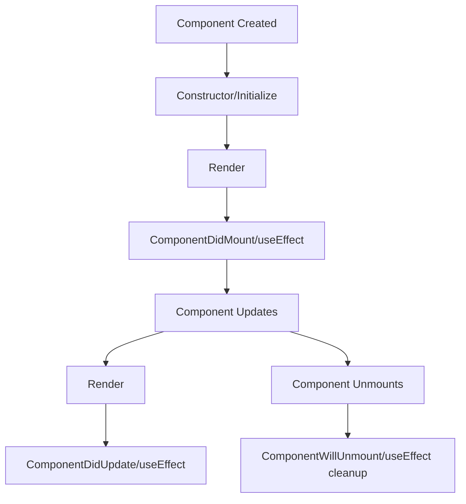
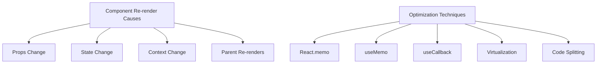

# Module 6: React Essentials

<!-- This document serves as both documentation and presentation slides -->

---

## Overview

<div class="instructor-led">Instructor-led content</div>
<div class="self-led">Self-led content</div>
<div class="asynchronous">Asynchronous learning</div>

In this module, we'll explore the fundamentals of React, the foundation of React Native development.

Note: This module is crucial for understanding React Native. Even if participants have React experience, the module covers important concepts that transfer to React Native.

---

## Learning Objectives

By the end of this module, you will be able to:

- Understand React's core concepts and philosophy
- Create and manage components effectively
- Implement data flow using props and state
- Use modern React hooks for state and side effects
- Apply performance optimization techniques
- Build reusable component architectures

---

## Prerequisites

- JavaScript ES6+ knowledge
- TypeScript fundamentals
- Understanding of web concepts

<div class="react-dev">If you're already familiar with React, you can skim this module for review</div>

---

## Introduction to React

<!-- Documentation-only start -->
React is a JavaScript library for building user interfaces, particularly single-page applications. It's maintained by Meta (formerly Facebook) and a community of developers.
<!-- Documentation-only end -->

- Created by Facebook (now Meta) in 2013
- Declarative, component-based architecture
- Virtual DOM for efficient rendering
- One-way data flow
- Extensive ecosystem

Note: React was developed internally at Facebook before being open-sourced. It was created to solve specific problems with building complex UIs. React Native extends this philosophy to mobile app development.

---

## React Philosophy

> "Learn once, write anywhere"

This differs from traditional "write once, run anywhere" philosophies.

React focuses on:

- The view layer
- Composition over inheritance
- Declarative vs imperative programming
- Component reusability

---

## React vs React Native

| React | React Native |
|-------|--------------|
| Uses DOM for rendering | Uses native components |
| `<div>`, `<span>`, etc. | `<View>`, `<Text>`, etc. |
| CSS for styling | StyleSheet API |
| Web platform APIs | Native platform APIs |
| Single-threaded | Multi-threaded (JS and native) |

Note: Emphasize that React and React Native share core concepts but differ in implementation details. The core mental model transfers between them.

---

## JSX: JavaScript XML

JSX allows you to write HTML-like syntax within JavaScript.

```jsx
// This is JSX
const element = <h1>Hello, world!</h1>;

// Compiled to:
const element = React.createElement('h1', null, 'Hello, world!');
```

Note: JSX is a syntax extension, not a language. It gets transformed to regular JavaScript function calls during the build process.

---

## JSX Features

```tsx
// Using expressions in JSX
function Greeting({ name, age }: { name: string; age: number }) {
  return (
    <div className="greeting">
      <h1>{name}'s Prescription</h1>
      <p>Patient age: {age}</p>
      {age >= 18 ? <AdultDosage /> : <ChildDosage />}
    </div>
  );
}
```

- JSX expressions use curly braces `{}`
- Can include any valid JavaScript expression
- Attributes use camelCase (`className` not `class`)
- Self-closing tags must end with `/>`

---

## Component Types

<div style="display: flex; justify-content: space-around;">
<div>

### Functional (Modern)

```tsx
function Medication({ name, dosage }: MedicationProps) {
  return (
    <div>
      <h3>{name}</h3>
      <p>Dosage: {dosage}</p>
    </div>
  );
}
```

</div>
<div>

### Class (Legacy)

```tsx
class Medication extends React.Component<MedicationProps> {
  render() {
    return (
      <div>
        <h3>{this.props.name}</h3>
        <p>Dosage: {this.props.dosage}</p>
      </div>
    );
  }
}
```

</div>
</div>

Note: Functional components are now preferred with the introduction of Hooks. Class components are still valid but considered legacy in new development.

---

## Component Lifecycle

<!-- Documentation-only start -->
Components go through a series of lifecycle events. Understanding this process is crucial for implementing features at the right time during a component's existence.
<!-- Documentation-only end -->



Note: Lifecycle methods are primarily used in class components. Hooks like useEffect handle lifecycle events in functional components.

--

### Functional Component Lifecycle with Hooks

```tsx
import React, { useState, useEffect } from 'react';

function MedicationTimer({ medicine }: { medicine: string }) {
  // Similar to constructor/initialization
  const [seconds, setSeconds] = useState(0);
  const [isActive, setIsActive] = useState(false);
  
  // Combines componentDidMount, componentDidUpdate, componentWillUnmount
  useEffect(() => {
    let interval: number | null = null;
    
    if (isActive) {
      // Setup (componentDidMount/componentDidUpdate)
      interval = window.setInterval(() => {
        setSeconds(seconds => seconds + 1);
      }, 1000);
    }
    
    // Cleanup (componentWillUnmount)
    return () => {
      if (interval) clearInterval(interval);
    };
  }, [isActive]); // Dependency array controls when effect runs
  
  // Render
  return (
    <div>
      <p>{medicine} reminder: {seconds} seconds</p>
      <button onClick={() => setIsActive(!isActive)}>
        {isActive ? 'Pause' : 'Start'}
      </button>
    </div>
  );
}
```

Note: The useEffect hook handles multiple lifecycle events based on its dependency array. The cleanup function runs when the component unmounts or before the effect runs again.

---

## Props: Component Communication

<!-- Documentation-only start -->
Props (short for "properties") are a way to pass data from parent to child components. They are read-only and help create reusable components.
<!-- Documentation-only end -->

```tsx
// Parent component
function Prescription() {
  return (
    <div>
      <h2>Your Prescription</h2>
      <Medication 
        name="Ibuprofen"
        dosage="200mg"
        frequency="every 6 hours"
        maxDose={4}
      />
    </div>
  );
}

// Child component
interface MedicationProps {
  name: string;
  dosage: string;
  frequency: string;
  maxDose: number;
}

function Medication({ name, dosage, frequency, maxDose }: MedicationProps) {
  return (
    <div className="medication-card">
      <h3>{name}</h3>
      <p>Take {dosage} {frequency}</p>
      <p>Maximum {maxDose} doses per day</p>
    </div>
  );
}
```

Note: Props follow a one-way data flow from parent to child. This ensures predictable behavior and makes components easier to understand and test.

---

## State: Component Memory

<!-- Documentation-only start -->
While props are passed from parent to child, state is managed within a component. State represents data that changes over time and affects a component's rendering.
<!-- Documentation-only end -->

```tsx
import React, { useState } from 'react';

function MedicationTracker() {
  // Initialize state with useState hook
  const [taken, setTaken] = useState(0);
  const [lastTaken, setLastTaken] = useState<Date | null>(null);
  
  const takeDose = () => {
    // Update state
    setTaken(taken + 1);
    setLastTaken(new Date());
  };
  
  return (
    <div>
      <h3>Medication Tracker</h3>
      <p>Doses taken today: {taken}</p>
      {lastTaken && <p>Last taken: {lastTaken.toLocaleTimeString()}</p>}
      <button onClick={takeDose}>Take Dose</button>
    </div>
  );
}
```

Note: State updates trigger re-renders. Multiple state updates in the same event handler are batched for performance. The useState hook returns the current state and a function to update it.

--

### State vs Props

| Props | State |
|-------|-------|
| Passed from parent | Defined in component |
| Read-only | Can be updated |
| Changing props triggers render | Changing state triggers render |
| Child cannot modify | Component owns and controls |
| Used for configuration | Used for interactivity |

Note: Understanding the difference between props and state is crucial for building React components correctly. State is for data that changes, props are for configuration.

---

## Hooks: Functional Component Superpowers

<!-- Documentation-only start -->
Hooks were introduced in React 16.8 to allow functional components to use state and other React features without writing a class. They've become the preferred way to build React components.
<!-- Documentation-only end -->

Core Hooks:

- `useState`: Manage state
- `useEffect`: Handle side effects
- `useContext`: Access context
- `useRef`: Reference DOM or persist values
- `useMemo`: Memoize expensive calculations
- `useCallback`: Memoize functions
- `useReducer`: Complex state logic

<div class="platform-specific">
Hooks follow specific rules:
- Only call hooks at the top level
- Only call hooks from React functions
</div>

Note: Hooks revolutionized the React ecosystem by making functional components as capable as class components while being more concise and easier to understand.

--

### useState

```tsx
import React, { useState } from 'react';

/**
 * Medication counter component
 * Tracks remaining pills and alerts when running low
 */
function MedicationCounter() {
  // State declaration with initial value
  const [count, setCount] = useState(30);
  
  const takePill = () => {
    // State update function
    setCount(prevCount => prevCount - 1);
  };
  
  return (
    <div className="med-counter">
      <h3>Medication Remaining</h3>
      <p className={count < 5 ? "warning" : ""}>
        Pills remaining: {count}
      </p>
      <button onClick={takePill} disabled={count <= 0}>
        Take Pill
      </button>
      {count <= 5 && (
        <p>Please refill your prescription soon!</p>
      )}
    </div>
  );
}
```

Note: The useState hook returns a pair: the current state value and a function to update it. The update function can accept the new value directly or a function that receives the previous state.

--

### useEffect

```tsx
import React, { useState, useEffect } from 'react';

/**
 * Component that tracks medication schedule
 * @param {object} props - Component props
 * @param {string} props.medicationName - Name of medication
 * @param {number} props.hourInterval - Hours between doses
 */
function MedicationReminder({ medicationName, hourInterval }: 
  { medicationName: string, hourInterval: number }) {
  
  const [lastTaken, setLastTaken] = useState<Date | null>(null);
  const [nextDue, setNextDue] = useState<Date | null>(null);
  const [isOverdue, setIsOverdue] = useState(false);
  
  // Effect for timer setup
  useEffect(() => {
    // Skip if no last taken time
    if (!lastTaken) return;
    
    // Calculate next due time
    const next = new Date(lastTaken);
    next.setHours(next.getHours() + hourInterval);
    setNextDue(next);
    
    // Setup interval to check if overdue
    const intervalId = setInterval(() => {
      const now = new Date();
      setIsOverdue(next <= now);
    }, 30000); // Check every 30 seconds
    
    // Cleanup function
    return () => clearInterval(intervalId);
  }, [lastTaken, hourInterval]); // Dependency array
  
  return (
    <div className={isOverdue ? "warning" : ""}>
      <h3>{medicationName} Reminder</h3>
      {lastTaken && <p>Last taken: {lastTaken.toLocaleString()}</p>}
      {nextDue && <p>Next dose: {nextDue.toLocaleString()}</p>}
      {isOverdue && <p>OVERDUE: Please take your medication</p>}
      <button onClick={() => setLastTaken(new Date())}>
        Take Medication
      </button>
    </div>
  );
}
```

Note: The useEffect hook handles side effects in functional components. The cleanup function runs when the component unmounts or before the effect runs again when dependencies change.

--

### useRef

```tsx
import React, { useRef, useEffect, useState } from 'react';

/**
 * Component for medication adherence tracking
 * Uses ref to access DOM element and store non-state values
 */
function MedicationAdherence() {
  // Ref for input element
  const inputRef = useRef<HTMLInputElement>(null);
  // Ref for storing previous value (doesn't trigger re-render)
  const prevDosesRef = useRef<number>(0);
  const [doses, setDoses] = useState(0);
  const [streak, setStreak] = useState(0);
  
  // Focus the input on mount
  useEffect(() => {
    if (inputRef.current) {
      inputRef.current.focus();
    }
  }, []);
  
  // Track changes in doses to update streak
  useEffect(() => {
    if (doses > prevDosesRef.current) {
      setStreak(streak + 1);
    }
    prevDosesRef.current = doses;
  }, [doses, streak]);
  
  return (
    <div>
      <h3>Medication Adherence Tracker</h3>
      <p>Current streak: {streak} days</p>
      <p>Doses taken: {doses}</p>
      <input 
        ref={inputRef}
        type="date" 
        onChange={() => setDoses(doses + 1)}
      />
    </div>
  );
}
```

Note: useRef serves two main purposes: accessing DOM elements and storing values that persist between renders without triggering re-renders when changed.

--

### Custom Hooks: Reusable Logic

```tsx
import { useState, useEffect } from 'react';

/**
 * Custom hook for medication reminders
 * @param {number} hoursBetweenDoses - Hours between medication doses
 * @returns {object} Reminder state and functions
 */
function useMedicationReminder(hoursBetweenDoses: number) {
  const [doses, setDoses] = useState<Date[]>([]);
  const [nextDue, setNextDue] = useState<Date | null>(null);
  const [isOverdue, setIsOverdue] = useState(false);
  
  // Calculate next due time when doses change
  useEffect(() => {
    if (doses.length === 0) {
      setNextDue(null);
      setIsOverdue(false);
      return;
    }
    
    // Sort doses by date (newest first)
    const sortedDoses = [...doses].sort((a, b) => b.getTime() - a.getTime());
    const lastDose = sortedDoses[0];
    
    // Calculate next due time
    const next = new Date(lastDose);
    next.setHours(next.getHours() + hoursBetweenDoses);
    setNextDue(next);
    
    // Check if overdue
    const checkOverdue = () => {
      const now = new Date();
      setIsOverdue(next <= now);
    };
    
    // Check immediately and set interval
    checkOverdue();
    const interval = setInterval(checkOverdue, 60000);
    
    return () => clearInterval(interval);
  }, [doses, hoursBetweenDoses]);
  
  // Function to record a dose
  const takeDose = () => {
    setDoses([...doses, new Date()]);
  };
  
  return {
    doses,
    nextDue,
    isOverdue,
    takeDose
  };
}

// Usage
function MedicationTracker() {
  const { doses, nextDue, isOverdue, takeDose } = useMedicationReminder(8);
  
  return (
    <div className={isOverdue ? "warning" : ""}>
      <h3>Medication Tracker</h3>
      <p>Doses taken: {doses.length}</p>
      {nextDue && <p>Next dose due: {nextDue.toLocaleTimeString()}</p>}
      {isOverdue && <p>OVERDUE: Please take your medication</p>}
      <button onClick={takeDose}>Take Dose</button>
    </div>
  );
}
```

Note: Custom hooks allow you to extract component logic into reusable functions. They always start with "use" and can call other hooks.

---

## Lists and Keys

```tsx
import React from 'react';

interface Medication {
  id: string;
  name: string;
  dosage: string;
  schedule: string;
}

function MedicationList({ medications }: { medications: Medication[] }) {
  return (
    <div>
      <h2>Your Medications</h2>
      <ul>
        {medications.map(medication => (
          // Key helps React identify which items have changed
          <li key={medication.id} className="medication-item">
            <h3>{medication.name}</h3>
            <p>Dosage: {medication.dosage}</p>
            <p>Schedule: {medication.schedule}</p>
          </li>
        ))}
      </ul>
    </div>
  );
}
```

- Always use keys when rendering lists
- Keys should be unique among siblings
- Avoid using index as key (unless list is static)
- Keys help React identify changes efficiently

Note: Keys are crucial for performance when rendering lists. Without keys, React would have to re-render the entire list when items change. Keys help React identify which items have been changed, added, or removed.

---

## Conditional Rendering

<!-- Documentation-only start -->
Conditional rendering in React allows you to create dynamic UIs that display different components or elements based on the application state.
<!-- Documentation-only end -->

```tsx
import React from 'react';

interface MedicationProps {
  name: string;
  requiresPrescription: boolean;
  inStock: boolean;
  dosage?: string; // Optional prop
}

function MedicationDetails({ 
  name, 
  requiresPrescription,
  inStock,
  dosage 
}: MedicationProps) {
  
  // If-else approach
  if (!inStock) {
    return <p>{name} is currently out of stock.</p>;
  }
  
  return (
    <div>
      <h3>{name}</h3>
      
      {/* Ternary operator */}
      {requiresPrescription 
        ? <p className="warning">Requires prescription</p>
        : <p>Available over the counter</p>
      }
      
      {/* Logical AND */}
      {dosage && <p>Recommended dosage: {dosage}</p>}
      
      {/* Element variables */}
      {(() => {
        if (requiresPrescription && inStock) {
          return <button>Request Prescription</button>;
        } else if (!requiresPrescription && inStock) {
          return <button>Add to Cart</button>;
        }
        return null;
      })()}
    </div>
  );
}
```

Note: There are multiple ways to handle conditional rendering in React. Choose the method that makes your code most readable. The conditional logic is evaluated during rendering, so the appropriate UI is displayed.

---

## Component Composition

<!-- Documentation-only start -->
Component composition is a fundamental concept in React that involves combining smaller, specialized components to build more complex UIs. This approach encourages reusability and separation of concerns.
<!-- Documentation-only end -->

```tsx
import React, { ReactNode } from 'react';

// Base Card component
function Card({ title, children }: { title: string, children: ReactNode }) {
  return (
    <div className="card">
      <div className="card-header">{title}</div>
      <div className="card-body">{children}</div>
    </div>
  );
}

// Specialized Medication Card
function MedicationCard({ name, instructions, sideEffects }: {
  name: string;
  instructions: string;
  sideEffects: string[];
}) {
  return (
    <Card title={name}>
      <p>{instructions}</p>
      <h4>Side Effects</h4>
      <ul>
        {sideEffects.map((effect, index) => (
          <li key={index}>{effect}</li>
        ))}
      </ul>
    </Card>
  );
}

// Usage
function Prescription() {
  return (
    <div>
      <h2>Your Prescription</h2>
      <MedicationCard
        name="Amoxicillin"
        instructions="Take 1 tablet 3 times daily with food."
        sideEffects={[
          "Nausea",
          "Diarrhea",
          "Skin rash"
        ]}
      />
    </div>
  );
}
```

Note: Composition allows for more flexible component design than inheritance. It enables you to build components that can be easily combined and reconfigured without deep hierarchies.

--

### Composition Patterns

```tsx
import React, { ReactNode } from 'react';

// Specialization via props
function Alert({ type, message }: { type: 'info' | 'warning' | 'error', message: string }) {
  return (
    <div className={`alert alert-${type}`}>
      {message}
    </div>
  );
}

// Containment via children
function TabPanel({ title, children }: { title: string, children: ReactNode }) {
  return (
    <div className="tab-panel">
      <h3>{title}</h3>
      <div className="panel-content">{children}</div>
    </div>
  );
}

// Specialized components
function PrescriptionInfo({ medication, dosage }: { medication: string, dosage: string }) {
  return (
    <TabPanel title="Prescription Information">
      <h4>{medication}</h4>
      <p>Dosage: {dosage}</p>
      <Alert type="info" message="Take with food" />
    </TabPanel>
  );
}
```

Note: These composition patterns allow you to create flexible, reusable components. Containment using children is particularly powerful as it lets you pass arbitrary content into a component.

--

### Higher-Order Components (HOCs)

```tsx
import React, { ComponentType, useState } from 'react';

// Higher-Order Component
function withLogging<P extends object>(
  WrappedComponent: ComponentType<P>
) {
  // Return a new component
  return function WithLoggingComponent(props: P) {
    console.log(`Component ${WrappedComponent.name} rendered with props:`, props);
    
    // Return the wrapped component with its props
    return <WrappedComponent {...props} />;
  };
}

// Component to enhance
function MedicationDisplay({ name, dosage }: { name: string, dosage: string }) {
  return (
    <div>
      <h3>{name}</h3>
      <p>Dosage: {dosage}</p>
    </div>
  );
}

// Enhanced component with logging
const LoggedMedicationDisplay = withLogging(MedicationDisplay);

// Usage
function Prescription() {
  return (
    <div>
      <LoggedMedicationDisplay 
        name="Lisinopril" 
        dosage="10mg daily" 
      />
    </div>
  );
}
```

Note: Higher-Order Components are a pattern for reusing component logic. They are functions that take a component and return a new component with additional functionality. With the introduction of hooks, HOCs are less common but still useful in certain scenarios.

--

### Render Props

```tsx
import React, { useState, ReactNode } from 'react';

// Component using render props pattern
interface ToggleProps {
  children: (state: { isOn: boolean; toggle: () => void }) => ReactNode;
}

function Toggle({ children }: ToggleProps) {
  const [isOn, setIsOn] = useState(false);
  
  const toggle = () => {
    setIsOn(!isOn);
  };
  
  // Pass state and handlers to children function
  return <>{children({ isOn, toggle })}</>;
}

// Usage with render props
function MedicationReminder() {
  return (
    <Toggle>
      {({ isOn, toggle }) => (
        <div>
          <h3>Medication Reminder</h3>
          <button onClick={toggle}>
            {isOn ? 'Turn Off Reminders' : 'Turn On Reminders'}
          </button>
          {isOn && (
            <div className="reminder-active">
              <p>Reminders are active</p>
              <p>We'll notify you when it's time to take your medication</p>
            </div>
          )}
        </div>
      )}
    </Toggle>
  );
}
```

Note: The render props pattern involves passing a function as a prop that a component can call to render something. This allows for flexible sharing of state and behavior between components.

---

## Context API: Global State Management

<!-- Documentation-only start -->
The Context API provides a way to share data between components without having to explicitly pass props down through each level of the component tree. This is especially useful for global state like user preferences, themes, or authentication status.
<!-- Documentation-only end -->

```tsx
import React, { createContext, useContext, useState, ReactNode } from 'react';

// Step 1: Create a context
interface MedicationContextType {
  medications: Medication[];
  addMedication: (med: Medication) => void;
  removeMedication: (id: string) => void;
}

interface Medication {
  id: string;
  name: string;
  dosage: string;
}

// Create context with default values
const MedicationContext = createContext<MedicationContextType>({
  medications: [],
  addMedication: () => {},
  removeMedication: () => {}
});

// Step 2: Create a provider component
interface MedicationProviderProps {
  children: ReactNode;
}

function MedicationProvider({ children }: MedicationProviderProps) {
  const [medications, setMedications] = useState<Medication[]>([]);
  
  const addMedication = (medication: Medication) => {
    setMedications([...medications, medication]);
  };
  
  const removeMedication = (id: string) => {
    setMedications(medications.filter(med => med.id !== id));
  };
  
  // Provide context value to children
  return (
    <MedicationContext.Provider value={{ 
      medications, 
      addMedication, 
      removeMedication 
    }}>
      {children}
    </MedicationContext.Provider>
  );
}

// Step 3: Create custom hook to use the context
function useMedications() {
  const context = useContext(MedicationContext);
  if (context === undefined) {
    throw new Error('useMedications must be used within a MedicationProvider');
  }
  return context;
}

// Step 4: Use the context in components
function MedicationList() {
  const { medications, removeMedication } = useMedications();
  
  return (
    <div>
      <h3>Your Medications</h3>
      <ul>
        {medications.map(med => (
          <li key={med.id}>
            {med.name} - {med.dosage}
            <button onClick={() => removeMedication(med.id)}>Remove</button>
          </li>
        ))}
      </ul>
    </div>
  );
}

function AddMedicationForm() {
  const { addMedication } = useMedications();
  const [name, setName] = useState('');
  const [dosage, setDosage] = useState('');
  
  const handleSubmit = (e: React.FormEvent) => {
    e.preventDefault();
    addMedication({
      id: Date.now().toString(),
      name,
      dosage
    });
    setName('');
    setDosage('');
  };
  
  return (
    <form onSubmit={handleSubmit}>
      <input
        value={name}
        onChange={e => setName(e.target.value)}
        placeholder="Medication name"
      />
      <input
        value={dosage}
        onChange={e => setDosage(e.target.value)}
        placeholder="Dosage"
      />
      <button type="submit">Add Medication</button>
    </form>
  );
}

// App component with Provider
function MedicationApp() {
  return (
    <MedicationProvider>
      <h2>Medication Tracker</h2>
      <AddMedicationForm />
      <MedicationList />
    </MedicationProvider>
  );
}
```

Note: The Context API is ideal for sharing global state without prop drilling. However, it's not a replacement for all state management - local component state is still appropriate for UI state that doesn't need to be shared.

---

## Performance Optimization

<!-- Documentation-only start -->
As React applications grow, performance optimization becomes important. React provides several ways to optimize rendering performance.
<!-- Documentation-only end -->



Note: Understanding what triggers re-renders is the first step to optimization. Then you can apply appropriate techniques to prevent unnecessary re-renders.

--

### React.memo and useMemo

```tsx
import React, { useMemo } from 'react';

interface MedicationCalculatorProps {
  medications: {
    name: string;
    dosesPerDay: number;
    pillsPerDose: number;
    daysSupply: number;
  }[];
}

// Memoized component with React.memo
const MedicationCalculator = React.memo(
  function MedicationCalculator({ medications }: MedicationCalculatorProps) {
    // Expensive calculation memoized with useMemo
    const totalPills = useMemo(() => {
      console.log('Calculating total pills...');
      return medications.reduce((total, med) => {
        return total + (med.dosesPerDay * med.pillsPerDose * med.daysSupply);
      }, 0);
    }, [medications]); // Only recalculate when medications changes
    
    // Another expensive calculation
    const monthlyRefills = useMemo(() => {
      console.log('Calculating monthly refills...');
      return medications.map(med => {
        const pillsPerMonth = med.dosesPerDay * med.pillsPerDose * 30;
        const refillsNeeded = Math.ceil(pillsPerMonth / (med.daysSupply * med.dosesPerDay * med.pillsPerDose));
        return {
          name: med.name,
          refillsNeeded
        };
      });
    }, [medications]);
    
    return (
      <div>
        <h3>Medication Statistics</h3>
        <p>Total pills: {totalPills}</p>
        <h4>Monthly Refills Needed:</h4>
        <ul>
          {monthlyRefills.map((refill, index) => (
            <li key={index}>
              {refill.name}: {refill.refillsNeeded} refills
            </li>
          ))}
        </ul>
      </div>
    );
  }
);
```

Note: React.memo prevents re-rendering if props haven't changed. useMemo caches the result of expensive calculations and only recomputes when dependencies change. These optimizations are powerful but should be used judiciously.

--

### useCallback

```tsx
import React, { useState, useCallback } from 'react';

interface Medication {
  id: string;
  name: string;
}

// Child component memoized to prevent unnecessary renders
const MedicationItem = React.memo(function MedicationItem({ 
  medication, 
  onSelect 
}: { 
  medication: Medication;
  onSelect: (id: string) => void;
}) {
  console.log(`Rendering ${medication.name}`);
  return (
    <li>
      {medication.name}
      <button onClick={() => onSelect(medication.id)}>
        Select
      </button>
    </li>
  );
});

function MedicationList() {
  const [medications] = useState<Medication[]>([
    { id: '1', name: 'Aspirin' },
    { id: '2', name: 'Ibuprofen' },
    { id: '3', name: 'Acetaminophen' }
  ]);
  const [selectedId, setSelectedId] = useState<string | null>(null);
  
  // Without useCallback, this function would be recreated
  // on every render, causing MedicationItem to re-render
  const handleSelect = useCallback((id: string) => {
    setSelectedId(id);
    console.log(`Selected medication: ${id}`);
  }, []);
  
  return (
    <div>
      <h3>Medications</h3>
      <ul>
        {medications.map(med => (
          <MedicationItem
            key={med.id}
            medication={med}
            onSelect={handleSelect}
          />
        ))}
      </ul>
      {selectedId && <p>Selected medication ID: {selectedId}</p>}
    </div>
  );
}
```

Note: useCallback memoizes functions, preventing them from being recreated on every render. This is important when passing functions as props to memoized child components, as a new function reference would cause the child to re-render.

---

## Exercise: Building a Medication Component

<div class="exercise">

### Task

Create a reusable medication component with TypeScript that displays medication information and tracks doses.

#### Requirements:

1. Use TypeScript with proper types and interfaces
2. Implement state management for tracking doses
3. Include a visual indicator when doses are due
4. Use appropriate hooks for side effects

#### Starter Code:

```tsx
import React, { useState, useEffect } from 'react';

// Define your types and interfaces here

function MedicationTracker() {
  // Implement the component
  return (
    <div>
      {/* Implement UI here */}
    </div>
  );
}

export default MedicationTracker;
```

#### Expected Output:

A functional component that:
- Displays medication details
- Allows tracking doses
- Shows visual indicator for dose timing
- Implements proper TypeScript typing

</div>

Note: This exercise brings together many of the concepts we've covered: props, state, hooks, TypeScript, conditional rendering, and styling.

---

## Challenge: Pharmacy Management Interface

<div class="challenge">

### Task

Build a more complex pharmacy management interface with multiple components, state management, and component composition.

#### Requirements:

1. Create a medication list component
2. Implement add/edit/delete functionality
3. Add a dosage reminder system
4. Implement context for sharing medication data
5. Apply performance optimizations where appropriate
6. Use TypeScript throughout

#### Components to Create:

1. `MedicationProvider` (context)
2. `MedicationList`
3. `MedicationForm`
4. `MedicationDetail`
5. `DosageReminder`

#### Advanced Features (optional):

- Implement local storage for persistence
- Add filtering and sorting options
- Create a statistics dashboard

</div>

Note: This challenge tests the participants' ability to use React in a more real-world scenario. It combines all the important concepts from the module into a cohesive application.

---

## Key Takeaways

- React is component-based with unidirectional data flow
- Modern React uses functional components with hooks
- Props are for passing data down, state is for component memory
- Context provides a way to share data across components
- Composition is preferred over inheritance for component reuse
- Performance optimizations should be applied judiciously

---

## Additional Resources

- [React Official Documentation](https://reactjs.org/docs/getting-started.html)
- [TypeScript React Cheatsheet](https://github.com/typescript-cheatsheets/react)
- [React Hooks API Reference](https://reactjs.org/docs/hooks-reference.html)
- [Performance Optimization in React](https://reactjs.org/docs/optimizing-performance.html)
- [React TypeScript Guide](https://react-typescript-cheatsheet.netlify.app/)

---

## Q&A

<!-- For documentation purposes only -->
<!-- 
This section is for collecting common questions and answers that arise during the course.
Instructors can use this to prepare for future sessions.
-->

Note: Time for questions! Common questions to anticipate:
1. When should I use Context vs. props?
2. What's the difference between useMemo and useCallback?
3. How do React concepts transfer to React Native?
4. When should I use class components vs. functional components?