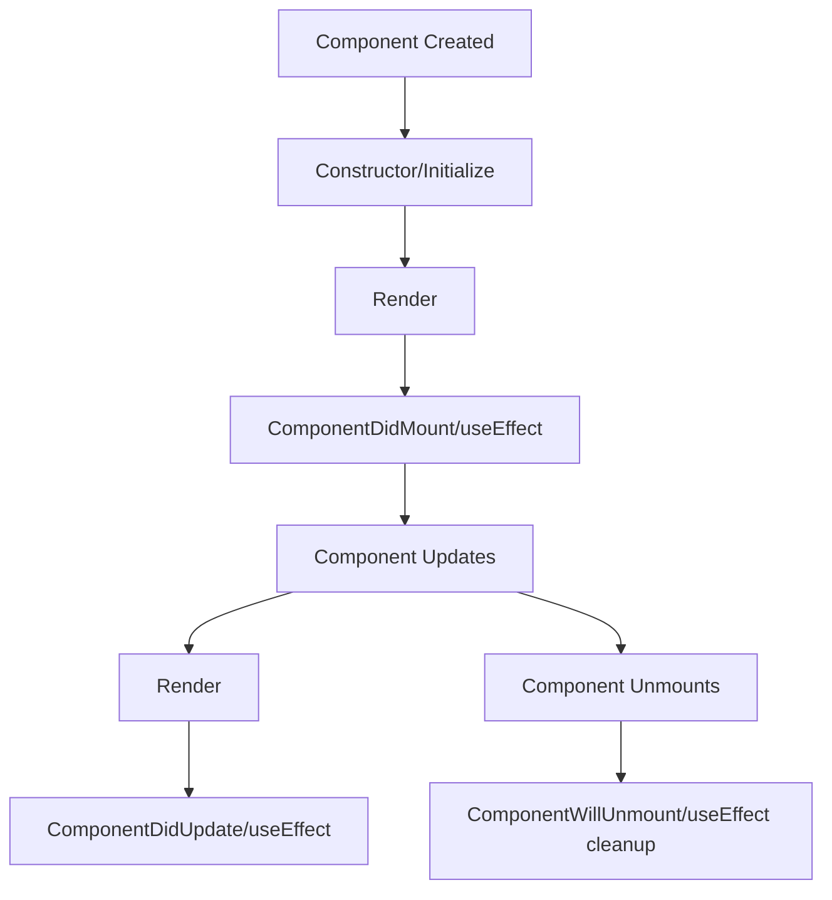
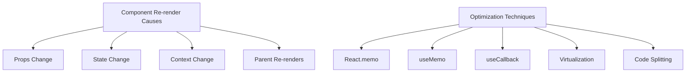

# Module 6: React Essentials

<!-- This document serves as both documentation and presentation slides -->

---

## Overview

<div class="instructor-led">Instructor-led content</div>
<div class="self-led">Self-led content</div>
<div class="asynchronous">Asynchronous learning</div>

In this module, we'll explore the fundamentals of React, the foundation of React Native development.

Note: This module is crucial for understanding React Native. Even if participants have React experience, the module covers important concepts that transfer to React Native. When presenting this slide, emphasize that React is the foundation of React Native, and all concepts learned here will directly apply to mobile development. Highlight how this module bridges previous JavaScript/TypeScript knowledge with upcoming React Native modules. For participants with different backgrounds (web, iOS, Android), point out that this module creates a common foundation. This is a good time to gauge the room's experience with React - ask for a show of hands for those who have used React before, and determine if you need to adjust your pace accordingly. For participants with strong React skills, mention they'll still benefit from TypeScript integration examples and the React-to-React-Native connection points.

---

## Learning Objectives

By the end of this module, you will be able to:

- Understand React's core concepts and philosophy
- Create and manage components effectively
- Implement data flow using props and state
- Use modern React hooks for state and side effects
- Apply performance optimization techniques
- Build reusable component architectures

---

## Prerequisites

- JavaScript ES6+ knowledge
- TypeScript fundamentals
- Understanding of web concepts

<div class="react-dev">If you're already familiar with React, you can skim this module for review</div>

---

## Introduction to React

<!-- Documentation-only start -->
React is a JavaScript library for building user interfaces, particularly single-page applications. It's maintained by Meta (formerly Facebook) and a community of developers.
<!-- Documentation-only end -->

- Created by Facebook (now Meta) in 2013
- Declarative, component-based architecture
- Virtual DOM for efficient rendering
- One-way data flow
- Extensive ecosystem

Note: React was developed internally at Facebook before being open-sourced. It was created to solve specific problems with building complex UIs. React Native extends this philosophy to mobile app development. When presenting this introduction, provide historical context about how React emerged as a solution to Facebook's UI scaling challenges. Explain how Jordan Walke created it in 2011, and it was open-sourced in 2013. Emphasize that React revolutionized UI development by introducing a component-based approach that was more efficient and maintainable than earlier frameworks. The Virtual DOM concept is particularly important - describe it as a lightweight copy of the actual DOM that React uses to calculate the most efficient way to update the actual DOM. This optimization significantly improves performance in complex applications. Point out that React's one-way data flow (unidirectional data binding) makes applications more predictable and easier to debug compared to two-way data binding patterns. Mention that React doesn't dictate other architectural choices, allowing it to be integrated with many different tech stacks, which contributed to its rapid adoption. Highlight that understanding React deeply will make learning React Native significantly easier, as React Native leverages the same core principles but replaces the DOM with native mobile components.

---

## React Philosophy

> "Learn once, write anywhere"

This differs from traditional "write once, run anywhere" philosophies.

React focuses on:

- The view layer
- Composition over inheritance
- Declarative vs imperative programming
- Component reusability

---

## React vs React Native

| React | React Native |
|-------|--------------|
| Uses DOM for rendering | Uses native components |
| `<div>`, `<span>`, etc. | `<View>`, `<Text>`, etc. |
| CSS for styling | StyleSheet API |
| Web platform APIs | Native platform APIs |
| Single-threaded | Multi-threaded (JS and native) |

Note: When presenting this crucial comparison slide, emphasize that React and React Native share the same fundamental philosophy and programming model, but with different rendering targets and APIs. Begin by explaining that React targets browser DOM while React Native targets mobile platform APIs. Point out that this table highlights the most important differences participants need to understand. Dive deeper into the component difference - in React web we use divs, spans, etc., but in React Native we use platform-agnostic components like View and Text that get translated to native UI components. Discuss the styling differences: in React web we use CSS (or CSS-in-JS), while React Native uses a subset of CSS properties via the StyleSheet API with flexbox-centered layouts. Highlight the performance architecture differences - React Native's multi-threaded approach with a JavaScript thread and a native UI thread connected by a "bridge" (in classic architecture) or "fabric" (in the new architecture). This is fundamentally different from web React's single-threaded model. For participants coming from web development, emphasize that they'll need to adapt to React Native's layout system and platform constraints. For native developers, emphasize how the component model makes UI development more efficient. This is a slide worth spending extra time on as it sets expectations properly for the React Native specific content coming later.

---

## JSX: JavaScript XML

JSX allows you to write HTML-like syntax within JavaScript.

```jsx
// This is JSX
const element = <h1>Hello, world!</h1>;

// Compiled to:
const element = React.createElement('h1', null, 'Hello, world!');
```

Note: JSX is a syntax extension, not a language. It gets transformed to regular JavaScript function calls during the build process. When presenting this slide, it's vital to clearly explain what JSX actually is - a syntax extension that allows us to write HTML-like code within JavaScript. Emphasize that JSX is not actually HTML, but a syntactic sugar that makes UI code more readable and intuitive. Show the parallel between the JSX syntax and the compiled React.createElement() calls that Babel or TypeScript will generate during the build process. This is a great opportunity to demystify what's happening "under the hood." Discuss how JSX was initially controversial in the JavaScript community because it mixed markup with logic, breaking the separation of concerns pattern that was popular. However, React's component model is based on the idea that rendering logic is inherently coupled with UI logic. Walk through how JSX expressions are just JavaScript expressions, and how this creates a seamless integration between markup and logic. For participants coming from template-based frameworks (like Angular), highlight that JSX gives you the full power of a programming language (JavaScript) to build UIs, rather than being limited to template syntax. Mention that JSX in React Native follows exactly the same principles, just with different base components, which is why this concept transfers directly.

---

## JSX Features

```tsx
// Using expressions in JSX
function Greeting({ name, age }: { name: string; age: number }) {
  return (
    <div className="greeting">
      <h1>{name}'s Prescription</h1>
      <p>Patient age: {age}</p>
      {age >= 18 ? <AdultDosage /> : <ChildDosage />}
    </div>
  );
}
```

- JSX expressions use curly braces `{}`
- Can include any valid JavaScript expression
- Attributes use camelCase (`className` not `class`)
- Self-closing tags must end with `/>`

---

## Component Types

<div style="display: flex; justify-content: space-around;">
<div>

### Functional (Modern)

```tsx
function Medication({ name, dosage }: MedicationProps) {
  return (
    <div>
      <h3>{name}</h3>
      <p>Dosage: {dosage}</p>
    </div>
  );
}
```

</div>
<div>

### Class (Legacy)

```tsx
class Medication extends React.Component<MedicationProps> {
  render() {
    return (
      <div>
        <h3>{this.props.name}</h3>
        <p>Dosage: {this.props.dosage}</p>
      </div>
    );
  }
}
```

</div>
</div>

Note: When presenting this slide on component types, explain the historical context and evolution of React. Start by noting that class components were the original way to create stateful components in React before the introduction of Hooks in 2019 (React 16.8). Explain that understanding both types is important because developers will encounter class components in legacy codebases. Highlight the key differences: class components use the class syntax, require extending React.Component, use lifecycle methods, and access props through this.props. In contrast, functional components are just JavaScript functions that take props as an argument and return JSX. They're more concise, easier to test, and with Hooks, have the same capabilities as class components. When discussing the examples, point out the syntax differences in how props are accessed and how the JSX is returned. Emphasize that the official React recommendation is to use functional components with Hooks for all new development. Class components require understanding JavaScript's 'this' binding, which can be confusing for beginners. This is a good time to ask participants if they have experience with class components and address any questions about the differences. For those coming from object-oriented programming backgrounds, note that while class components might initially feel more familiar, functional components with Hooks better represent modern JavaScript practices and React's future direction. In the React Native context, all modern React Native code examples and libraries predominantly use functional components.

---

## Component Lifecycle

<!-- Documentation-only start -->
Components go through a series of lifecycle events. Understanding this process is crucial for implementing features at the right time during a component's existence.
<!-- Documentation-only end -->



Note: When presenting the component lifecycle slide, use this diagram to explain how React components go through different phases during their existence. Begin by explaining that understanding the component lifecycle is crucial for executing code at the right times - like fetching data when a component mounts or cleaning up resources when it unmounts. Walk through each stage chronologically: Component Creation (instantiation), Constructor/Initialization (setting up initial state), Render (determining what to display), ComponentDidMount/useEffect (side effects after first render), Component Updates (handling prop or state changes), ComponentDidUpdate/useEffect (side effects after updates), and finally Component Unmounts (cleanup with ComponentWillUnmount or useEffect cleanup). Highlight that in class components, these different phases have explicit lifecycle methods (componentDidMount, componentDidUpdate, etc.), while in functional components, the useEffect hook handles multiple lifecycle phases depending on its configuration. This is a good time to emphasize how React's lifecycle model encourages proper resource management and performance optimization. Make connections to how this applies in the React Native context, where proper lifecycle management is even more important for mobile performance. For participants with native mobile development backgrounds, draw parallels to view lifecycle methods in iOS (viewDidLoad, viewWillAppear) or Android (onCreate, onResume) for better context.

--

### Functional Component Lifecycle with Hooks

```tsx
import React, { useState, useEffect } from 'react';

function MedicationTimer({ medicine }: { medicine: string }) {
  // Similar to constructor/initialization
  const [seconds, setSeconds] = useState(0);
  const [isActive, setIsActive] = useState(false);
  
  // Combines componentDidMount, componentDidUpdate, componentWillUnmount
  useEffect(() => {
    let interval: number | null = null;
    
    if (isActive) {
      // Setup (componentDidMount/componentDidUpdate)
      interval = window.setInterval(() => {
        setSeconds(seconds => seconds + 1);
      }, 1000);
    }
    
    // Cleanup (componentWillUnmount)
    return () => {
      if (interval) clearInterval(interval);
    };
  }, [isActive]); // Dependency array controls when effect runs
  
  // Render
  return (
    <div>
      <p>{medicine} reminder: {seconds} seconds</p>
      <button onClick={() => setIsActive(!isActive)}>
        {isActive ? 'Pause' : 'Start'}
      </button>
    </div>
  );
}
```

Note: When presenting this code example of functional component lifecycle with hooks, walk through each part methodically as it demonstrates several key concepts. Begin by highlighting that this MedicationTimer component shows how useEffect replaces multiple lifecycle methods from class components. Start with the state initialization at the top - useState(0) for seconds and useState(false) for isActive. Explain that these replace the state initialization in a class constructor. Then focus on the useEffect hook, which is the core of the example. Emphasize its three main parts: 1) The setup code inside the function body that creates an interval when isActive is true, 2) The cleanup function that's returned and clears the interval, and in class components would live in componentWillUnmount, and 3) The dependency array [isActive] that controls when the effect runs (comparable to comparing prevProps/prevState in componentDidUpdate). Walk through the execution flow: when isActive changes from false to true, the interval starts, and the seconds state increases every second. When isActive changes back to false, the cleanup function runs first to clear the previous interval, then the effect sets up a new one (which doesn't create an interval since isActive is false). Demonstrate what happens if we were to omit the dependency array (effect runs after every render) or provide an empty array (effect runs only on mount/unmount). Finally, point out how the toggle button in the render function directly updates the isActive state, triggering our effect. This example demonstrates the elegant way hooks compose multiple lifecycle behaviors in a single, focused piece of code. For React Native, this pattern is essential for managing timers, animation frames, subscriptions, and other resources that need proper cleanup.

---

## Props: Component Communication

<!-- Documentation-only start -->
Props (short for "properties") are a way to pass data from parent to child components. They are read-only and help create reusable components.
<!-- Documentation-only end -->

```tsx
// Parent component
function Prescription() {
  return (
    <div>
      <h2>Your Prescription</h2>
      <Medication 
        name="Ibuprofen"
        dosage="200mg"
        frequency="every 6 hours"
        maxDose={4}
      />
    </div>
  );
}

// Child component
interface MedicationProps {
  name: string;
  dosage: string;
  frequency: string;
  maxDose: number;
}

function Medication({ name, dosage, frequency, maxDose }: MedicationProps) {
  return (
    <div className="medication-card">
      <h3>{name}</h3>
      <p>Take {dosage} {frequency}</p>
      <p>Maximum {maxDose} doses per day</p>
    </div>
  );
}
```

Note: When presenting the Props slide, emphasize that props are the primary mechanism for component communication in React's unidirectional data flow model. Start by explaining that "props" is short for "properties" and represents data that is passed from a parent component to a child component. In this example, thoroughly walk through how the Prescription component (parent) passes different types of data to the Medication component (child): strings for name, dosage, and frequency, and a number for maxDose. Highlight the TypeScript interface MedicationProps that defines the contract for what props the component accepts - this is a key benefit of using TypeScript with React. Point out the destructuring pattern in the function parameter ({ name, dosage, frequency, maxDose }) which is the modern way to access props in functional components. Emphasize that props are read-only, meaning a component should never modify its own props. This constraint is fundamental to React's data flow model and helps prevent unexpected side effects. Compare this to two-way binding in some other frameworks, explaining that while it might seem more convenient initially, one-way data flow makes applications more predictable and easier to debug as data changes can only happen at well-defined points. This concept transfers directly to React Native - the mechanism for passing props is identical, only the component types differ. For native mobile developers, draw a parallel to how view configuration is typically passed down view hierarchies in UIKit or Android's View system, but with a more standardized pattern.

---

## State: Component Memory

<!-- Documentation-only start -->
While props are passed from parent to child, state is managed within a component. State represents data that changes over time and affects a component's rendering.
<!-- Documentation-only end -->

```tsx
import React, { useState } from 'react';

function MedicationTracker() {
  // Initialize state with useState hook
  const [taken, setTaken] = useState(0);
  const [lastTaken, setLastTaken] = useState<Date | null>(null);
  
  const takeDose = () => {
    // Update state
    setTaken(taken + 1);
    setLastTaken(new Date());
  };
  
  return (
    <div>
      <h3>Medication Tracker</h3>
      <p>Doses taken today: {taken}</p>
      {lastTaken && <p>Last taken: {lastTaken.toLocaleTimeString()}</p>}
      <button onClick={takeDose}>Take Dose</button>
    </div>
  );
}
```

Note: When presenting the State slide, begin by contrasting state with props: while props are passed down from parents, state is managed internally by a component. Explain that state represents data that can change over time and affects what the component renders. In this MedicationTracker example, walk through each part methodically. First, highlight the two useState declarations: one for tracking the number of doses taken (a number) and another for tracking when the last dose was taken (a Date object or null). Point out the TypeScript typing with useState<Date | null> that ensures type safety. Then explain the takeDose function, which demonstrates how state is updated through the setter functions (setTaken and setLastTaken). Emphasize that we never directly modify state variables (we don't do taken++ for example) - we always use the setter functions. This is crucial for React to know when to re-render components. When discussing the JSX returned from the component, point out how state values are used directly in the rendering logic, and how conditional rendering works with the lastTaken state (only showing the last taken time if it exists). Explain that any state changes trigger React to re-render the component, efficiently updating only the parts of the DOM that need to change. Highlight the batching behavior - React groups multiple state updates in the same event handler for performance. This is especially important in React Native where performance concerns are amplified on mobile devices. For native developers, compare this to managing UI state in traditional mobile development, highlighting how React's declarative approach simplifies state management compared to imperative UI updates.

--

### State vs Props

| Props | State |
|-------|-------|
| Passed from parent | Defined in component |
| Read-only | Can be updated |
| Changing props triggers render | Changing state triggers render |
| Child cannot modify | Component owns and controls |
| Used for configuration | Used for interactivity |

Note: When presenting this comparison slide between props and state, emphasize that understanding this distinction is foundational to working effectively with React. Begin by explaining that this table summarizes the key differences between these two core React concepts. Walk through each row of the comparison, highlighting the origin difference (props come from parent components, state is defined within the component itself), the mutability difference (props are read-only while state can be updated), and the rendering behavior (both trigger re-renders when they change). Emphasize the ownership model - a component can't modify its props directly, but it has complete control over its state. The purpose row is particularly important: props are primarily for configuration and customization of components from the outside, while state is for handling interactivity and data that changes over time. Use a real-world analogy to help solidify this understanding: props are like parameters passed to a function - they configure how the function behaves but can't be changed by the function itself. State is like variables declared inside the function - the function controls them entirely and can modify them as needed. For participants coming from different backgrounds, provide relevant comparisons: for web developers, compare to HTML attributes vs JavaScript variables; for iOS developers, compare to initializers vs instance variables; for Android developers, compare to XML attributes vs class fields. This distinction is identical in React Native, so this understanding transfers directly to mobile development.

---

## Hooks: Functional Component Superpowers

<!-- Documentation-only start -->
Hooks were introduced in React 16.8 to allow functional components to use state and other React features without writing a class. They've become the preferred way to build React components.
<!-- Documentation-only end -->

Core Hooks:

- `useState`: Manage state
- `useEffect`: Handle side effects
- `useContext`: Access context
- `useRef`: Reference DOM or persist values
- `useMemo`: Memoize expensive calculations
- `useCallback`: Memoize functions
- `useReducer`: Complex state logic

<div class="platform-specific">
Hooks follow specific rules:
- Only call hooks at the top level
- Only call hooks from React functions
</div>

Note: When presenting this introduction to Hooks, emphasize that Hooks represent one of the most significant paradigm shifts in React's history. Begin by explaining that Hooks were introduced in React 16.8 (February 2019) to solve several problems with class components: complex components became difficult to understand, reusing stateful logic between components was challenging, and classes can be confusing for both humans and machines (optimization). Walk through each of the core hooks listed, providing a brief explanation of each: useState manages local state, useEffect handles side effects (data fetching, subscriptions, DOM manipulation), useContext accesses React's Context API for global state, useRef creates mutable references that persist across renders, useMemo optimizes expensive calculations, useCallback optimizes function references, and useReducer handles complex state logic (similar to Redux). Highlight the rules of hooks displayed in the platform-specific callout - these rules are critical for hooks to work correctly. Only call hooks at the top level (not inside conditions, loops, or nested functions) to ensure hooks are called in the same order on every render. Only call hooks from React function components or custom hooks, not regular JavaScript functions. Take time to explain that these rules enable React's "hooks system" to correctly preserve state between renders. Emphasize that hooks completely change how we approach React development, allowing for more functional programming patterns and better composition of logic. For participants coming from React class components, highlight how much more concise and focused hook-based code is. For React Native development, note that all modern React Native code uses hooks extensively, so this knowledge directly transfers to mobile development.

--

### useState

```tsx
import React, { useState } from 'react';

/**
 * Medication counter component
 * Tracks remaining pills and alerts when running low
 */
function MedicationCounter() {
  // State declaration with initial value
  const [count, setCount] = useState(30);
  
  const takePill = () => {
    // State update function
    setCount(prevCount => prevCount - 1);
  };
  
  return (
    <div className="med-counter">
      <h3>Medication Remaining</h3>
      <p className={count < 5 ? "warning" : ""}>
        Pills remaining: {count}
      </p>
      <button onClick={takePill} disabled={count <= 0}>
        Take Pill
      </button>
      {count <= 5 && (
        <p>Please refill your prescription soon!</p>
      )}
    </div>
  );
}
```

Note: When presenting this useState hook example, use it to demonstrate how state management works in functional components. Begin by explaining that the useState hook is the most commonly used hook, serving as the foundation for component interactivity. Walk through the MedicationCounter component step by step. First, identify the state declaration: const [count, setCount] = useState(30). Explain the array destructuring syntax - the first element (count) is the current state value, and the second element (setCount) is a function to update that value. The argument to useState(30) is the initial state value. Show how the takePill function uses the functional update form of setState by passing a function that receives the previous state value (prevCount => prevCount - 1) rather than directly setting count - 1. This is important for ensuring updates based on previous state are always accurate, especially when multiple updates might be batched. Point out the conditional rendering that shows the "Please refill" message when the count is low, and the conditional class name that applies a warning style when below 5 pills. Highlight the disabled attribute on the button that prevents further clicks when count reaches zero, showing how state can directly control UI behavior. This component shows several React patterns: state-based UI updates, derived values (the warning class), conditional rendering, and events modifying state. Take time to explain how this differs from imperative UI programming that native developers might be used to, where you'd explicitly update UI elements in response to user events. In React's declarative model, you describe how the UI should look based on state, and React handles updating the DOM. For React Native development, highlight that this exact same pattern is used, only with native UI components rendered instead of HTML elements.

--

### useEffect

```tsx
import React, { useState, useEffect } from 'react';

/**
 * Component that tracks medication schedule
 * @param {object} props - Component props
 * @param {string} props.medicationName - Name of medication
 * @param {number} props.hourInterval - Hours between doses
 */
function MedicationReminder({ medicationName, hourInterval }: 
  { medicationName: string, hourInterval: number }) {
  
  const [lastTaken, setLastTaken] = useState<Date | null>(null);
  const [nextDue, setNextDue] = useState<Date | null>(null);
  const [isOverdue, setIsOverdue] = useState(false);
  
  // Effect for timer setup
  useEffect(() => {
    // Skip if no last taken time
    if (!lastTaken) return;
    
    // Calculate next due time
    const next = new Date(lastTaken);
    next.setHours(next.getHours() + hourInterval);
    setNextDue(next);
    
    // Setup interval to check if overdue
    const intervalId = setInterval(() => {
      const now = new Date();
      setIsOverdue(next <= now);
    }, 30000); // Check every 30 seconds
    
    // Cleanup function
    return () => clearInterval(intervalId);
  }, [lastTaken, hourInterval]); // Dependency array
  
  return (
    <div className={isOverdue ? "warning" : ""}>
      <h3>{medicationName} Reminder</h3>
      {lastTaken && <p>Last taken: {lastTaken.toLocaleString()}</p>}
      {nextDue && <p>Next dose: {nextDue.toLocaleString()}</p>}
      {isOverdue && <p>OVERDUE: Please take your medication</p>}
      <button onClick={() => setLastTaken(new Date())}>
        Take Medication
      </button>
    </div>
  );
}
```

Note: When presenting this useEffect hook example, emphasize that useEffect is probably the most conceptually challenging hook to master, yet it's incredibly powerful. Begin by explaining that "side effects" in React terms refer to operations that affect something outside the scope of the function component itself - API calls, subscriptions, timers, and manual DOM manipulations. Walk through this MedicationReminder component methodically. First, note the three pieces of state: lastTaken (when medication was last taken), nextDue (when next dose is due), and isOverdue (whether the current time has passed the next due time). The real focus is the useEffect hook. Explain that useEffect takes two arguments: a function containing the effect code, and an array of dependencies that determine when the effect runs. In this example, point out how the effect first checks if lastTaken exists, and if not, returns early. Then it calculates the next due time based on lastTaken and hourInterval, sets up an interval to check if the medication is overdue every 30 seconds, and returns a cleanup function that clears the interval. The dependency array [lastTaken, hourInterval] means this effect runs when either of those values changes. Highlight the cleanup function pattern - the function returned from the effect is called before the effect runs again or when the component unmounts. This prevents memory leaks from lingering intervals or subscriptions. The component demonstrates several best practices: early return for conditionals, cleanup to prevent memory leaks, and a focused effect with proper dependencies. For React Native developers, emphasize that this pattern is crucial for performance in mobile apps - memory leaks from uncleaned effects can cause significant performance degradation or even crashes on mobile devices. React Native uses this exact same pattern, and timers especially need proper cleanup in mobile applications.

--

### useRef

```tsx
import React, { useRef, useEffect, useState } from 'react';

/**
 * Component for medication adherence tracking
 * Uses ref to access DOM element and store non-state values
 */
function MedicationAdherence() {
  // Ref for input element
  const inputRef = useRef<HTMLInputElement>(null);
  // Ref for storing previous value (doesn't trigger re-render)
  const prevDosesRef = useRef<number>(0);
  const [doses, setDoses] = useState(0);
  const [streak, setStreak] = useState(0);
  
  // Focus the input on mount
  useEffect(() => {
    if (inputRef.current) {
      inputRef.current.focus();
    }
  }, []);
  
  // Track changes in doses to update streak
  useEffect(() => {
    if (doses > prevDosesRef.current) {
      setStreak(streak + 1);
    }
    prevDosesRef.current = doses;
  }, [doses, streak]);
  
  return (
    <div>
      <h3>Medication Adherence Tracker</h3>
      <p>Current streak: {streak} days</p>
      <p>Doses taken: {doses}</p>
      <input 
        ref={inputRef}
        type="date" 
        onChange={() => setDoses(doses + 1)}
      />
    </div>
  );
}
```

Note: When presenting the useRef hook slide, explain that useRef addresses two specific needs in React components that aren't covered by other hooks. First, it provides a way to access DOM elements directly (similar to document.getElementById but integrated with React). Second, it offers a way to persist values between renders without triggering re-renders when those values change. Start by explaining that the MedicationAdherence component demonstrates both use cases. Walk through the two useRef declarations - inputRef for DOM access and prevDosesRef for persisting a value between renders. The inputRef is used in the first useEffect hook to focus the input element when the component mounts, demonstrating the DOM manipulation use case. This is a common pattern for accessibility features, form focusing, or measurements. The prevDosesRef is used in the second useEffect to track the previous value of doses between renders, allowing the component to determine if the doses value has increased (triggering a streak increment). This demonstrates using useRef as a "instance variable" that persists across renders without causing re-renders when changed. Compare this to state - if prevDoses were a state value, changing it would trigger another render cycle, potentially causing an infinite loop. Emphasize that modifying ref.current doesn't trigger a re-render, unlike setState. For React Native developers, note that while React Native doesn't have a DOM, useRef is still valuable for the second purpose (persisting values) and for referencing component instances. In React Native, refs can also be used to call imperative methods on components (like scrollToPosition on a ScrollView). This pattern is essential for advanced React and React Native development, especially when integrating with non-React or imperative APIs.

--

### Custom Hooks: Reusable Logic

```tsx
import { useState, useEffect } from 'react';

/**
 * Custom hook for medication reminders
 * @param {number} hoursBetweenDoses - Hours between medication doses
 * @returns {object} Reminder state and functions
 */
function useMedicationReminder(hoursBetweenDoses: number) {
  const [doses, setDoses] = useState<Date[]>([]);
  const [nextDue, setNextDue] = useState<Date | null>(null);
  const [isOverdue, setIsOverdue] = useState(false);
  
  // Calculate next due time when doses change
  useEffect(() => {
    if (doses.length === 0) {
      setNextDue(null);
      setIsOverdue(false);
      return;
    }
    
    // Sort doses by date (newest first)
    const sortedDoses = [...doses].sort((a, b) => b.getTime() - a.getTime());
    const lastDose = sortedDoses[0];
    
    // Calculate next due time
    const next = new Date(lastDose);
    next.setHours(next.getHours() + hoursBetweenDoses);
    setNextDue(next);
    
    // Check if overdue
    const checkOverdue = () => {
      const now = new Date();
      setIsOverdue(next <= now);
    };
    
    // Check immediately and set interval
    checkOverdue();
    const interval = setInterval(checkOverdue, 60000);
    
    return () => clearInterval(interval);
  }, [doses, hoursBetweenDoses]);
  
  // Function to record a dose
  const takeDose = () => {
    setDoses([...doses, new Date()]);
  };
  
  return {
    doses,
    nextDue,
    isOverdue,
    takeDose
  };
}

// Usage
function MedicationTracker() {
  const { doses, nextDue, isOverdue, takeDose } = useMedicationReminder(8);
  
  return (
    <div className={isOverdue ? "warning" : ""}>
      <h3>Medication Tracker</h3>
      <p>Doses taken: {doses.length}</p>
      {nextDue && <p>Next dose due: {nextDue.toLocaleTimeString()}</p>}
      {isOverdue && <p>OVERDUE: Please take your medication</p>}
      <button onClick={takeDose}>Take Dose</button>
    </div>
  );
}
```

Note: When presenting this custom hooks slide, emphasize that custom hooks represent one of the most powerful patterns in modern React development. Begin by explaining that custom hooks are a mechanism for extracting and reusing stateful logic between components without changing the component hierarchy (unlike higher-order components or render props). Stress that custom hooks aren't a new API feature but a convention that leverages existing hooks. Walk through the useMedicationReminder custom hook in detail. First, note that it follows the naming convention of starting with "use" - this isn't just a style choice but signals to React and linting tools that this function follows the rules of hooks. The hook encapsulates complex logic for tracking medication doses, calculating when the next dose is due, and determining if a dose is overdue. It manages three pieces of state (doses, nextDue, isOverdue) and contains a useEffect that handles the timing calculations and cleanup. Point out how the hook returns an object with values and functions that components can use, creating a clean API. Then demonstrate the usage in the MedicationTracker component, showing how it dramatically simplifies the component by extracting all the complex timing logic. This pattern is essential for maintaining manageable component sizes as applications grow. Emphasize that custom hooks are the preferred way to share logic between components in modern React. They're more flexible than HOCs or render props because they don't add extra components to the tree. For React Native development, custom hooks are even more valuable because they can encapsulate platform-specific code, device APIs, or animations while keeping components clean and focused. Custom hooks are widely used in React Native for handling device orientation, network connectivity, permissions, and other mobile-specific concerns.

---

## Lists and Keys

```tsx
import React from 'react';

interface Medication {
  id: string;
  name: string;
  dosage: string;
  schedule: string;
}

function MedicationList({ medications }: { medications: Medication[] }) {
  return (
    <div>
      <h2>Your Medications</h2>
      <ul>
        {medications.map(medication => (
          // Key helps React identify which items have changed
          <li key={medication.id} className="medication-item">
            <h3>{medication.name}</h3>
            <p>Dosage: {medication.dosage}</p>
            <p>Schedule: {medication.schedule}</p>
          </li>
        ))}
      </ul>
    </div>
  );
}
```

- Always use keys when rendering lists
- Keys should be unique among siblings
- Avoid using index as key (unless list is static)
- Keys help React identify changes efficiently

Note: When presenting the Lists and Keys slide, emphasize that rendering collections of data is one of the most common operations in React applications, and keys are critical for this to work efficiently. Begin by explaining the purpose of the keys prop when rendering lists - it helps React identify which items have changed, been added, or been removed, and is essential for maintaining component state and preventing unnecessary re-renders. Walk through the MedicationList component example, highlighting the array.map method that transforms an array of medication objects into an array of JSX elements. Point out that each list item has a unique key attribute set to medication.id, which serves as a stable identifier for each item. Explain the four key points listed: keys are required for list items, keys must be unique among siblings (not globally), index is an anti-pattern as a key for dynamic lists (though acceptable for static ones), and keys enhance performance by allowing React to minimize DOM operations. Delve deeper into the problems with using array indices as keys - if items can be added, removed, or reordered, indices don't stably identify items across renders, leading to potential state bugs and performance issues. Provide a real-world example of what happens without proper keys: if a user is typing in an input field in a list item and the list reorders, React might associate the input with a different item, causing the UI to appear broken. For React Native developers, emphasize that this pattern is identical in React Native - the FlatList and SectionList components in React Native use keys internally for the same performance reasons, but often abstract the key requirement away through a keyExtractor prop. This concept directly transfers to mobile development where list performance is even more critical due to device constraints.

---

## Conditional Rendering

<!-- Documentation-only start -->
Conditional rendering in React allows you to create dynamic UIs that display different components or elements based on the application state.
<!-- Documentation-only end -->

```tsx
import React from 'react';

interface MedicationProps {
  name: string;
  requiresPrescription: boolean;
  inStock: boolean;
  dosage?: string; // Optional prop
}

function MedicationDetails({ 
  name, 
  requiresPrescription,
  inStock,
  dosage 
}: MedicationProps) {
  
  // If-else approach
  if (!inStock) {
    return <p>{name} is currently out of stock.</p>;
  }
  
  return (
    <div>
      <h3>{name}</h3>
      
      {/* Ternary operator */}
      {requiresPrescription 
        ? <p className="warning">Requires prescription</p>
        : <p>Available over the counter</p>
      }
      
      {/* Logical AND */}
      {dosage && <p>Recommended dosage: {dosage}</p>}
      
      {/* Element variables */}
      {(() => {
        if (requiresPrescription && inStock) {
          return <button>Request Prescription</button>;
        } else if (!requiresPrescription && inStock) {
          return <button>Add to Cart</button>;
        }
        return null;
      })()}
    </div>
  );
}
```

Note: When presenting the Conditional Rendering slide, emphasize that this concept is central to creating dynamic user interfaces in React. Begin by explaining that conditional rendering is the practice of showing different UI elements or components based on the current state or props. It's what makes React applications interactive and responsive to user input and data changes. Walk through the MedicationDetails component example, highlighting the four different conditional rendering patterns demonstrated: 1) If-else statements - the early return pattern shows how to conditionally render an entirely different component tree based on the inStock prop. 2) Ternary operator (?:) - a compact inline way to choose between two elements based on the requiresPrescription prop. 3) Logical AND (&&) - uses short-circuit evaluation to conditionally render an element only when a condition is true (dosage exists). 4) Immediately-invoked function expressions (IIFE) - a more complex approach that allows for multi-line conditional logic within JSX. For each pattern, discuss when it's most appropriate: if-else for completely different renders, ternaries for simple either/or choices, && for optional elements, and IIFEs for complex logic that can't be expressed with the other methods. Emphasize that these techniques are evaluated at render time, not just once during initialization. This is part of React's declarative paradigm - we describe what should be shown under different conditions, and React handles updating the UI when those conditions change. For React Native developers, note that these exact same patterns apply in React Native. The conditional rendering approach is particularly valuable in mobile apps for handling different device capabilities, user permissions, or authentication states.

---

## Component Composition

<!-- Documentation-only start -->
Component composition is a fundamental concept in React that involves combining smaller, specialized components to build more complex UIs. This approach encourages reusability and separation of concerns.
<!-- Documentation-only end -->

```tsx
import React, { ReactNode } from 'react';

// Base Card component
function Card({ title, children }: { title: string, children: ReactNode }) {
  return (
    <div className="card">
      <div className="card-header">{title}</div>
      <div className="card-body">{children}</div>
    </div>
  );
}

// Specialized Medication Card
function MedicationCard({ name, instructions, sideEffects }: {
  name: string;
  instructions: string;
  sideEffects: string[];
}) {
  return (
    <Card title={name}>
      <p>{instructions}</p>
      <h4>Side Effects</h4>
      <ul>
        {sideEffects.map((effect, index) => (
          <li key={index}>{effect}</li>
        ))}
      </ul>
    </Card>
  );
}

// Usage
function Prescription() {
  return (
    <div>
      <h2>Your Prescription</h2>
      <MedicationCard
        name="Amoxicillin"
        instructions="Take 1 tablet 3 times daily with food."
        sideEffects={[
          "Nausea",
          "Diarrhea",
          "Skin rash"
        ]}
      />
    </div>
  );
}
```

Note: When presenting the Component Composition slide, emphasize that composition is one of the core design principles in React that sets it apart from class-based inheritance patterns. Begin by explaining that composition in React means building complex components by combining simpler, more focused components - similar to the Unix philosophy of "do one thing and do it well." Walk through the example methodically, showing how it demonstrates composition in practice. Start with the base Card component, which is a generic container with a header and body. It accepts a title prop and uses the children prop to render any content passed to it. Then show the specialized MedicationCard component, which uses the Card component as its foundation but adds specific structure for medication information. Finally, demonstrate how the Prescription component composes these pieces together. This pattern allows for tremendous flexibility - the Card component can be reused in many contexts (not just for medications), and the children prop allows any content to be passed in. Emphasize that this is preferred over inheritance in React for several reasons: it's more flexible (mix and match components freely), more explicit (the component tree clearly shows what's being used), and avoids the fragile base class problem (changes to base classes can unexpectedly break subclasses). For React Native developers, highlight that this composition pattern is even more valuable in mobile development, where reusable UI components like cards, lists, and panels form the building blocks of consistent interfaces across screens. The composition pattern transcends the web/mobile boundary - it's the exact same conceptual approach in React Native, just with native components instead of DOM elements.

--

### Composition Patterns

```tsx
import React, { ReactNode } from 'react';

// Specialization via props
function Alert({ type, message }: { type: 'info' | 'warning' | 'error', message: string }) {
  return (
    <div className={`alert alert-${type}`}>
      {message}
    </div>
  );
}

// Containment via children
function TabPanel({ title, children }: { title: string, children: ReactNode }) {
  return (
    <div className="tab-panel">
      <h3>{title}</h3>
      <div className="panel-content">{children}</div>
    </div>
  );
}

// Specialized components
function PrescriptionInfo({ medication, dosage }: { medication: string, dosage: string }) {
  return (
    <TabPanel title="Prescription Information">
      <h4>{medication}</h4>
      <p>Dosage: {dosage}</p>
      <Alert type="info" message="Take with food" />
    </TabPanel>
  );
}
```

Note: When presenting the Composition Patterns slide, go deeper into specific patterns that leverage React's composition model. Begin by explaining that there are several established patterns for component composition in React, and this slide demonstrates three common ones. First, walk through the "Specialization via props" pattern shown by the Alert component. This component has a type prop that determines its appearance, allowing one component to serve multiple purposes (info, warning, or error alerts). Next, explain the "Containment via children" pattern demonstrated by the TabPanel component. This powerful pattern uses the children prop to create wrapper components that provide structure, styling, or behavior while allowing arbitrary content inside. The children prop is React's primary composition mechanism - similar to "slots" in other frameworks. Finally, show the "Specialized components" pattern with PrescriptionInfo, which composes both previous patterns. It uses TabPanel for containment and Alert as a specialized sub-component. Emphasize that these patterns can be mixed and matched to create a highly flexible component architecture. Compare this approach to inheritance-based systems where you might create a BaseAlert class with InfoAlert, WarningAlert, etc. subclasses. The composition approach is more flexible and easier to refactor as requirements change. For React Native developers, highlight that these composition patterns are identical in React Native. In fact, the core React Native components themselves follow these patterns - View for containment, specialized components like Button or ActivityIndicator, and composition of both in higher-level components. These patterns form the foundation of any well-structured React or React Native application.

--

### Higher-Order Components (HOCs)

```tsx
import React, { ComponentType, useState } from 'react';

// Higher-Order Component
function withLogging<P extends object>(
  WrappedComponent: ComponentType<P>
) {
  // Return a new component
  return function WithLoggingComponent(props: P) {
    console.log(`Component ${WrappedComponent.name} rendered with props:`, props);
    
    // Return the wrapped component with its props
    return <WrappedComponent {...props} />;
  };
}

// Component to enhance
function MedicationDisplay({ name, dosage }: { name: string, dosage: string }) {
  return (
    <div>
      <h3>{name}</h3>
      <p>Dosage: {dosage}</p>
    </div>
  );
}

// Enhanced component with logging
const LoggedMedicationDisplay = withLogging(MedicationDisplay);

// Usage
function Prescription() {
  return (
    <div>
      <LoggedMedicationDisplay 
        name="Lisinopril" 
        dosage="10mg daily" 
      />
    </div>
  );
}
```

Note: When presenting the Higher-Order Components (HOCs) slide, explain that HOCs are an advanced pattern that emerged before hooks as a way to reuse component logic. Begin by defining what a HOC is: a function that takes a component and returns a new enhanced component. It follows the higher-order function concept from functional programming. Walk through the withLogging HOC example step by step: 1) It's a function that accepts a component (WrappedComponent) as its parameter. 2) It returns a new functional component that renders the original component with its props spread. 3) Before rendering, it adds behavior - in this case, logging the component name and props to the console. Explain the TypeScript generics used (<P extends object>) that ensure type safety is maintained through the HOC. Then show how the HOC is applied to create LoggedMedicationDisplay from MedicationDisplay, and how this enhanced component is used just like any other component. Discuss common use cases for HOCs: adding logging, authentication checks, data fetching, or any cross-cutting concern that applies to multiple components. Emphasize that while hooks have replaced many use cases for HOCs, they're still valuable in certain scenarios: when you need to wrap a component (not just its behavior), when working with class components that can't use hooks, or when integrating with legacy code or libraries that expect HOCs. For React Native developers, note that HOCs are used in many React Native libraries, particularly for handling navigation, authentication, or device features. Understanding this pattern is important for working with these libraries, even if you primarily use hooks in your own code. The pattern applies identically in React Native.

--

### Render Props

```tsx
import React, { useState, ReactNode } from 'react';

// Component using render props pattern
interface ToggleProps {
  children: (state: { isOn: boolean; toggle: () => void }) => ReactNode;
}

function Toggle({ children }: ToggleProps) {
  const [isOn, setIsOn] = useState(false);
  
  const toggle = () => {
    setIsOn(!isOn);
  };
  
  // Pass state and handlers to children function
  return <>{children({ isOn, toggle })}</>;
}

// Usage with render props
function MedicationReminder() {
  return (
    <Toggle>
      {({ isOn, toggle }) => (
        <div>
          <h3>Medication Reminder</h3>
          <button onClick={toggle}>
            {isOn ? 'Turn Off Reminders' : 'Turn On Reminders'}
          </button>
          {isOn && (
            <div className="reminder-active">
              <p>Reminders are active</p>
              <p>We'll notify you when it's time to take your medication</p>
            </div>
          )}
        </div>
      )}
    </Toggle>
  );
}
```

Note: When presenting the Render Props slide, explain that this is another advanced pattern for sharing logic between components, developed before hooks. Begin by defining the render props pattern: passing a function as a prop to a component that determines what that component renders. The function receives state or methods from the component and returns JSX. Walk through the Toggle component example step by step: 1) It defines a children prop that's typed as a function receiving an object with isOn state and a toggle function, and returning ReactNode. 2) It manages its own state with useState. 3) Instead of rendering UI directly, it calls the children function, passing the state and toggle method as arguments. Then show the MedicationReminder component that uses Toggle. Instead of passing normal children elements, it passes a function that receives the isOn state and toggle function, and uses them to render a UI that changes based on the isOn state. Highlight the flexibility of this pattern - the Toggle component handles state management (the "logic"), while the using component controls rendering (the "presentation"). This creates a clear separation of concerns. Compare this to HOCs: render props don't create an extra component in the tree and make the relationship between components more explicit in JSX. Explain that while hooks have replaced many use cases for render props, they're still useful when a component needs to control what another component renders based on its internal state. For React Native developers, note that this pattern is used in some popular libraries, particularly for gestures, animations, or other interactions where timing or state determines what UI should render. The pattern works identically in React Native.

---

## Context API: Global State Management

<!-- Documentation-only start -->
The Context API provides a way to share data between components without having to explicitly pass props down through each level of the component tree. This is especially useful for global state like user preferences, themes, or authentication status.
<!-- Documentation-only end -->

```tsx
import React, { createContext, useContext, useState, ReactNode } from 'react';

// Step 1: Create a context
interface MedicationContextType {
  medications: Medication[];
  addMedication: (med: Medication) => void;
  removeMedication: (id: string) => void;
}

interface Medication {
  id: string;
  name: string;
  dosage: string;
}

// Create context with default values
const MedicationContext = createContext<MedicationContextType>({
  medications: [],
  addMedication: () => {},
  removeMedication: () => {}
});

// Step 2: Create a provider component
interface MedicationProviderProps {
  children: ReactNode;
}

function MedicationProvider({ children }: MedicationProviderProps) {
  const [medications, setMedications] = useState<Medication[]>([]);
  
  const addMedication = (medication: Medication) => {
    setMedications([...medications, medication]);
  };
  
  const removeMedication = (id: string) => {
    setMedications(medications.filter(med => med.id !== id));
  };
  
  // Provide context value to children
  return (
    <MedicationContext.Provider value={{ 
      medications, 
      addMedication, 
      removeMedication 
    }}>
      {children}
    </MedicationContext.Provider>
  );
}

// Step 3: Create custom hook to use the context
function useMedications() {
  const context = useContext(MedicationContext);
  if (context === undefined) {
    throw new Error('useMedications must be used within a MedicationProvider');
  }
  return context;
}

// Step 4: Use the context in components
function MedicationList() {
  const { medications, removeMedication } = useMedications();
  
  return (
    <div>
      <h3>Your Medications</h3>
      <ul>
        {medications.map(med => (
          <li key={med.id}>
            {med.name} - {med.dosage}
            <button onClick={() => removeMedication(med.id)}>Remove</button>
          </li>
        ))}
      </ul>
    </div>
  );
}

function AddMedicationForm() {
  const { addMedication } = useMedications();
  const [name, setName] = useState('');
  const [dosage, setDosage] = useState('');
  
  const handleSubmit = (e: React.FormEvent) => {
    e.preventDefault();
    addMedication({
      id: Date.now().toString(),
      name,
      dosage
    });
    setName('');
    setDosage('');
  };
  
  return (
    <form onSubmit={handleSubmit}>
      <input
        value={name}
        onChange={e => setName(e.target.value)}
        placeholder="Medication name"
      />
      <input
        value={dosage}
        onChange={e => setDosage(e.target.value)}
        placeholder="Dosage"
      />
      <button type="submit">Add Medication</button>
    </form>
  );
}

// App component with Provider
function MedicationApp() {
  return (
    <MedicationProvider>
      <h2>Medication Tracker</h2>
      <AddMedicationForm />
      <MedicationList />
    </MedicationProvider>
  );
}
```

Note: When presenting the Context API slide, emphasize that it provides a solution to the "prop drilling" problem in React applications. Begin by explaining what prop drilling is - passing props through multiple levels of components that don't actually need those props, just to get them to a deeply nested component. Context offers a way to share values between components without explicitly passing props through every level of the tree. Walk through the four-step process demonstrated in this comprehensive example: 1) Creating a context with createContext, including TypeScript interfaces defining the shape of the context data and a default value. 2) Creating a provider component (MedicationProvider) that manages state and exposes it via the Context.Provider. 3) Creating a custom hook (useMedications) that uses useContext to access the context data and provides error checking. 4) Building components that use the context through the custom hook. Examine the MedicationList and AddMedicationForm components that access and modify the shared context data without prop drilling. Finally, show how the MedicationApp component wraps everything in the provider. Highlight best practices: typed context, error checking in the hook, and the provider pattern. Discuss appropriate use cases for Context: theming, user authentication, localization, or any data needed by many components at different nesting levels. Emphasize that Context is not a replacement for all state management - it's not optimized for high-frequency updates and can cause unnecessary re-renders if overused. Local component state is still appropriate for UI state that doesn't need to be shared. For React Native developers, note that Context works exactly the same way in React Native and is commonly used for themes, authentication, and configuration that spans across screens.

---

## Performance Optimization

<!-- Documentation-only start -->
As React applications grow, performance optimization becomes important. React provides several ways to optimize rendering performance.
<!-- Documentation-only end -->



Note: When presenting the Performance Optimization slide, emphasize that as React applications grow in complexity, performance optimization becomes increasingly important. Begin with the Mermaid diagram that illustrates both the causes of re-renders and the optimization techniques available. Explain the four main causes of component re-renders: 1) Props Change - when a component receives new props from its parent. 2) State Change - when a component's internal state is updated. 3) Context Change - when a value in a Context the component consumes is modified. 4) Parent Re-renders - by default, when a parent component re-renders, all its children re-render too, even if their props haven't changed. Then transition to the optimization techniques shown in the diagram: React.memo prevents unnecessary re-renders when props haven't changed, useMemo caches expensive calculations, useCallback preserves function references, virtualization efficiently renders large lists (like React Native's FlatList or react-window for web), and code splitting reduces initial bundle size. Emphasize that optimization should be applied judiciously - premature optimization can make code more complex without meaningful benefits. The React development model encourages building for correctness first, then measuring performance, and optimizing only where needed. For React Native developers, highlight that performance optimization is even more critical in mobile applications due to device constraints. React Native has additional performance considerations like JavaScript-to-native bridge communication overhead, image optimization, and gesture handling that we'll cover in the React Native-specific modules.

--

### React.memo and useMemo

```tsx
import React, { useMemo } from 'react';

interface MedicationCalculatorProps {
  medications: {
    name: string;
    dosesPerDay: number;
    pillsPerDose: number;
    daysSupply: number;
  }[];
}

// Memoized component with React.memo
const MedicationCalculator = React.memo(
  function MedicationCalculator({ medications }: MedicationCalculatorProps) {
    // Expensive calculation memoized with useMemo
    const totalPills = useMemo(() => {
      console.log('Calculating total pills...');
      return medications.reduce((total, med) => {
        return total + (med.dosesPerDay * med.pillsPerDose * med.daysSupply);
      }, 0);
    }, [medications]); // Only recalculate when medications changes
    
    // Another expensive calculation
    const monthlyRefills = useMemo(() => {
      console.log('Calculating monthly refills...');
      return medications.map(med => {
        const pillsPerMonth = med.dosesPerDay * med.pillsPerDose * 30;
        const refillsNeeded = Math.ceil(pillsPerMonth / (med.daysSupply * med.dosesPerDay * med.pillsPerDose));
        return {
          name: med.name,
          refillsNeeded
        };
      });
    }, [medications]);
    
    return (
      <div>
        <h3>Medication Statistics</h3>
        <p>Total pills: {totalPills}</p>
        <h4>Monthly Refills Needed:</h4>
        <ul>
          {monthlyRefills.map((refill, index) => (
            <li key={index}>
              {refill.name}: {refill.refillsNeeded} refills
            </li>
          ))}
        </ul>
      </div>
    );
  }
);
```

Note: When presenting the React.memo and useMemo slide, focus on explaining these two critical performance optimization techniques. Begin with React.memo - a higher-order component that memoizes a component's render output based on its props. If a parent component re-renders but the child's props haven't changed, React.memo prevents the child from re-rendering unnecessarily. In the MedicationCalculator example, React.memo wraps the entire component function. Then explain useMemo, which memoizes the result of expensive calculations. Walk through the two useMemo examples in the component: totalPills calculation and monthlyRefills calculation. Note how each one has its own dependency array ([medications]) that determines when the calculation should be re-run. Emphasize that these calculations would normally run on every render, but useMemo ensures they only run when the medications array changes. Highlight the console.log statements that help visualize when calculations are performed. When discussing best practices, emphasize that these optimizations should be applied judiciously - not every component or calculation needs memoization. The added complexity is only worthwhile for expensive calculations or when preventing unnecessary renders creates a meaningful performance improvement. These optimizations are particularly important for: 1) Computationally expensive operations that don't need to run on every render, 2) Large lists or trees of components where re-rendering has a noticeable performance impact, and 3) Components that trigger expensive side effects when re-rendered. For React Native developers, explain that these optimizations are even more important in mobile applications where performance directly impacts battery life and user experience, especially on lower-end devices.

--

### useCallback

```tsx
import React, { useState, useCallback } from 'react';

interface Medication {
  id: string;
  name: string;
}

// Child component memoized to prevent unnecessary renders
const MedicationItem = React.memo(function MedicationItem({ 
  medication, 
  onSelect 
}: { 
  medication: Medication;
  onSelect: (id: string) => void;
}) {
  console.log(`Rendering ${medication.name}`);
  return (
    <li>
      {medication.name}
      <button onClick={() => onSelect(medication.id)}>
        Select
      </button>
    </li>
  );
});

function MedicationList() {
  const [medications] = useState<Medication[]>([
    { id: '1', name: 'Aspirin' },
    { id: '2', name: 'Ibuprofen' },
    { id: '3', name: 'Acetaminophen' }
  ]);
  const [selectedId, setSelectedId] = useState<string | null>(null);
  
  // Without useCallback, this function would be recreated
  // on every render, causing MedicationItem to re-render
  const handleSelect = useCallback((id: string) => {
    setSelectedId(id);
    console.log(`Selected medication: ${id}`);
  }, []);
  
  return (
    <div>
      <h3>Medications</h3>
      <ul>
        {medications.map(med => (
          <MedicationItem
            key={med.id}
            medication={med}
            onSelect={handleSelect}
          />
        ))}
      </ul>
      {selectedId && <p>Selected medication ID: {selectedId}</p>}
    </div>
  );
}
```

Note: When presenting the useCallback slide, explain that this hook complements useMemo but is specifically designed for memoizing functions. Begin by highlighting the key problem useCallback solves: in JavaScript, functions defined inside a component are recreated with new references on every render. This is typically fine, but causes problems when passing functions as props to memoized child components (using React.memo), as the new function reference will trigger a re-render even if the function's behavior hasn't changed. Walk through the example step by step: first, examine the MedicationItem component wrapped in React.memo, which takes a medication object and an onSelect function as props. It logs when it renders, helping visualize optimization effects. Then look at the parent MedicationList component, which uses useCallback to memoize the handleSelect function. Explain that without useCallback, this function would be recreated on every render, causing all MedicationItem components to re-render unnecessarily. The empty dependency array ([]) means this function is created once and never recreated (unless the component unmounts and remounts). Discuss when to use useCallback: 1) When passing functions to memoized child components (React.memo, useMemo), 2) When a function is a dependency of another hook like useEffect and you want to prevent the effect from running unnecessarily, and 3) When creating event handlers for frequently updated components. Emphasize that like all optimization techniques, useCallback adds complexity and should be used when there's a measurable performance benefit. For React Native developers, note that useCallback is particularly valuable in mobile applications where minimizing unnecessary rendering is crucial for smooth animations and responsive UIs, especially in list views and complex screen layouts where small performance improvements can significantly impact user experience.

---

## Exercise: Building a Medication Component

<div class="exercise">

### Task

Create a reusable medication component with TypeScript that displays medication information and tracks doses.

#### Requirements:

1. Use TypeScript with proper types and interfaces
2. Implement state management for tracking doses
3. Include a visual indicator when doses are due
4. Use appropriate hooks for side effects

#### Starter Code:

```tsx
import React, { useState, useEffect } from 'react';

// Define your types and interfaces here

function MedicationTracker() {
  // Implement the component
  return (
    <div>
      {/* Implement UI here */}
    </div>
  );
}

export default MedicationTracker;
```

#### Expected Output:

A functional component that:
- Displays medication details
- Allows tracking doses
- Shows visual indicator for dose timing
- Implements proper TypeScript typing

</div>

Note: When presenting the exercise slide, explain that this is a hands-on opportunity to apply the React concepts covered so far. This exercise is strategically designed to reinforce key React patterns in a practical context that aligns with the pharmacy/medication theme of the course. Begin by walking through the requirements: using TypeScript with proper interfaces (reinforcing type safety), implementing state management (applying useState), adding visual indicators based on state (conditional rendering), and using hooks for side effects (useEffect for timing). Emphasize that this exercise pulls together multiple concepts into a cohesive component. When reviewing the starter code, point out that it provides the basic structure but leaves the implementation details to the participants. This is intentional - it gives them enough scaffolding to get started without doing the work for them. The expected output section clearly defines what success looks like: a functional component that displays medication details, tracks doses, shows visual indicators for timing, and implements proper TypeScript typing. During the exercise time, circulate among participants to provide guidance and answer questions. Look for common issues: improper state initialization, missing dependency arrays in useEffect, type errors, or inefficient rendering patterns. Encourage participants to use the CSS classes defined in the course styles to make their components visually consistent. After the time limit, review a sample solution together, pointing out the key patterns and explaining design decisions. This exercise prepares participants for the more complex challenge that follows, building confidence in applying React concepts to practical problems.

---

## Challenge: Pharmacy Management Interface

<div class="challenge">

### Task

Build a more complex pharmacy management interface with multiple components, state management, and component composition.

#### Requirements:

1. Create a medication list component
2. Implement add/edit/delete functionality
3. Add a dosage reminder system
4. Implement context for sharing medication data
5. Apply performance optimizations where appropriate
6. Use TypeScript throughout

#### Components to Create:

1. `MedicationProvider` (context)
2. `MedicationList`
3. `MedicationForm`
4. `MedicationDetail`
5. `DosageReminder`

#### Advanced Features (optional):

- Implement local storage for persistence
- Add filtering and sorting options
- Create a statistics dashboard

</div>

Note: When presenting the challenge slide, emphasize that this represents a more comprehensive, real-world application of the concepts covered in the module. Unlike the exercise which focuses on a single component, this challenge requires building an entire mini-application with multiple interconnected components and state management. Begin by walking through the requirements: creating a medication list component, implementing CRUD operations, building a reminder system, using context for global state, applying performance optimizations, and using TypeScript throughout. Explain that this challenge intentionally incorporates nearly every major concept from the module - from basic component creation to advanced patterns like Context and performance optimization. The components to create section provides structure without being prescriptive, giving participants creative freedom while ensuring they build the necessary pieces. When discussing the advanced features, note that these are optional stretch goals for participants who finish early or want to further challenge themselves. These features (local storage, filtering/sorting, statistics dashboard) add real-world complexity that participants might encounter in production applications. Provide guidance on approaching the challenge: start by planning the component structure and data flow, then build the context provider and basic components before adding more complex features. Recommend breaking the work into manageable chunks and testing incrementally. During the challenge time, be available for questions but encourage participants to problem-solve independently or in groups. After the time limit, have volunteers share their solutions or present a reference implementation, discussing design decisions, trade-offs, and alternative approaches. This challenge serves as a capstone for the React Essentials module, preparing participants for the React Native-specific content that follows by ensuring they have a solid grasp of React fundamentals.

---

## Key Takeaways

- React is component-based with unidirectional data flow
- Modern React uses functional components with hooks
- Props are for passing data down, state is for component memory
- Context provides a way to share data across components
- Composition is preferred over inheritance for component reuse
- Performance optimizations should be applied judiciously

---

## Additional Resources

- [React Official Documentation](https://reactjs.org/docs/getting-started.html)
- [TypeScript React Cheatsheet](https://github.com/typescript-cheatsheets/react)
- [React Hooks API Reference](https://reactjs.org/docs/hooks-reference.html)
- [Performance Optimization in React](https://reactjs.org/docs/optimizing-performance.html)
- [React TypeScript Guide](https://react-typescript-cheatsheet.netlify.app/)

---

## Q&A

<!-- For documentation purposes only -->
<!-- 
This section is for collecting common questions and answers that arise during the course.
Instructors can use this to prepare for future sessions.
-->

Note: When wrapping up this module, use the Key Takeaways slide to reinforce the most important concepts. This is your opportunity to ensure participants leave with a clear understanding of React's fundamental principles before moving into React Native-specific content. Elaborate on each bullet point: 1) Component-based architecture with unidirectional data flow - emphasize how this predictable data flow pattern helps manage application complexity by ensuring data changes follow a consistent path. 2) Modern React's focus on functional components with hooks - highlight this as the current best practice and what participants will see in production React Native code. 3) Props for configuration vs. state for internal component memory - reinforce this critical distinction that affects how components are designed and composed. 4) Context for sharing data across component trees - position this as a powerful tool that should be used judiciously for truly global state. 5) Composition over inheritance - emphasize that this principle is central to React's philosophy and creates more flexible, maintainable components. 6) Performance optimizations applied where needed - remind participants that optimizations add complexity and should be applied based on measurement, not speculation.

For the Additional Resources slide, briefly describe each resource: The official React documentation provides comprehensive guides and API references; the TypeScript React Cheatsheet offers practical type patterns specific to React; the Hooks API Reference details each hook's purpose and usage patterns; the Performance Optimization guide shows advanced techniques beyond what we covered; and the React TypeScript Guide provides deeper TypeScript integration patterns.

For the Q&A slide, prepare detailed answers to the common questions listed: For "When should I use Context vs. props?", explain that props are for component-specific configuration while Context is for values needed by many components at different levels of the tree. For "What's the difference between useMemo and useCallback?", clarify that useMemo memoizes values while useCallback memoizes functions. For "How do React concepts transfer to React Native?", emphasize that the component model, hooks, and state management are identical while rendering targets and styling differ. For "When should I use class components vs. functional components?", recommend functional components with hooks for all new development, with class components only when integrating with legacy code or using lifecycle methods not easily expressed with hooks.