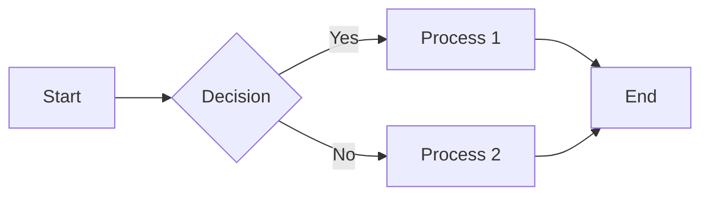

# Module Title

<div class="instructor-led">Instructor-Led</div>
<div class="self-led">Self-Led</div>
<div class="asynchronous">Asynchronous</div>

---

## Overview

Brief introduction to the module and what will be covered.

Note: This is a speaker note that will only be visible in presentation mode when pressing 'S'.

---

## Learning Objectives

By the end of this module, you will be able to:

- Objective 1
- Objective 2
- Objective 3
- Objective 4

---

# Section 1: Topic Title

---

## Introduction to Topic

Main content for this slide. This will appear as a slide in presentation mode and as regular content in document mode.

- Bullet point 1
- Bullet point 2
- Bullet point 3

---

## Subsection

Content continues here with more details.

```typescript
// Code example
const example = () => {
  console.log("Hello, React Native!");
  return <Text>Hello, React Native!</Text>;
};
```

--

## Vertical Slide

This is a vertical slide, accessed by pressing down arrow in presentation mode.
In document mode, it appears as a continuation of the content.

---

# Section 2: Another Topic

---

## Content with Fragments

<div class="platform-specific">
<strong>Android Developers:</strong> This relates to your experience with Android's layout system.
</div>

<div class="platform-specific">
<strong>iOS Developers:</strong> This is similar to Auto Layout in iOS.
</div>

<div class="platform-specific">
<strong>React Developers:</strong> This builds on your knowledge of React components.
</div>

<div class="platform-specific">
<strong>Angular Developers:</strong> This is comparable to Angular's component structure.
</div>

---

## Mermaid Diagrams



You can create various types of diagrams using Mermaid syntax.

---

## Links to Documentation

For more information, refer to the [official React Native documentation](https://reactnative.dev/docs/getting-started).

---

## Exercise

<div class="exercise">

### Exercise: Title

**Objective:** Brief description of what the exercise aims to achieve.

**Time:** 15-20 minutes

**Instructions:**
1. Step 1
2. Step 2
3. Step 3

**Resources:**
- [Link to Expo Snack](https://snack.expo.dev/)
- [Link to CodePen](https://codepen.io/)

</div>

---

# Section 3: Final Topic

---

## Summary

- Recap of key point 1
- Recap of key point 2
- Recap of key point 3

---

## Challenge

<div class="challenge">

### Challenge: Title

**Objective:** Brief description of what the challenge aims to achieve.

**Time:** 30-60 minutes

**Instructions:**
1. Step 1
2. Step 2
3. Step 3

**Requirements:**
- Requirement 1
- Requirement 2
- Requirement 3

**Resources:**
- [Link to Expo Snack](https://snack.expo.dev/)
- [Link to CodePen](https://codepen.io/)

</div>

---

## Additional Resources

- [Resource 1](https://example.com)
- [Resource 2](https://example.com)
- [Resource 3](https://example.com)

---

# Thank You!

Questions?

[Back to Course Home](../../index.html)
