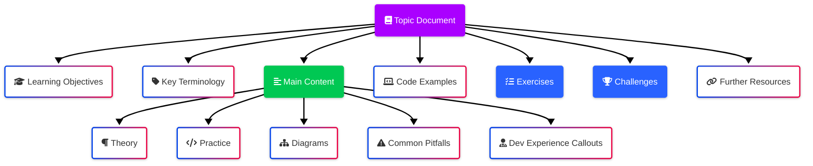
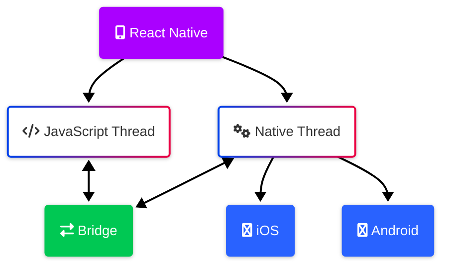
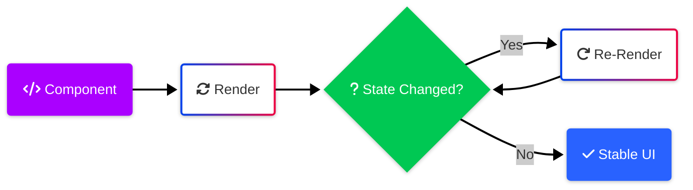
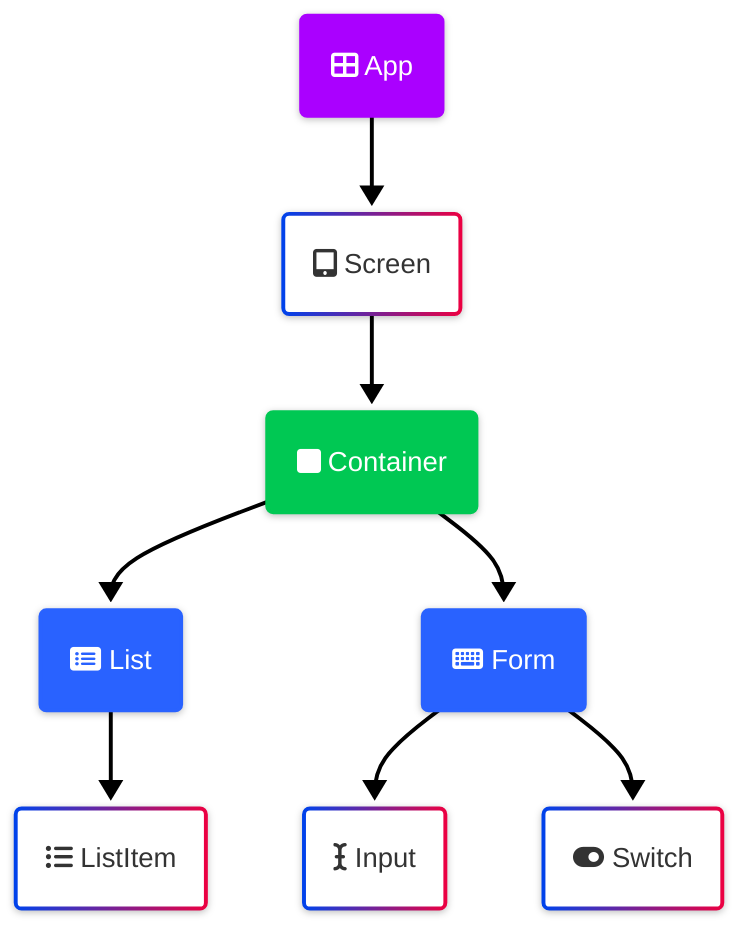
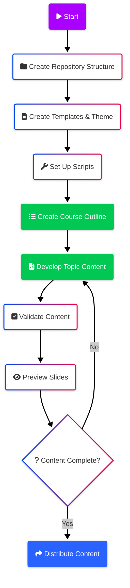

# React Native Training Course Plan

## Overview

This document outlines the comprehensive plan for developing a React Native training course. The course will serve as a centralized hub of content distributed through multiple channels (Confluence, Articulate 360, GitHub, and instructor-led sessions) while supporting three distinct learning paths: Instructor-Led, Self-Led, and Asynchronous.

The plan leverages [Marp](https://marp.app) for creating markdown documentation that serves a dual purpose as both detailed reference documentation and presentation slides for instructor-led sessions.

## Goals

1. Create a modular, maintainable structure for course content
2. Develop reusable templates and snippets for consistency
3. Implement automation scripts to accelerate content creation
4. Ensure content meets the needs of all learning paths
5. Integrate pharmacy theme (SpeedyMeds) throughout material
6. Support multiple learner backgrounds (native Android/iOS, React, Angular)

## Repository Structure

```
react-native-training/
├── README.md                     # Course overview and repository navigation
├── CONTRIBUTING.md               # Guidelines for course contributors
├── course-outline.md             # Detailed course outline document
├── templates/                    # Reusable templates directory
│   ├── main-topic-template.md    # Template for major topics
│   ├── exercise-template.md      # Template for exercises
│   ├── challenge-template.md     # Template for challenges
│   └── slides/                   # Slide-specific templates
│       ├── title-slide.md
│       ├── content-slide.md
│       └── code-slide.md
├── assets/                       # Shared assets
│   ├── images/                   # Course images
│   ├── diagrams/                 # Mermaid diagrams
│   ├── theme/                    # Marp themes and styling
│   │   └── company-theme.css     # Custom Marp theme
│   └── scripts/                  # Scripts for content generation
│       ├── create-topic.sh       # Topic generator script
│       ├── create-exercise.sh    # Exercise generator script
│       ├── validate-content.sh   # Content validation script
│       └── preview-slides.sh     # Slide preview script
├── topics/                       # Main course content by topic
│   ├── 01-react-native-fundamentals/
│   │   ├── fundamentals.md       # Main topic document
│   │   ├── exercises/            # Topic-specific exercises
│   │   └── challenges/           # Topic-specific challenges
│   ├── 02-environment-setup/
│   └── [other topic directories]/
└── learning-paths/               # Learning path guides
    ├── instructor-led.md
    ├── self-led.md
    └── async-learning.md
```

## Course Structure & Content Outline

Each major topic will be organized in a dedicated markdown file with consistent structure:



### Detailed Course Outline

1. **React Native Fundamentals**
   - History of Mobile Development
   - React Native Architecture Overview
   - How React Native Works Under the Hood
   - Comparison with Native Development
   - Expo vs React Native CLI

2. **React Native Environment Setup**
   - Expo Go Installation and Setup
   - iOS Simulator Configuration
   - Creating Your First Project
   - Expo Template Structure
   - Common Troubleshooting Steps

3. **Web Development Essentials**
   - HTML Fundamentals for React Native Developers
   - CSS Concepts Applied to React Native
   - Web-to-Mobile Development Paradigms
   - Browser vs. Native Rendering

4. **JavaScript Essentials**
   - Modern JavaScript Features
   - Asynchronous Programming
   - ES6+ Features Critical for React Native
   - TypeScript Introduction
   - Type Safety in Mobile Development

5. **React Essentials**
   - Component Architecture
   - JSX Syntax
   - Props and State Management
   - Component Lifecycle
   - React Patterns for Mobile Development

6. **TypeScript Essentials**
   - TypeScript Setup in React Native
   - Basic Types and Interfaces
   - Advanced Types for React Native
   - Type Safety for Component Props
   - Performance Benefits of TypeScript

7. **React Native Components**
   - Core Components Overview
   - Custom Component Development
   - Component Composition Strategies
   - Platform-Specific Components
   - Accessibility Support

8. **React Native Hooks**
   - Core Hooks (useState, useEffect, etc.)
   - Custom Hook Development
   - Hook Patterns for Mobile Applications
   - Performance Optimization with Hooks
   - Testing Hooks

9. **React Native UI and Styling**
   - StyleSheet API
   - Styled-Components Implementation
   - React Native Paper Integration
   - Responsive Design for Multiple Devices
   - Theme Management (Dark/Light)

10. **Performance and Debugging**
    - React Native Debugger
    - Performance Profiling
    - Memory Management
    - Common Performance Issues
    - Optimization Techniques

11. **Navigation and Routing**
    - Expo Router Implementation
    - React Navigation Setup
    - Navigation Patterns
    - Deep Linking
    - Authentication Flows

12. **React Native User Input and Forms**
    - Input Components
    - Form Validation
    - Form Management Libraries
    - Keyboard Handling
    - Accessibility Considerations

13. **State Management**
    - Context API Implementation
    - Zustand Store Setup
    - React Query for Data Fetching
    - State Persistence
    - State Management Patterns

14. **Native Modules**
    - Understanding Native Modules
    - Using Expo Modules
    - Creating Custom Native Modules
    - Bridging JavaScript and Native Code
    - Testing Native Module Integration

15. **EAS and Publishing**
    - EAS Build Configuration
    - Submission Preparation
    - App Store Guidelines
    - Google Play Requirements
    - CI/CD Pipeline Setup

16. **Advanced Features**
    - Animation Systems
    - Gesture Handling
    - Background Tasks
    - Push Notifications
    - Device-Specific Features

17. **Capstone Project: SpeedyMeds**
    - Project Setup and Architecture
    - Feature Implementation
    - Testing Strategies
    - Code Review Process
    - Deployment Workflow

## Templates & Snippets

### Main Topic Template

```markdown
---
marp: true
theme: company
paginate: true
header: "React Native Training"
footer: "© 2025 Company Name"
---

# [Topic Title]

<!-- 
Instructor Notes:
- Estimated time: XX minutes
- Key focus: [brief description]
-->

---

## Learning Objectives

By the end of this topic, you will be able to:
- [Objective 1]
- [Objective 2]
- [Objective 3]

---

## Key Terminology

| Term | Definition |
|------|------------|
| [Term 1] | [Definition 1 - 25-30 words] |
| [Term 2] | [Definition 2 - 25-30 words] |

---

## [Section Title]

[Content - 100-150 words per slide]

<!-- 
Learning Path Notes:
- For native developers: [specific callout]
- For web developers: [specific callout]
-->

---

## Code Example

```typescript
// Example code with full TypeScript typing
// 20-25 lines maximum per slide
```

[Code explanation - 100-150 words]

---

<!-- More content slides follow the same pattern -->

---

## Exercise: [Exercise Name]

Duration: 15-20 minutes

[Exercise instructions - 150-200 words]

[Include starter code or link to Expo Snack]

---

## Challenge: [Challenge Name]

Duration: 30-60 minutes

[Challenge description - 200-250 words]

[Include success criteria and evaluation points]

---

## Additional Resources

- [Official Documentation Link]
- [Related Article Link]
- [Tutorial Link]
- [GitHub Repository Link]

---

## Summary

[Topic summary - 150-200 words highlighting key points covered]

Next topic: [Next Topic Name]
```

### Exercise Template

```markdown
# Exercise: [Exercise Name]

**Duration:** 15-20 minutes  
**Topic:** [Related Topic]  
**Difficulty:** [Beginner/Intermediate/Advanced]

## Objective
[Clear, concise statement of what will be accomplished - 30-50 words]

## Pharmacy Theme Integration
[How this exercise relates to the SpeedyMeds pharmacy theme - 50-75 words]

## Prerequisites
- [Prerequisite 1]
- [Prerequisite 2]

## Instructions
1. [Step 1 - clear, actionable instruction]
2. [Step 2 - clear, actionable instruction]
3. [Step 3 - clear, actionable instruction]

## Starter Code
```typescript
// Include fully typed starter code
// With JSDoc comments
```

## Expected Output
[Description of expected result - 50-75 words]
[Screenshot or visual representation if applicable]

## Tips for Success
- [Helpful tip 1]
- [Helpful tip 2]

## Extension (Optional)
[Additional challenge for those who finish early - 75-100 words]

## Learning Path Notes
- **Native Developers:** [Specific guidance - 50-75 words]
- **Web Developers:** [Specific guidance - 50-75 words]
```

### Challenge Template

```markdown
# Challenge: [Challenge Name]

**Duration:** 30-60 minutes  
**Topic:** [Related Topic]  
**Difficulty:** [Intermediate/Advanced]

## Challenge Overview
[Comprehensive description of the challenge - 150-200 words]

## Pharmacy Theme Context
[How this challenge fits into the SpeedyMeds pharmacy application - 100-150 words]

## Requirements
1. [Requirement 1 - specific, measurable]
2. [Requirement 2 - specific, measurable]
3. [Requirement 3 - specific, measurable]

## Acceptance Criteria
- [Criterion 1 - clear, testable]
- [Criterion 2 - clear, testable]
- [Criterion 3 - clear, testable]

## Starter Resources
- [Expo Snack link or GitHub repository]
- [API documentation link if applicable]
- [Design mockup link if applicable]

## Implementation Guidelines
[Architecture recommendations, design patterns to consider - 150-200 words]

## Testing Expectations
[How to test the solution, what to check for - 100-150 words]

## Submission Instructions
[How to submit the completed challenge - 75-100 words]

## Learning Path Considerations
- **Instructor-Led:** [Group work suggestions - 50-75 words]
- **Self-Led:** [Independent completion tips - 50-75 words]
- **Asynchronous:** [Focus areas for partial completion - 50-75 words]
```

## Visual Styling & Theme

### Marp Theme Configuration

```css
/* company-theme.css */
@import 'default';

:root {
  --primary-color: #AA00FF;
  --secondary-color: #00C853;
  --tertiary-color: #2962FF;
  --background-light: #FFFFFF;
  --background-dark: #212121;
  --text-light: #FFFFFF;
  --text-dark: #212121;
  --font-main: 'Segoe UI', sans-serif;
  --font-code: 'Consolas', monospace;
}

/* Global styles */
section {
  font-family: var(--font-main);
  padding: 40px;
  background-color: var(--background-light);
  color: var(--text-dark);
}

/* Dark theme variant */
section.dark {
  background-color: var(--background-dark);
  color: var(--text-light);
}

/* Headings */
h1 {
  color: var(--primary-color);
  font-size: 2.5em;
  margin-bottom: 0.5em;
}

h2 {
  color: var(--secondary-color);
  font-size: 1.8em;
  margin-bottom: 0.5em;
}

/* Code blocks */
pre {
  background-color: #f5f5f5;
  border-radius: 5px;
  padding: 15px;
  margin: 15px 0;
  font-family: var(--font-code);
  font-size: 0.9em;
}

/* Tables */
table {
  border-collapse: collapse;
  width: 100%;
  margin: 20px 0;
}

th, td {
  border: 1px solid #ddd;
  padding: 8px 12px;
  text-align: left;
}

th {
  background-color: var(--secondary-color);
  color: var(--text-light);
}

/* Pharmacy themed elements */
.pharmacy-box {
  border-left: 5px solid var(--primary-color);
  background-color: rgba(170, 0, 255, 0.1);
  padding: 15px;
  margin: 20px 0;
}

.med-warning {
  border-left: 5px solid #FF5252;
  background-color: rgba(255, 82, 82, 0.1);
  padding: 15px;
  margin: 20px 0;
}

/* Learning path callouts */
.native-dev-note, .web-dev-note {
  padding: 10px 15px;
  margin: 15px 0;
  border-radius: 5px;
}

.native-dev-note {
  background-color: rgba(41, 98, 255, 0.1);
  border-left: 5px solid var(--tertiary-color);
}

.web-dev-note {
  background-color: rgba(0, 200, 83, 0.1);
  border-left: 5px solid var(--secondary-color);
}
```

### Mermaid Diagram Templates

Architecture Diagram Template:


Process Flow Template:


Component Hierarchy Template:


## Scripts & Automation

### Topic Generator Script

```bash
#!/bin/bash
# create-topic.sh

# Check if topic number and name are provided
if [ $# -lt 2 ]; then
    echo "Usage: ./create-topic.sh <topic-number> <topic-name>"
    exit 1
fi

# Set variables
TOPIC_NUM=$1
TOPIC_NAME=$2
TOPIC_DIR="topics/$(printf "%02d" $TOPIC_NUM)-${TOPIC_NAME// /-}"
TOPIC_FILE="${TOPIC_DIR}/${TOPIC_NAME// /-}.md"

# Create directory structure
mkdir -p "${TOPIC_DIR}/exercises"
mkdir -p "${TOPIC_DIR}/challenges"

# Copy template to topic file
cp templates/main-topic-template.md "$TOPIC_FILE"

# Replace placeholders in the topic file
sed -i '' "s/\[Topic Title\]/${TOPIC_NAME}/g" "$TOPIC_FILE"

# Create exercise and challenge templates
cp templates/exercise-template.md "${TOPIC_DIR}/exercises/exercise-1.md"
cp templates/challenge-template.md "${TOPIC_DIR}/challenges/challenge-1.md"

echo "Created topic structure for: $TOPIC_NAME"
echo "Main file: $TOPIC_FILE"
echo "Don't forget to update the learning objectives and content!"
```

### Exercise Generator Script

```bash
#!/bin/bash
# create-exercise.sh

# Check if topic name and exercise name are provided
if [ $# -lt 3 ]; then
    echo "Usage: ./create-exercise.sh <topic-number> <topic-name> <exercise-name>"
    exit 1
fi

# Set variables
TOPIC_NUM=$1
TOPIC_NAME=$2
EXERCISE_NAME=$3
TOPIC_DIR="topics/$(printf "%02d" $TOPIC_NUM)-${TOPIC_NAME// /-}"
EXERCISE_FILE="${TOPIC_DIR}/exercises/${EXERCISE_NAME// /-}.md"

# Ensure topic directory exists
if [ ! -d "$TOPIC_DIR" ]; then
    echo "Error: Topic directory does not exist: $TOPIC_DIR"
    exit 1
fi

# Copy template to exercise file
cp templates/exercise-template.md "$EXERCISE_FILE"

# Replace placeholders in the exercise file
sed -i '' "s/\[Exercise Name\]/${EXERCISE_NAME}/g" "$EXERCISE_FILE"
sed -i '' "s/\[Related Topic\]/${TOPIC_NAME}/g" "$EXERCISE_FILE"

echo "Created exercise: $EXERCISE_NAME"
echo "File: $EXERCISE_FILE"
echo "Don't forget to complete the exercise content!"
```

### Content Validator Script

```bash
#!/bin/bash
# validate-content.sh

# Check for markdown files
find topics -name "*.md" | while read file; do
    echo "Checking: $file"
    
    # Check for required sections
    if ! grep -q "## Learning Objectives" "$file"; then
        echo "  Missing: Learning Objectives section"
    fi
    
    if ! grep -q "## Key Terminology" "$file"; then
        echo "  Missing: Key Terminology section"
    fi
    
    # Check for code blocks with proper language specification
    if grep -q '```[^a-z]' "$file"; then
        echo "  Warning: Code block without language specification"
    fi
    
    # Check for slide separators (---)
    if ! grep -q "^---$" "$file"; then
        echo "  Warning: No slide separators found"
    fi
    
    # Check for instructor notes
    if ! grep -q "<!-- Instructor Notes:" "$file"; then
        echo "  Missing: Instructor Notes"
    fi
    
    # Check for learning path notes
    if ! grep -q "Learning Path Notes" "$file"; then
        echo "  Missing: Learning Path Notes"
    fi
    
    echo "Done checking: $file"
    echo ""
done

echo "Validation complete!"
```

### Slide Preview Script

```bash
#!/bin/bash
# preview-slides.sh

# Check if file is provided
if [ $# -lt 1 ]; then
    echo "Usage: ./preview-slides.sh <markdown-file>"
    exit 1
fi

# Set variables
FILE=$1

# Check if file exists
if [ ! -f "$FILE" ]; then
    echo "Error: File does not exist: $FILE"
    exit 1
fi

# Check if marp CLI is installed
if ! command -v marp &> /dev/null; then
    echo "Error: Marp CLI is not installed."
    echo "Install with: npm install -g @marp-team/marp-cli"
    exit 1
fi

# Generate HTML preview
marp "$FILE" --html --output "${FILE%.md}.html"

# Open preview in browser
open "${FILE%.md}.html"

echo "Preview generated for: $FILE"
echo "HTML file: ${FILE%.md}.html"
```

## Implementation Workflow



### Step-by-Step Implementation

1. **Repository Setup (1-2 days)**
   - Create GitHub repository
   - Establish directory structure
   - Set up README and contributing guidelines
   - Create initial assets directory

2. **Template & Theme Development (2-3 days)**
   - Develop Marp theme CSS
   - Create document templates
   - Design slide templates
   - Establish Mermaid diagram templates

3. **Script Development (1-2 days)**
   - Create topic generator script
   - Develop exercise/challenge generator scripts
   - Build content validation script
   - Implement slide preview script

4. **Course Outline Development (2-3 days)**
   - Create detailed course outline document
   - Define learning objectives for each topic
   - Establish topic dependencies and flow
   - Map content to learning paths

5. **Topic Content Development (10-15 days, ongoing)**
   - Develop content for each major topic
   - Create exercises and challenges
   - Integrate pharmacy theme throughout
   - Include developer experience callouts

6. **Content Validation & Review (5-7 days, ongoing)**
   - Validate content against requirements
   - Preview slides and documents
   - Review accessibility and consistency
   - Ensure all learning paths are supported

7. **Distribution Setup (2-3 days)**
   - Configure export settings for various channels
   - Set up Confluence integration
   - Prepare Articulate 360 content structure
   - Establish GitHub collaboration workflow

8. **Maintenance & Updates (Ongoing)**
   - Document update procedures
   - Set up version control workflow
   - Establish feedback collection process
   - Plan regular content refresh cycles

## Pharmacy Theme Integration Strategy

Throughout the course, we'll integrate the pharmacy theme (SpeedyMeds) in the following ways:

1. **Code Examples**: All examples will use medication-related data structures (prescriptions, medications, orders)

2. **Visual Elements**: Custom icons and graphics with pharmacy theme

3. **Exercises & Challenges**: Progressively build components and features that could be used in the SpeedyMeds app

4. **Case Studies**: Real-world scenarios based on medication management

5. **Capstone Project**: Structured to build a cohesive pharmacy application with defined features

This approach ensures consistent theme integration while providing relevant, practical experience.

## Implementation Checklist

- [ ] Create repository and establish base structure
- [ ] Set up Marp configuration
- [ ] Create CSS theme file
- [ ] Develop Markdown templates
- [ ] Write automation scripts
- [ ] Create detailed course outline
- [ ] Develop first topic content
- [ ] Test content validation and preview
- [ ] Set up learning path guides
- [ ] Begin systematic content development