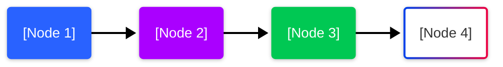

# [Topic Title]

<!-- 
Instructor Notes:
- Estimated time: 120 minutes
- Key focus: Main concepts and learning objectives
- Learning path adaptations: 
  - Native developers: Key focus areas for those with native background
  - Web developers: Key focus areas for those with web background
-->

---

## Learning Objectives

By the end of this topic, you will be able to:
- [Objective 1]
- [Objective 2]
- [Objective 3]
- [Objective 4]
- [Objective 5]
- [Objective 6]

---

## Key Terminology

| Term | Definition |
|------|------------|
| [Term 1] | [Definition 1] |
| [Term 2] | [Definition 2] |
| [Term 3] | [Definition 3] |
| [Term 4] | [Definition 4] |
| [Term 5] | [Definition 5] |
| [Term 6] | [Definition 6] |

---

<!-- SECTION: Introduction -->

## Introduction

[Introduction paragraph 1 - Provide context and background for the topic]

[Introduction paragraph 2 - Explain why this topic is important for React Native development]

<div class="pharmacy-box">

**SpeedyMeds Context**: [Provide specific context for how this topic applies to pharmacy applications like SpeedyMeds. Include specific examples and use cases that demonstrate the relevance to pharmacy/medication management.]

</div>

---

<!-- SECTION: Main Content Section 1 -->

## [Main Topic Section 1]

[Content for the first main section of the topic. Each main section should be 200-300 words covering a key concept.]



[Additional content for this section, including explanations of the diagram]

---

<!-- SECTION: Main Content Section 2 -->

## [Main Topic Section 2]

[Content for the second main section of the topic. Each main section should be 200-300 words covering a key concept.]

<div class="native-dev-note">

**For Native Developers**: [Provide specific guidance, analogies, or explanations tailored to developers with iOS/Android experience. Focus on relating concepts to native development parallels or differences.]

</div>

[Additional content for this section]

---

<!-- SECTION: Main Content Section 3 -->

## [Main Topic Section 3]

[Content for the third main section of the topic. Each main section should be 200-300 words covering a key concept.]

<div class="web-dev-note">

**For Web Developers**: [Provide specific guidance, analogies, or explanations tailored to developers with web experience. Focus on relating concepts to web development parallels or differences.]

</div>

[Additional content for this section]

---

<!-- SECTION: Main Content Section 4 -->

## [Main Topic Section 4]

[Content for the fourth main section of the topic. Each main section should be 200-300 words covering a key concept.]

[Additional content for this section]

---

## Code Example

```typescript
// [Code example title]
import React, { useState } from 'react';
import { View, Text, StyleSheet } from 'react-native';

interface ExampleProps {
  // Define props interface with TypeScript
  property1: string;
  property2: number;
  onAction?: () => void;
}

/**
 * [Component description]
 * 
 * @param property1 - [Property description]
 * @param property2 - [Property description]
 * @param onAction - [Property description]
 * @returns A React Native component
 */
const ExampleComponent: React.FC<ExampleProps> = ({ 
  property1, 
  property2, 
  onAction 
}) => {
  // Component implementation
  const [state, setState] = useState(false);
  
  return (
    <View style={styles.container}>
      <Text>{property1}</Text>
      {/* Additional component JSX */}
    </View>
  );
};

const styles = StyleSheet.create({
  container: {
    // Component styles
  },
  // Additional style definitions
});

export default ExampleComponent;
```

[200+ word explanation of the code example, highlighting key concepts, best practices, and implementation details]

---

## Exercise: [Exercise Name]

**Duration**: 15-20 minutes

[Brief description of the exercise, its goals, and what skills it practices]

1. [Step 1]
2. [Step 2]
3. [Step 3]
4. [Step 4]
5. [Step 5]

**Success Criteria**:
- [Criterion 1]
- [Criterion 2]
- [Criterion 3]

For detailed instructions, see the [exercise file](./exercises/[exercise-file-name].md).

---

## Challenge: [Challenge Name]

**Duration**: 30-60 minutes

[Brief description of the challenge, its goals, and what skills it tests]

**Requirements**:
- [Requirement 1]
- [Requirement 2]
- [Requirement 3]
- [Requirement 4]
- [Requirement 5]

For detailed instructions, see the [challenge file](./challenges/[challenge-file-name].md).

---

## Additional Resources

- [Resource 1 with link](https://example.com)
- [Resource 2 with link](https://example.com)
- [Resource 3 with link](https://example.com)
- [Resource 4 with link](https://example.com)

<div class="med-info">

**Recommended Reading**: [Specific book or article recommendation with a brief explanation of why it's valuable]

</div>

---

## Summary

[Summary paragraph recapping the key points of the topic]

**Key Takeaways**:
- [Takeaway 1]
- [Takeaway 2]
- [Takeaway 3]
- [Takeaway 4]
- [Takeaway 5]

As we move forward to [Next Topic Name], you'll [brief preview of how this topic connects to the next one]. This foundation in [Current Topic] will provide context for [specific application or skill in upcoming topics].

Next topic: [Next Topic Name]