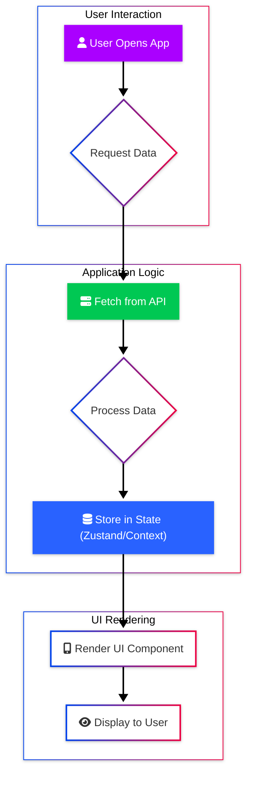

<!-- Mermaid Diagram Template -->
<!-- Use this structure for all Mermaid diagrams to ensure consistent styling. -->

---
<!-- Add slide separators (---) above and below the diagram as needed -->

**Diagram Explanation:**

<!-- Add a brief explanation of what the diagram illustrates. -->
This diagram shows the basic flow of data when a user opens the app and data is fetched and displayed. Key components like the API interaction and state management are highlighted.