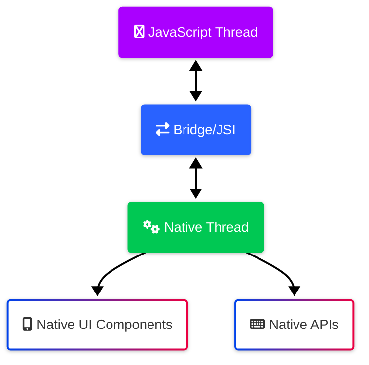

# React Native Fundamentals

<!-- 
Instructor Notes:
- Estimated time: 120 minutes
- Key focus: History of mobile development, React Native architecture, and core concepts
- Learning path adaptations: 
  - Native developers: Focus on React and JavaScript paradigms
  - Web developers: Focus on native mobile concepts and constraints
-->

---

## Learning Objectives

By the end of this topic, you will be able to:
- Explain the history and evolution of mobile development approaches
- Describe how React Native works under the hood
- Compare React Native to other mobile development frameworks
- Identify when React Native is an appropriate technology choice
- Explain the core architecture of a React Native application
- Recognize the relationship between JavaScript and native code
- Understand the role of the bridge and JSI in React Native
- Identify Expo's role in the React Native ecosystem

---

## Key Terminology

| Term | Definition |
|------|------------|
| React Native | A framework for building native apps using React and JavaScript |
| Bridge | The communication layer between JavaScript and native code in React Native |
| JSI (JavaScript Interface) | Direct interface between JavaScript and native code, replacing the bridge in newer RN versions |
| Metro | The JavaScript bundler used by React Native |
| Native Modules | Platform-specific native code that can be called from JavaScript |
| Hermes | An optimized JavaScript engine for React Native |
| Fabric | React Native's new rendering system |
| Expo | A platform and set of tools built around React Native |

---

<!-- SECTION: Introduction -->

## Introduction

Mobile application development has evolved dramatically since the introduction of smartphones. From native development requiring platform-specific code in languages like Swift, Objective-C, Java, and Kotlin, to cross-platform approaches that promise a "write once, run anywhere" experience. React Native emerged in 2015 as Facebook's solution to bridge this gap, offering a unique approach that balances developer experience with near-native performance.

Unlike previous cross-platform frameworks that relied on web views or generated code, React Native takes a fundamentally different approach. It uses JavaScript to define the application logic and UI, but renders using actual native components. This creates a genuine native experience while allowing developers to work primarily in JavaScript and React, a combination that has revolutionized mobile development for companies ranging from startups to industry giants like Facebook, Instagram, Walmart, and Microsoft.

<div class="pharmacy-box">

**SpeedyMeds Context**: For a pharmacy application like SpeedyMeds, React Native offers several compelling advantages. Pharmacies need to rapidly adapt to changing healthcare regulations and customer expectations while maintaining accurate medication information and secure handling of sensitive data. React Native allows for quick iterations to address regulatory changes, cross-platform deployment to reach all customers regardless of device preference, and access to native capabilities for features like barcode scanning for medication verification, secure biometric authentication for patient data, and hardware integration for payment processing.

</div>

---

<!-- SECTION: Main Content Section 1 -->

## History of Mobile Development

The journey of mobile development spans multiple eras, each with distinct approaches to creating applications:

Native development emerged as the first paradigm, with iOS apps written in Objective-C (later Swift) and Android apps in Java (later Kotlin). This approach offered the best performance and access to platform features but required maintaining separate codebases, leading to higher development and maintenance costs.

Web-based mobile applications followed, using technologies like HTML5, CSS, and JavaScript wrapped in solutions like Apache Cordova (PhoneGap). While this allowed for code sharing across platforms, these applications often suffered from performance issues and limited access to native features.

Hybrid frameworks attempted to bridge these gaps, with tools like Xamarin using C# and Ionic improving the web approach. However, they still faced challenges in matching the performance and feel of truly native applications.


React Native emerged in 2015 as a revolutionary approach that used JavaScript and React for logic while rendering with actual native components. This preserved the developer experience of React while delivering near-native performance and appearance.

---

<!-- SECTION: Main Content Section 2 -->

## React Native Architecture

React Native's unique architecture enables its balance of developer experience and native performance. At its core is a dual-thread model that separates concerns:

- **JavaScript Thread**: Executes the React/JavaScript application code, handling business logic, state management, and the virtual DOM.
  
- **Native Threads**: Platform-specific threads that manage the actual rendering of native components and access to device capabilities.

These threads communicate through what was traditionally called the "Bridge" - a serialization and asynchronous messaging system. The Bridge translates JavaScript calls into native instructions and vice versa.



Modern React Native has evolved beyond the original Bridge with the introduction of the JavaScript Interface (JSI), which provides more direct communication between JavaScript and native code without the serialization overhead. This is part of the "New Architecture" that includes Fabric (a new rendering system) and TurboModules (enhanced native modules).

The Hermes JavaScript engine, optimized specifically for React Native, further improves performance with faster startup times, reduced memory usage, and smaller application size.

---

<!-- SECTION: Main Content Section 3 -->

## Why React Native?

React Native offers compelling advantages that have led to its widespread adoption:

- **Code Sharing**: Up to 90% of code can be shared between iOS and Android platforms, significantly reducing development and maintenance efforts.

- **Developer Experience**: The fast refresh feature allows developers to see changes almost instantly, dramatically speeding up the development cycle compared to native compilation times.

- **Component-Based Architecture**: React's component model encourages reusable, maintainable code structures that scale well for teams.

- **Native Performance**: By using actual native components rather than web views, React Native applications can achieve performance nearly indistinguishable from fully native apps for most use cases.

<div class="native-dev-note">

**For Native Developers**: React Native's approach differs fundamentally from traditional native development. Instead of the imperative style of UIKit or Android's View system where you directly manipulate the UI, React Native uses React's declarative paradigm where you describe what the UI should look like based on current state, and the framework handles updates. This eliminates entire categories of bugs related to inconsistent UI states, though it requires adjusting to a different mental model.

</div>

React Native also provides access to native capabilities through its native module system, allowing developers to write platform-specific code when necessary and expose it to the JavaScript layer. This flexibility means you're never completely limited by the framework.

---

<!-- SECTION: Main Content Section 4 -->

## Expo and React Native

Expo is a powerful framework and platform built around React Native that significantly enhances the developer experience and capabilities:

- **Simplified Setup**: Expo provides a zero-configuration development environment that eliminates many of the complex native build setup steps.

- **SDK Access**: The Expo SDK offers JavaScript APIs for a wide range of native functionalities like camera, location, notifications, and sensors.

- **Development Tools**: Features like Expo Go allow testing on physical devices without building native binaries, dramatically speeding up iteration.

- **Build Services**: Expo Application Services (EAS) provide cloud-based building and publishing, removing the need for local native development environments.

<div class="web-dev-note">

**For Web Developers**: If you're coming from web React development, Expo offers the most familiar developer experience. Its emphasis on JavaScript APIs for native functionality mirrors how you might use browser APIs in web development. The managed workflow feels similar to frameworks like Create React App, with configuration abstracted away until you need it. This makes the transition from web to mobile development significantly smoother.

</div>

Expo offers two primary workflows: the managed workflow (simpler, with some constraints) and the bare workflow (more flexible, with direct access to native code). With Expo's development build system, you can now use most native modules without ejecting from the managed workflow, giving you the best of both worlds.

---

## Code Example

```typescript
// Basic React Native Component
import React, { useState } from 'react';
import { View, Text, StyleSheet, Pressable } from 'react-native';

interface MedicationItemProps {
  name: string;
  dosage: string;
  onPress: () => void;
}

/**
 * MedicationItem displays a medication with its dosage information
 * 
 * @param name - The name of the medication
 * @param dosage - The dosage information (e.g., "10mg")
 * @param onPress - Function to call when the item is pressed
 * @returns A pressable component displaying medication information
 */
const MedicationItem: React.FC<MedicationItemProps> = ({ 
  name, 
  dosage, 
  onPress 
}) => {
  // State for tracking if the item is selected
  const [isSelected, setIsSelected] = useState(false);
  
  return (
    <Pressable
      style={[styles.container, isSelected && styles.selectedContainer]}
      onPress={() => {
        setIsSelected(!isSelected);
        onPress();
      }}
      accessible={true}
      accessibilityRole="button"
      accessibilityLabel={`Medication ${name}, ${dosage}`}
      accessibilityHint="Tap to view medication details"
    >
      <Text style={styles.nameText}>{name}</Text>
      <Text style={styles.dosageText}>{dosage}</Text>
    </Pressable>
  );
};

const styles = StyleSheet.create({
  container: {
    padding: 16,
    borderRadius: 8,
    backgroundColor: '#FFFFFF',
    marginVertical: 8,
    marginHorizontal: 16,
    shadowColor: '#000',
    shadowOffset: { width: 0, height: 2 },
    shadowOpacity: 0.1,
    shadowRadius: 4,
    elevation: 2,
  },
  selectedContainer: {
    backgroundColor: '#F0F8FF',
    borderColor: '#0066CC',
    borderWidth: 1,
  },
  nameText: {
    fontSize: 18,
    fontWeight: 'bold',
    color: '#333333',
  },
  dosageText: {
    fontSize: 16,
    color: '#666666',
    marginTop: 8,
  },
});

export default MedicationItem;
```

This example demonstrates core React Native concepts: functional components with TypeScript types, hooks for state management, and the StyleSheet API for styling. The component showcases how React Native combines React patterns (props, state, JSX) with mobile-specific considerations like Pressable for touch handling and accessibility attributes for screen readers. The styling demonstrates how React Native's StyleSheet API provides a familiar CSS-like experience while incorporating mobile-specific properties like elevation for Android shadows.

---

## Exercise: Basic Component Creation

**Duration**: 15-20 minutes

Create a simple MedicationCard component that displays medication information in a visually appealing card format. This exercise will help you practice creating reusable components with props, styling, and proper TypeScript typing.

1. Create a new component file
2. Define the component props interface
3. Implement the component UI with appropriate styling
4. Add proper accessibility attributes
5. Test the component with sample data

**Success Criteria**:
- Component correctly displays all medication information
- Styling provides a card-like appearance
- TypeScript types are properly implemented
- Component includes appropriate accessibility attributes

For detailed instructions, see the [exercise file](./exercises/basic-component-creation.md).

---

## Challenge: Medication List Filter

**Duration**: 30-60 minutes

Build a more complex component that displays a list of medications with search and filtering functionality. This challenge will test your ability to combine multiple React Native components, manage state, and implement user interactions.

**Requirements**:
- Display a list of medications using FlatList
- Implement a search bar to filter medications by name
- Add filter buttons for medication status (active/inactive)
- Apply visual distinctions between medication types
- Ensure all elements are properly accessible
- Handle empty states appropriately

For detailed instructions, see the [challenge file](./challenges/medication-list-filter.md).

---

## Additional Resources

- [React Native Official Documentation](https://reactnative.dev/docs/getting-started)
- [Expo Documentation](https://docs.expo.dev/)
- [React Native Architecture Overview](https://reactnative.dev/architecture/overview)
- [React Native Paper (UI Library)](https://callstack.github.io/react-native-paper/)
- [TypeScript with React Native](https://reactnative.dev/docs/typescript)

<div class="med-info">

**Recommended Reading**: "React Native in Action" by Nader Dabit provides an excellent deep dive into React Native fundamentals and practical application development. It covers both basic concepts and advanced patterns while focusing on real-world implementation scenarios.

</div>

---

## Summary

React Native represents a significant evolution in mobile development, offering a unique approach that combines the developer experience of React with the performance of native applications. Its architecture bridges JavaScript and native code, enabling truly cross-platform development without major compromises.

**Key Takeaways**:
- React Native uses actual native components rather than web views
- The architecture separates JavaScript logic from native rendering
- Modern React Native uses JSI for improved performance
- Expo provides tools that enhance the React Native experience
- Component-based development applies React patterns to mobile
- TypeScript and accessibility are essential for quality applications

As we move forward to React Native Environment Setup, you'll learn how to configure a development environment using Expo and begin building your first React Native application. This foundation in React Native fundamentals will provide context for all the practical development skills you'll learn throughout the course.

Next topic: React Native Environment Setup